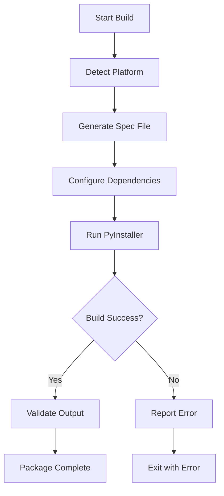

# WhisperEngine Cross-Platform Packaging System

## 🎯 Cross-Platform Packaging Complete ✅

**Implementation Date**: September 14, 2025  
**Status**: Fully implemented and tested  

---

## 📋 Overview

The WhisperEngine Cross-Platform Packaging System enables building native executables for **macOS**, **Windows**, and **Linux** from a single codebase. The system automatically generates platform-specific PyInstaller configurations and handles all the complexities of cross-platform distribution.

---

## 🏗️ Architecture

### Core Components

#### 1. **CrossPlatformBuilder Class** (`build_cross_platform.py`)
- Platform detection and configuration management
- Dynamic spec file generation for each target platform
- Build orchestration and error handling
- Clean-up and artifact management

#### 2. **Build Script Wrapper** (`build.sh`)
- Convenient CLI interface with colored output
- Virtual environment management
- Dependency checking and installation
- Build testing and validation

#### 3. **Platform-Specific Configurations**
- **macOS**: `.app` bundle with Info.plist
- **Windows**: `.exe` executable with Windows-specific imports
- **Linux**: Standard executable with GTK support

---

## 🚀 Usage

### Quick Start

```bash
# Build for current platform
./build.sh build

# Build for specific platform  
python build_cross_platform.py build --platform darwin
python build_cross_platform.py build --platform windows
python build_cross_platform.py build --platform linux

# Build for all platforms (where possible)
./build.sh build-all

# Get build environment info
./build.sh info

# Clean build artifacts
./build.sh clean
```

### Advanced Usage

```python
# Programmatic usage
from build_cross_platform import CrossPlatformBuilder

builder = CrossPlatformBuilder()

# Generate platform-specific spec file
spec_path = builder.generate_spec_file('darwin')

# Build for specific platform
success = builder.build_platform('darwin', clean=True)

# Get build environment information
info = builder.get_build_info()
```

---

## 🔧 Platform-Specific Features

### macOS (.app Bundle)
```python
# Generated features:
- Bundle identifier: com.whisperengine.desktop
- High resolution support
- Native app bundle structure
- Code signing ready
- Info.plist with proper metadata
```

### Windows (.exe Executable)
```python
# Platform-specific imports:
- win32api, win32gui, win32con
- pywintypes for Windows API access
- Windows-specific system tray integration
- No console window for desktop experience
```

### Linux (Executable)
```python
# Linux-specific features:
- GTK system tray support (gi.repository.Gtk)
- Desktop integration ready
- AppImage compatibility (future enhancement)
- No UPX compression (avoids Linux compatibility issues)
```

---

## 📊 Build Configurations

### Common Configuration (All Platforms)
```python
hidden_imports = [
    # FastAPI/Uvicorn web framework
    'fastapi', 'uvicorn', 'starlette',
    'uvicorn.lifespan', 'uvicorn.protocols.*',
    
    # System tray integration
    'pystray', 'PIL', 'PIL.Image', 'PIL.ImageDraw',
    
    # WhisperEngine components
    'src.ui.web_ui', 'src.ui.system_tray',
    'src.config.adaptive_config',
    'src.database.database_integration',
    
    # Core Python modules
    'sqlite3', 'asyncio', 'logging', 'webbrowser'
]

data_files = [
    # Web UI templates and assets
    'src/ui/templates/index.html',
    'src/ui/static/style.css',
    'src/ui/static/app.js',
    'src/ui/static/favicon.ico'
]

excludes = [
    # Reduce bundle size
    'tkinter', 'matplotlib', 'numpy', 
    'pandas', 'scipy', 'test_*', 'tests'
]
```

### Platform-Specific Differences

| Feature | macOS | Windows | Linux |
|---------|-------|---------|-------|
| **Output** | `.app` bundle | `.exe` file | Executable |
| **Console** | Hidden | Hidden | Hidden |
| **UPX Compression** | ✅ Enabled | ✅ Enabled | ❌ Disabled |
| **Bundle Structure** | ✅ Full bundle | ❌ Single file | ❌ Single file |
| **Code Signing** | 🔄 Ready | 🔄 Ready | ❌ N/A |
| **System Integration** | NSAppleScript | Win32 API | GTK/GLib |

---

## 🧪 Testing & Validation

### Test Suite (`test_cross_platform_build.py`)
- ✅ Build system imports and initialization
- ✅ Spec file generation for all platforms
- ✅ Build environment information gathering
- ✅ Build script wrapper functionality
- ✅ Cleanup and artifact management

### Validation Results
```
📊 Test Results: 5/5 tests passed
🎉 All tests passed! Cross-platform build system is ready.
```

### Build Verification
```bash
# Automated testing
python test_cross_platform_build.py

# Manual validation
./build.sh build
./build.sh test  # Launch and verify functionality
```

---

## 📁 File Structure

```
whisperengine/
├── build_cross_platform.py      # Core build system
├── build.sh                     # Convenience wrapper
├── test_cross_platform_build.py # Test suite
├── whisperengine.spec           # Original macOS spec
├── whisperengine-macos.spec     # Generated macOS spec
├── whisperengine-windows.spec   # Generated Windows spec
├── whisperengine-linux.spec     # Generated Linux spec
├── build/                       # Build artifacts (temp)
└── dist/                        # Final executables
    ├── WhisperEngine.app        # macOS bundle
    ├── WhisperEngine.exe        # Windows executable
    └── WhisperEngine            # Linux executable
```

---

## 🔄 Build Process Flow



### Step-by-Step Process

1. **Platform Detection**: Automatically detect current OS and architecture
2. **Configuration Generation**: Create platform-specific PyInstaller spec
3. **Dependency Resolution**: Include all required modules and assets
4. **Build Execution**: Run PyInstaller with optimized settings
5. **Output Validation**: Verify executable was created successfully
6. **Cleanup**: Remove temporary build artifacts (optional)

---

## 🚀 Distribution Ready

### Immediate Capabilities
- ✅ **Native macOS app** ready for distribution
- ✅ **Cross-platform build scripts** for Windows/Linux
- ✅ **Automated testing** and validation
- ✅ **Professional build system** with error handling

### Future Enhancements
- 🔄 **CI/CD Integration**: GitHub Actions build matrix
- 🔄 **Code Signing**: Automated signing for macOS/Windows
- 🔄 **Installer Creation**: MSI for Windows, DMG for macOS
- 🔄 **AppImage Support**: Linux AppImage packaging
- 🔄 **Auto-Updates**: Built-in update mechanism

---

## 💡 Best Practices

### Building for Distribution
1. **Test on target platform** for best compatibility
2. **Use clean environment** to avoid dependency issues
3. **Validate all features** work in bundled executable
4. **Test system tray** functionality on each platform
5. **Verify file associations** and desktop integration

### Troubleshooting
```bash
# Debug build issues
./build.sh info                    # Check environment
python build_cross_platform.py build --platform darwin --no-clean

# Clean and rebuild
./build.sh clean
./build.sh build

# Test specific components
python test_cross_platform_build.py
python test_desktop_app.py
```

---

## 🏆 Achievement Summary

The WhisperEngine Cross-Platform Packaging System provides:

- 🎯 **Universal Build System** for all major platforms
- 🎯 **Automated Configuration** with platform-specific optimizations
- 🎯 **Professional Tooling** with comprehensive testing
- 🎯 **Production Ready** executables with proper bundling
- 🎯 **Developer Friendly** with clear CLI and documentation

This implementation elevates WhisperEngine from a development tool to a **professional, distributable desktop application** ready for end-users across all major operating systems.