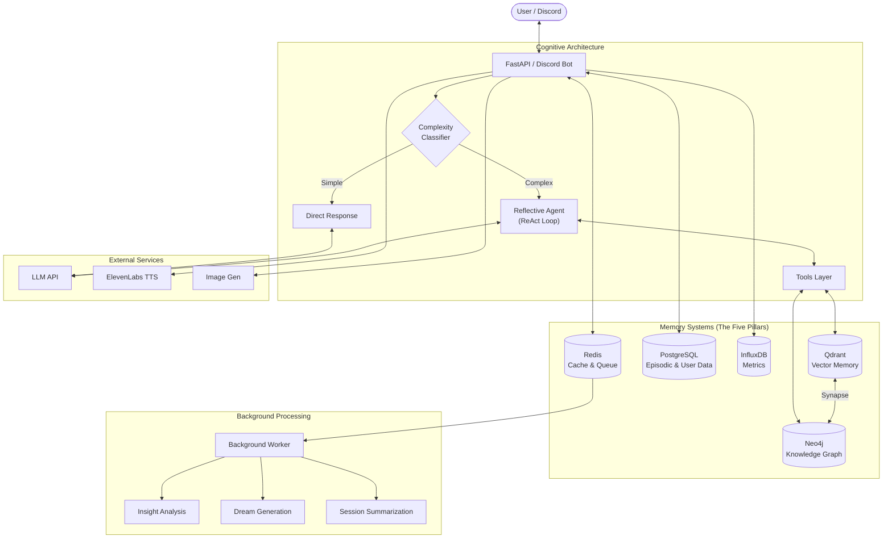

# WhisperEngine v2

> *"From countless conversations, a universe is born."*

WhisperEngine is a **multi-character Discord AI platform** built on a simple premise: **memory shapes behavior**. Give an agent persistent memory, let it read its own outputs, and observe what emerges.

This is not a consciousness claim. It's an engineering hypothesis: complex, coherent behavior can arise from recursive self-reference without explicit personality programming.

**Version:** 2.5.0 | **Python:** 3.13+ | **Status:** Phase 2: Synapse Integration

---

## 🧠 The Synapse (New in v2.5)

WhisperEngine v2.5 introduces **The Synapse** — a dual-write architecture that unifies vector search and knowledge graphs into a single unified memory system.

- **Vector Search (Qdrant)** finds *meaning* (associative recall).
- **Graph Traversal (Neo4j)** finds *structure* (connected facts).
- **The Synapse** links them: every vector is a node, every node has a vector.

This enables **Vector-First Traversal**: the system recalls a memory, then "looks around" in the graph to see who was there, what was discussed, and how it relates to the current moment.

---

## 🧬 The Core Idea

Traditional chatbots are **stateless functions**: input → output → forget. WhisperEngine inverts this:

```
Memory shapes retrieval → Retrieval shapes response → Response becomes memory → ∞
```

**What we're testing:**
- Can personality emerge from retrieval patterns alone?
- Do self-referential loops (dreams citing memories citing dreams) stabilize or diverge?
- What happens when agents read their own artifacts — diaries, dreams, past reasoning?

**The graph is not storage. It's substrate.** Traversal patterns through the knowledge graph *are* the thought patterns. What gets retrieved shapes what gets said. What fails to surface shapes behavior through absence.

---

## 🔬 Computational Model

### Memory as Behavior (Not Configuration)

We don't configure personality. We configure *memory formation* and *retrieval patterns*:

| Layer | What It Does | Behavioral Effect |
|-------|--------------|-------------------|
| **Vector Memory** (Qdrant) | Semantic similarity search | "What feels relevant" — associative recall |
| **Knowledge Graph** (Neo4j) | Entity/relationship traversal | "What connects to what" — structured reasoning |
| **Episodic Memory** (Postgres) | Session summaries, preferences | "What happened" — narrative continuity |
| **Temporal Decay** | Absence tracking, streak counters | "What's fading" — forgetting as behavior |

### Open Recursion

Characters read their own outputs:
- **Dreams** → synthesize recent memories → become memories → inform future dreams
- **Diaries** → reflect on conversations → shape future reflections  
- **Reasoning traces** → stored and retrieved → few-shot learning from self

This creates **feedback loops by design**. The question isn't whether loops form — it's whether they stabilize into coherent personality or drift into noise.

### Adaptive Cognition

Not all queries deserve equal computation:

| Complexity | Path | Cost |
|------------|------|------|
| Simple greeting | Direct LLM response | ~$0.001 |
| Memory question | Single tool call | ~$0.005 |
| Complex reasoning | Multi-step ReAct loop | ~$0.02-0.10 |

The classifier routes based on query complexity — fast when possible, thorough when needed.

---

## 🏗️ System Architecture



---

## ✨ Platform Capabilities

### Multi-Character Architecture
- **11+ distinct personalities** with isolated memory per character
- **Multi-model backends**: Claude, GPT-4, Gemini, Mistral, DeepSeek, Llama
- **Trust evolution**: 8-stage relationship system (Stranger → Bonded)
- **Preference learning**: Adapts to user communication styles

### Autonomous Agency
- **Proactive messaging**: Initiates conversations after silence
- **Channel awareness**: Monitors public channels for relevant topics
- **Bot-to-bot interaction**: Characters converse with each other
- **Autonomous reactions**: Context-appropriate emoji responses

### Multi-Modal Perception
- **Vision**: Processes and responds to user images
- **Image generation**: Flux Pro 1.1 via BFL/Replicate/Fal
- **Voice synthesis**: ElevenLabs TTS with per-character voices

### Cross-Agent Awareness
- **Universe events**: Characters share context across instances
- **Stigmergic discovery**: Agents find each other's artifacts (dreams, diaries)
- **Shared knowledge**: Facts propagate across the agent network

### Observability
- **Personality drift detection**: Tracks consistency over time
- **Full metrics pipeline**: InfluxDB + Grafana dashboards
- **Manipulation detection**: Identifies jailbreak attempts

---

## 🧭 Research Methodology

**Observe First, Constrain Later.** Unexpected behaviors are data, not bugs.

| Principle | Implementation |
|-----------|----------------|
| **Vocabulary over Schema** | Behavior expressed in prompts, not database fields. A "subconscious" memory isn't labeled — it's a memory that keeps failing to surface. |
| **Emergence over Engineering** | How much can we *not* build and still get coherent behavior? |
| **Absence as Signal** | Track what *fails* to retrieve, not just what succeeds. Gaps shape behavior. |
| **Minimal Viable Constraint** | Document emergent patterns before deciding if they need correction. |

**Read more:** [Emergence Philosophy](docs/emergence_philosophy/README.md) | [Research Journal](docs/research/) | [For Consciousness Researchers](docs/FOR_CONSCIOUSNESS_RESEARCHERS.md)

---

## 🏗️ Technical Architecture

### Infrastructure (The Five Pillars)

| Layer | Technology | Role in Cognition |
|-------|------------|-------------------|
| **Relational** | PostgreSQL | Chat history, trust scores, session state |
| **Semantic** | Qdrant | Vector similarity search — "what feels related" |
| **Structural** | Neo4j | Graph traversal — "what connects to what" |
| **Temporal** | InfluxDB | Metrics, drift detection, feedback loops |
| **Reactive** | Redis + arq | Cache, background jobs, async cognition |

### LangGraph Orchestration

All cognitive paths are state machines:
- **MasterGraph**: Top-level orchestrator
- **ReflectiveGraph**: Multi-step reasoning with tools
- **CharacterGraph**: Single-tool agency
- **DiaryGraph / DreamGraph**: Narrative generation
- **InsightGraph**: Background pattern detection

---

## 📚 Documentation

| Topic | Link |
|-------|------|
| Full roadmap | [Implementation Roadmap](docs/IMPLEMENTATION_ROADMAP_OVERVIEW.md) |
| API Reference | [API Documentation](docs/ref/REF-030-API_REFERENCE.md) |
| Architecture | [Cognitive Engine](docs/ref/REF-001-COGNITIVE_ENGINE.md), [Memory System](docs/ref/REF-003-MEMORY_SYSTEM.md), [Graph Systems](docs/ref/REF-002-GRAPH_SYSTEMS.md) |
| Research | [Emergence Philosophy](docs/emergence_philosophy/README.md), [Research Journal](docs/research/) |
| Characters | [Creating Characters](docs/guide/GUIDE-020-CREATING_CHARACTERS.md) |
| PRDs | [Product Requirements](docs/prd/README.md) |
| Specs | [Technical Specifications](docs/spec/README.md) |

Full docs index: [docs/README.md](docs/README.md)

## 🚀 Quick Start

### Prerequisites
- Python 3.13+
- Docker and Docker Compose
- Discord bot token
- LLM API key (OpenRouter recommended, or OpenAI/local)

### Installation

```bash
# Clone the repository
git clone https://github.com/whisperengine-ai/whisperengine-v2.git
cd whisperengine-v2

# Create virtual environment
python -m venv .venv
source .venv/bin/activate  # Windows: .venv\Scripts\activate

# Install dependencies
pip install -r requirements.txt

# Configure environment
cp .env.example .env.elena
# Edit .env.elena with your configuration
```

### Start Infrastructure

The Five Pillars (PostgreSQL, Qdrant, Neo4j, InfluxDB, Redis):

```bash
# Start everything (Docker is primary, even for dev)
./bot.sh up elena
```

### Run the Bot

**Docker (Primary - Recommended):**
```bash
./bot.sh up elena       # Single bot (includes infra)
./bot.sh up all         # All bots + workers
./bot.sh logs elena     # View logs
./bot.sh restart elena  # After code changes
./bot.sh restart bots   # Restart all bots only
```

**Local Python (Debugging only):**
```bash
./bot.sh up infra          # Start infrastructure only
source .venv/bin/activate
python run_v2.py elena     # For debugger breakpoints
```

### Verify It's Working

```bash
# Check container status
./bot.sh ps

# View logs
./bot.sh logs elena

# Test the API
curl -X POST http://localhost:8000/api/chat \
  -H "Content-Type: application/json" \
  -d '{"user_id":"test","message":"Hello!","metadata":{}}'
```

## 🎭 Characters

WhisperEngine supports multiple unique AI personalities, each with their own character file, goals, and evolution parameters.

**Available characters:** `elena` (dev primary), `nottaylor` (production), `dotty`, `aria`, `dream`, `jake`, `sophia`, `marcus`, `ryan`, `gabriel`, `aetheris`, `aethys`

| Bot | Port | Role | Main Model |
|-----|------|------|------------|
| elena | 8000 | Dev Primary | Claude Sonnet 4.5 |
| nottaylor | 8008 | Production | GPT-4o |
| dotty | 8002 | Personal | Claude 3.7 Sonnet |
| gabriel | 8009 | Personal | Mistral Medium 3.1 |
| aetheris | 8011 | Personal | Claude Sonnet 4 |
| aethys | 8010 | Test | Cosmic Entity |
| aria, dream, jake, marcus, ryan, sophia | 8003-8007 | Test | Various (A/B testing) |

### Character Configuration

Each character has:
- `characters/{name}/character.md` — System prompt and personality
- `characters/{name}/core.yaml` — Identity, purpose, drives
- `characters/{name}/goals.yaml` — Learning objectives and character-specific goals
- `characters/{name}/evolution.yaml` — Trust thresholds and relationship parameters
- `characters/{name}/background.yaml` — Background knowledge and expertise
- `characters/{name}/ux.yaml` — Response style, thinking indicators, reactions

### Creating a New Character

```bash
# 1. Create directory
mkdir characters/newcharacter

# 2. Copy templates
cp characters/character.md.template characters/newcharacter/character.md
cp characters/core.yaml.template characters/newcharacter/core.yaml
cp characters/goals.yaml.template characters/newcharacter/goals.yaml
cp characters/evolution.yaml.template characters/newcharacter/evolution.yaml
cp characters/background.yaml.template characters/newcharacter/background.yaml
cp characters/ux.yaml.template characters/newcharacter/ux.yaml

# 3. Edit files with character specifics
# 4. Create environment file
cp .env.example .env.newcharacter

# 5. Add to docker-compose.yml (see QUICK_REFERENCE.md)
```

**Full guide:** [Creating New Characters](docs/guide/GUIDE-020-CREATING_CHARACTERS.md) | **Deploy multiple:** [Multi-Bot Deployment](docs/run/RUN-001-MULTI_BOT_DEPLOYMENT.md)

## 🛠️ Development

### Bot Management

Syntax: `./bot.sh [command] [target]`

**Targets:** `all`, `infra`, `bots`, `workers`, or specific service name (e.g., `elena`)

```bash
./bot.sh help             # All available commands
./bot.sh ps               # Container status
./bot.sh logs elena       # Stream logs
./bot.sh restart elena    # Restart after code changes
./bot.sh restart bots     # Restart all bots (not infra/workers)
./bot.sh down all         # Stop all containers
./bot.sh up infra         # Start databases only
```

### Background Workers

Workers handle async cognitive tasks: narrative generation (diaries, dreams), insight analysis, reflections, and knowledge extraction.

**Start/Stop Workers:**
```bash
./bot.sh up workers       # Start worker container
./bot.sh restart workers  # Restart after code changes
./bot.sh logs workers     # View worker logs
./bot.sh down workers     # Stop workers
```

**Worker Configuration (`.env.worker`):**

Workers need their own LLM configuration. Copy the example and configure:

```bash
cp .env.example_worker .env.worker
```

**Cloud LLM (recommended for production):**
```dotenv
LLM_PROVIDER=openrouter
LLM_API_KEY=sk-or-v1-your-key
LLM_MODEL_NAME=anthropic/claude-haiku-4.5
```

**Local LLM with LM Studio:**
```dotenv
LLM_PROVIDER=lmstudio
LLM_BASE_URL=http://host.docker.internal:1234/v1
LLM_MODEL_NAME=qwen2.5-7b-instruct
# Requires: LM Studio running with Qwen2.5-Instruct loaded
# Native tool support: Qwen2.5, Llama 3.1+, Ministral
```

**Local LLM with Ollama:**
```dotenv
LLM_PROVIDER=ollama
LLM_BASE_URL=http://host.docker.internal:11434
LLM_MODEL_NAME=qwen2.5:7b
# Requires: ollama serve && ollama pull qwen2.5:7b
# Native tool support: qwen2.5, qwen3, llama3.1+, mistral
```

> ⚠️ **Tool Calling Note:** The InsightGraphAgent requires models with native tool calling support. LM Studio supports Qwen2.5 (not Qwen3). Ollama supports both Qwen2.5 and Qwen3. See `.env.example_worker` for full model compatibility list.

### Database Migrations

```bash
# Generate migration
alembic -c alembic_v2.ini revision --autogenerate -m "description"

# Apply migrations (runs automatically on bot startup)
alembic -c alembic_v2.ini upgrade head

# Rollback
alembic -c alembic_v2.ini downgrade -1
```

### Testing

```bash
# All tests
pytest tests_v2/ -v

# Specific test file
pytest tests_v2/test_memory_manager.py -v

# With coverage
pytest tests_v2/ --cov=src_v2 --cov-report=html
```

### Project Structure

```
src_v2/
├── agents/       # Cognitive engine, LLM interactions, reflective mode
├── api/          # FastAPI endpoints
├── core/         # Database, character loading, settings
├── discord/      # Bot, scheduler, proactive messaging
├── evolution/    # Trust scores, feedback analysis
├── knowledge/    # Neo4j graph, fact extraction
├── memory/       # Qdrant vectors, dreams, diary, summarization
├── voice/        # TTS (ElevenLabs)
├── vision/       # Image processing, multimodal LLM
├── image_gen/    # Image generation (BFL, Replicate)
├── workers/      # Background task processing (arq)
├── tools/        # LangChain tools for agents
└── utils/        # Helpers, validation, time utilities
```

---

## 📄 License

See [LICENSE](LICENSE) file for details.

