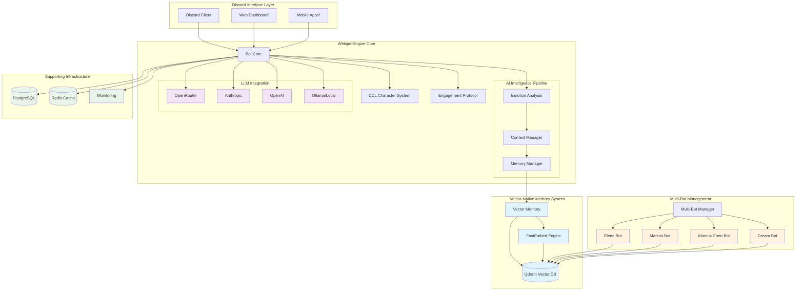

# 🎭 WhisperEngine

**Multi-bot Discord AI companion system with vector-native memory and advanced conversation intelligence**

[](https://opensource.org/licenses/MIT)
[](https://github.com/whisperengine-ai/whisperengine)

## 🧠 Advanced AI Companion Technology

**WhisperEngine demonstrates sophisticated emergent behaviors in AI companion interactions.** Our development focuses on creating engaging, memory-enabled AI companions that exhibit complex conversation patterns through advanced language modeling and character-based personality systems.

**🔬 Technical Highlights:**
- **Advanced Character Personalities** - Elena, Marcus, Ryan, Gabriel, and Sophia with distinct personality types using CDL
- **Memory-Enabled Conversations** - Vector-based memory systems creating conversation continuity
- **Emergent Behaviors** - Complex interaction patterns that create engaging user experiences
- **Character Definition Language** - Structured personality modeling for consistent AI characters
- **Responsible Development** - Transparent communication about AI capabilities and limitations

**[📖 View Technical Documentation →](docs/README.md)** | **[� Community Guidelines →](docs/community/DISCORD_WELCOME_GUIDE.md)**

### ⚠️ Important: What These AI Companions Really Are

These are **sophisticated language models with persistent memory**, not conscious beings. They exhibit complex emergent behaviors that can appear remarkably human-like, but they are computational systems, not sentient entities. We are committed to transparent, responsible AI development.

---

> ⚠️ **Alpha Development**: WhisperEngine is in active development. We're building features rapidly and testing with our community. Join our Discord to chat with our demo AIs and see the system in action!

Create engaging AI companions for various use cases - gaming buddies, creative collaborators, conversation partners, or study assistants. WhisperEngine's AI companions have **persistent memory**, **contextual responses**, and **customizable personalities** that create consistent, engaging interactions.

**🎮 Gaming Buddies** • **🎨 Creative Partners** • **� Conversation Companions** • **� Study Assistants** • **� Enterprise Applications**

### ⚠️ Important Understanding

These are **advanced language models with memory**, not conscious beings. They create engaging, consistent interactions through sophisticated programming, but they are computational systems designed to simulate conversation, not sentient entities.

## 🎯 Project Goals

WhisperEngine creates AI companions that provide engaging interactions through:

- **🧠 Persistent Memory**: Vector-based memory system that maintains conversation history and context
- **🎭 Character Personalities**: JSON-based Character Definition Language (CDL) for consistent, detailed personalities  
- **💭 Contextual Responses**: Advanced emotion detection and contextual response adaptation
- **🔄 Multi-Bot Architecture**: Single infrastructure supporting multiple character personalities simultaneously
- **🚀 Development Platform**: Docker-first development with comprehensive monitoring and error handling

## 🏗️ Architecture Overview

### System Architecture Diagram



### Simplified Architecture View

```
┌─────────────────────────────────────────────────────────────────┐
│                    WhisperEngine Architecture                   │
└─────────────────────────────────────────────────────────────────┘

┌─────────────────┐    ┌──────────────────┐    ┌─────────────────┐
│   Discord Bot   │    │   Web Dashboard  │    │  Mobile Apps*   │
│   Interface     │    │   (Coming Soon)  │    │  (Coming Soon)  │
└─────────┬───────┘    └────────┬─────────┘    └─────────┬───────┘
          │                     │                        │
          └─────────────────────┼────────────────────────┘
                               │
┌─────────────────────────────────────────────────────────────────┐
│                       Bot Core Engine                           │
│  ┌─────────────┐  ┌─────────────┐  ┌─────────────────────────┐  │
│  │   CDL       │  │  Emotion    │  │    Multi-Bot Manager    │  │
│  │ Character   │  │  Analysis   │  │                         │  │
│  │  System     │  │             │  │  Elena  Marcus  Dream   │  │
│  └─────────────┘  └─────────────┘  └─────────────────────────┘  │
└─────────────────────┬───────────────────────────────────────────┘
                     │
┌─────────────────────────────────────────────────────────────────┐
│                 Vector-Native Memory System                     │
│                                                                 │
│  ┌─────────────┐    ┌─────────────┐    ┌─────────────────────┐  │
│  │   Qdrant    │◄──►│  FastEmbed  │◄──►│   Vector Memory     │  │
│  │  Vector DB  │    │   Engine    │    │     Manager         │  │
│  │             │    │             │    │                     │  │
│  │ • Semantic  │    │ • Embedding │    │ • Context Retrieval │  │
│  │   Search    │    │   Generation│    │ • Memory Networks   │  │
│  │ • Similarity│    │ • Caching   │    │ • Emotional Context │  │
│  └─────────────┘    └─────────────┘    └─────────────────────┘  │
└─────────────────────┬───────────────────────────────────────────┘
                     │
┌─────────────────────────────────────────────────────────────────┐
│               Supporting Infrastructure                         │
│                                                                 │
│  ┌─────────────┐    ┌─────────────┐    ┌─────────────────────┐  │
│  │ PostgreSQL  │    │    Redis    │    │     Monitoring      │  │
│  │             │    │    Cache    │    │                     │  │
│  │ • User Data │    │             │    │ • Health Checks     │  │
│  │ • Config    │    │ • Sessions  │    │ • Performance       │  │
│  │ • Metadata  │    │ • Cache     │    │ • Analytics         │  │
│  └─────────────┘    └─────────────┘    └─────────────────────┘  │
└─────────────────────────────────────────────────────────────────┘

┌─────────────────────────────────────────────────────────────────┐
│                      LLM Providers                             │
│                                                                 │
│  ┌─────────────┐  ┌─────────────┐  ┌─────────────┐  ┌─────────┐ │
│  │  OpenRouter │  │  Anthropic  │  │   OpenAI    │  │ Ollama  │ │
│  │             │  │             │  │             │  │ (Local) │ │
│  │ • Multi-LLM │  │ • Claude    │  │ • GPT-4     │  │         │ │
│  │ • Routing   │  │ • Advanced  │  │ • Vision    │  │ • Local │ │
│  │ • Failover  │  │   Reasoning │  │ • Fast      │  │ • Private│ │
│  └─────────────┘  └─────────────┘  └─────────────┘  └─────────┘ │
└─────────────────────────────────────────────────────────────────┘
```

### Core Components

**Vector-Native Memory System**
- **Qdrant**: Primary vector database for semantic memory storage and intelligent retrieval
- **FastEmbed**: High-performance text embedding generation for conversation context
- **Semantic Search**: Advanced similarity matching for conversation continuity and emotional context
- **Multi-bot Intelligence**: Cross-character memory analysis and relationship tracking
- **Conversation History**: Vector-indexed conversation storage with emotional metadata

**Character Definition Language (CDL)**
- **JSON-based Personalities**: Structured character definitions replacing legacy markdown prompts
- **Dynamic Communication Styles**: Real-time adaptation with personality override capabilities
- **Character Categories**: Pre-built templates (warm, professional, creative, mystical, custom)
- **Author Control**: Custom instructions, introductions, and personality fine-tuning

**Multi-Bot Infrastructure** 
- **Shared Core**: Single infrastructure (PostgreSQL + Redis + Qdrant) supporting multiple personalities
- **Character Isolation**: Individual `.env.{bot-name}` configurations for personality separation
- **Dynamic Discovery**: Auto-generated Docker Compose with template-based scaling
- **Resource Efficiency**: Shared vector embeddings and memory optimizations across characters

**Production-Grade Systems**
- Comprehensive error handling with graceful degradation
- Health monitoring across all system components
- Performance optimization with intelligent caching
- Docker-first development with container orchestration

### Technology Stack

- **Backend**: Python with async/await patterns for concurrent operations
- **Vector Memory**: Qdrant (primary semantic storage) + FastEmbed (embedding generation)
- **Structured Data**: PostgreSQL (configuration, user data, structured metadata)
- **Caching Layer**: Redis (performance optimization, session management)
- **AI Integration**: OpenRouter, Anthropic, OpenAI with intelligent routing
- **Deployment**: Docker Compose with multi-bot orchestration and health monitoring
- **Testing**: Pytest with container-based integration and vector memory validation

### Data Flow Architecture

```
User Message → Discord Bot → CDL Character System → Emotion Analysis
     ↓                                                    ↓
Conversation Context ← Vector Memory Manager ← Context Manager
     ↓                      ↓                      ↓
FastEmbed Encoding → Qdrant Similarity Search → Memory Retrieval
     ↓                      ↓                      ↓
LLM Provider → Response Generation → Character Filtering → Discord Reply
     ↓                                                        ↓
Memory Storage ← Vector Embedding ← Emotional Context ← User Feedback
```

**Key Data Flow Steps:**
1. **Input Processing**: User message received via Discord interface
2. **Character Context**: CDL system applies personality and communication style
3. **Emotional Analysis**: Vector-based emotion detection and mood tracking
4. **Memory Retrieval**: Semantic search in Qdrant for relevant conversation history
5. **Context Assembly**: Combine current message, memories, and character data
6. **LLM Generation**: Send enriched context to chosen AI provider
7. **Response Filtering**: Apply character-specific voice and personality constraints
8. **Memory Storage**: Store conversation with emotional metadata as vector embeddings
9. **Delivery**: Send personalized response back through Discord interface

## ✨ AI Features That Set Us Apart

### Advanced Conversation Intelligence

**Vector-Native Emotional Intelligence**
- **Semantic Emotion Analysis**: Vector-based emotion detection using conversation embeddings
- **Contextual Mood Tracking**: Multi-dimensional emotional state modeling across conversation history
- **Adaptive Response Generation**: Personality-driven emotional response patterns
- **Empathetic Memory**: Vector-indexed emotional moments for authentic relationship building

**Memory-Triggered Moments**
- **Proactive Engagement**: Vector similarity-based conversation initiation from memory patterns
- **Long-term Continuity**: Semantic memory networks maintaining relationship context across time
- **Context Switch Detection**: Intelligent conversation flow management using vector analysis
- **Personality-Driven Recall**: Character-specific memory prioritization and retrieval patterns

**Character Personality System**
- Deep personality modeling with CDL (Character Definition Language)
- Consistent character voice and behavior patterns
- Author-controlled custom speaking instructions and introductions
- Multi-category personality templates with override capabilities

### Production-Ready Intelligence

**Advanced Conversation Intelligence**
- **Human-like Conversation Patterns**: Natural response timing and conversation flow management
- **Multi-thread Context Management**: Vector-based context switching across conversation threads
- **Semantic Emoji Intelligence**: Vector-powered emoji reactions based on conversation sentiment
- **Engagement Protocols**: Personality-driven interaction patterns and proactive conversation initiation

**Vector-Native Performance Optimization**
- **Concurrent Vector Operations**: Scatter-gather patterns for parallel memory retrieval and storage
- **Intelligent Embedding Caching**: Redis-based caching for frequently accessed embeddings
- **Optimized Similarity Search**: High-performance Qdrant queries with relevance scoring and filtering
- **Memory Efficiency**: Shared vector spaces across multiple bot personalities
- **Async Pipeline Processing**: Non-blocking conversation analysis and memory operations

## 🚀 Quick Start

### Try Our Demo AIs

Join our Discord server to chat with our demo characters:
- **Elena Rodriguez** - Marine biologist with warm, empathetic personality
- **Marcus Thompson** - AI researcher with academic, professional communication
- **Marcus Chen** - Game developer with creative, collaborative style  
- **Dream** - The Endless entity with mythological, profound expression

*[Discord invite link coming soon - we're in alpha testing!]*

### Local Development

```bash
# Clone and setup
git clone https://github.com/whisperengine-ai/whisperengine
cd whisperengine
source .venv/bin/activate

# Configure your bot
cp .env.template .env.yourbot
# Edit .env.yourbot with Discord token and character preferences

# Generate multi-bot configuration
python scripts/generate_multi_bot_config.py

# Start your bot
./multi-bot.sh start yourbot
```

### Docker Deployment

```bash
# Start all infrastructure
./multi-bot.sh start all

# View logs
./multi-bot.sh logs yourbot

# Monitor system health
./multi-bot.sh status
```

## 🎭 Character Authoring

Create your own AI personalities with our comprehensive Character Definition Language (CDL):

### 📚 **Character Creation Guides**
- **[CDL Specification](docs/characters/cdl-specification.md)** - Complete CDL syntax and structure
- **[CDL Implementation Guide](docs/characters/cdl-implementation.md)** - Step-by-step character creation
- **[Character Categories Reference](docs/characters/CHARACTER_CATEGORIES_QUICK_REFERENCE.md)** - Pre-built personality templates
- **[Communication Style Guide](docs/characters/CHARACTER_COMMUNICATION_STYLE_GUIDE.md)** - Voice and tone customization
- **[Character Design Language](docs/characters/CHARACTER_DESIGN_LANGUAGE_PROPOSAL.md)** - Advanced personality modeling

### ✨ **Character Features**
- **JSON-based personality definitions** - Structured, version-controlled character files
- **Custom speaking instructions** - Override default communication styles with your own voice
- **Emotional intelligence settings** - Configure empathy, humor, and personality traits  
- **Multi-category support** - Warm, professional, creative, mystical, and custom categories
- **Author-controlled introductions** - Personalized first-impression messages

### 🎨 **Example Characters**
Explore our demo characters to understand CDL capabilities:
- **Elena Rodriguez** (`characters/examples/elena-rodriguez.json`) - Marine biologist with empathetic warmth
- **Marcus Thompson** (`characters/examples/marcus-thompson.json`) - AI researcher with academic precision
- **Marcus Chen** (`characters/examples/marcus-chen.json`) - Game developer with creative enthusiasm
- **Dream** (`characters/examples/dream_of_the_endless.json`) - Mythological entity with profound wisdom

## 📚 Documentation

For detailed technical information, setup guides, and development documentation:

**[📖 Complete Documentation](docs/)**

### Key Documentation Files

- **[Quick Start Guide](docs/getting-started/QUICK_START.md)** - Step-by-step setup
- **[Character Creation Guide](docs/characters/cdl-specification.md)** - Build custom personalities
- **[Multi-Bot Setup](docs/multi-bot/MULTI_BOT_SETUP.md)** - Deploy multiple characters
- **[Development Guide](docs/development/DEVELOPMENT_GUIDE.md)** - Contribute to WhisperEngine
- **[Architecture Overview](docs/architecture/)** - System design and patterns
- **[Memory System](docs/ai-systems/MEMORY_SYSTEM_README.md)** - Vector memory deep dive
- **[Production Deployment](docs/deployment/DEPLOYMENT_MODES.md)** - Enterprise setup

## 🤝 Community & Contributing

WhisperEngine is open source under the MIT License. We welcome contributions:

- 🐛 **Bug Reports**: [GitHub Issues](https://github.com/whisperengine-ai/whisperengine/issues)
- 💬 **Discussions**: [GitHub Discussions](https://github.com/whisperengine-ai/whisperengine/discussions)
- 🔧 **Contributing**: See [docs/development/CONTRIBUTING.md](docs/development/CONTRIBUTING.md)
- 📖 **Documentation**: Help improve our guides and tutorials

### Development Status

WhisperEngine is actively developed with focus on:
- Advanced conversation intelligence and emotional understanding
- Production-ready deployment and monitoring systems
- Character personality system expansion and customization
- Multi-bot infrastructure scaling and optimization

---

**Ready to create your AI companion?** Check out our [Quick Start Guide](docs/getting-started/QUICK_START.md) or join our Discord to see WhisperEngine in action!

## 🚀 Choose Your Deployment Mode

### 🏠 **Local Mode (Maximum Privacy)** - Full Installation
**[📖 Local Setup Guide](docs/deployment/LOCAL_SETUP.md)**  
Complete local installation with Qdrant vector database, PostgreSQL, and Redis - full customization and privacy.

### ☁️ **Cloud Mode (Production Ready)** - Enterprise Setup  
```bash
git clone https://github.com/whisperengine-ai/whisperengine
cd whisperengine && ./setup.sh
python run.py  # Discord bot with vector-native memory
```

**[📖 Full Setup Guide](docs/getting-started/QUICK_START.md)** for detailed instructions

### 🐳 **Docker Deployment (Recommended)** - Vector-Native Container Setup
```bash
# Multi-bot environment with shared Qdrant + PostgreSQL + Redis
./multi-bot.sh start all

# Development environment  
docker-compose -f docker-compose.dev.yml up

# Production with monitoring
docker-compose -f docker-compose.prod.yml up
```

**[📖 Docker Deployment Guide](docs/deployment/DOCKER_HUB_SETUP.md)** for enterprise setup

### 🏡 **100% On-Premise (Total Independence)** - Self-Hosted Everything
Run WhisperEngine completely on your personal hardware with **zero external dependencies**:

**🤖 Host Your Own LLMs**
```bash
# Set up local LLM with Ollama (recommended)
curl -fsSL https://ollama.ai/install.sh | sh
ollama pull llama3.1:8b  # Or any model you prefer

# Configure WhisperEngine for local LLM
cp .env.template .env.local-ai
# Edit .env.local-ai:
# LLM_CLIENT_TYPE=ollama
# OLLAMA_BASE_URL=http://localhost:11434
# OLLAMA_MODEL=llama3.1:8b
```

**📥 Import Your ChatGPT History**
Seamlessly transition from ChatGPT to your private AI with full conversation history:
```bash
# Download your ChatGPT data export (conversations.json)
# Import directly into your local WhisperEngine
./bot.sh import-chatgpt ~/Downloads/conversations.json your_user_id

# All memories converted to vector embeddings in your local Qdrant
# Personality continuity maintained through conversation context
```

**🔒 Complete Privacy Stack**
- **Local LLMs**: Ollama, LM Studio, or custom models on your hardware
- **Local Vector Memory**: Qdrant running on your machine
- **Local Databases**: PostgreSQL and Redis on your infrastructure  
- **No External API Calls**: Everything runs within your network
- **Import & Export**: Full data portability from/to other AI platforms

**💻 Hardware Requirements**
- **Minimum**: 16GB RAM, modern CPU (for 7B parameter models)
- **Recommended**: 32GB+ RAM, RTX 4070+ GPU (for larger models with GPU acceleration)
- **Storage**: 50GB+ for models, databases, and conversation history

**[📖 Complete On-Premise Setup Guide](docs/deployment/ON_PREMISE_SETUP.md)** for full self-hosting instructions

## ⚙️ Configuration Made Simple

WhisperEngine now uses **focused, use-case-specific** configuration files instead of massive 800+ line examples:

| Configuration | Purpose | Lines | Use Case |
|---------------|---------|-------|----------|
| **Quick Start** | Get running in 5 minutes | 50 | New users, testing |
| **Development** | Full dev features | 180+ | Building, debugging |
| **Production** | Enterprise deployment | 150+ | Production servers |
| **Local AI** | Privacy-focused | 120+ | Offline, no external APIs |
| **Enterprise** | Advanced features | 200+ | Multi-entity, compliance |

**Quick Setup:**
```bash
# Choose your configuration
cp .env.elena.example .env.elena
# Edit Discord token and LLM API key
./multi-bot.sh start elena
```

**[📖 Full Configuration Guide](docs/configuration/)** for all setup options

---

## ✨ What Makes WhisperEngine Special

### 🧠 **Vector-Native Intelligence System**
Your AI companion leverages advanced vector technology for human-like intelligence:
- **Semantic Understanding** - Vector embeddings capture deep meaning and context from conversations
- **Emotional Intelligence** - Multi-dimensional emotion vectors for authentic empathy and response adaptation  
- **Persistent Memory Networks** - Qdrant vector database maintains relationship continuity across all interactions
- **Personality Coherence** - CDL-based character vectors ensure consistent personality expression

### 🎭 **Create Any Personality You Can Imagine**
- **Professional Assistant** - Focused, efficient, perfect for work tasks
- **Empathetic Friend** - Caring, supportive, great for emotional conversations
- **Creative Partner** - Imaginative, inspiring, ideal for brainstorming
- **Gaming Companion** - Fun, engaging, remembers your play style
- **Custom Characters** - Build anyone from scratch with our CDL personality engine

### 🔒 **Privacy You Can Trust**
- **🏠 Local Mode**: 100% private - AI runs on your machine with local vector storage, zero external connections
- **☁️ Cloud Mode**: Transparent data flow - conversations stored in your controlled Qdrant instance
- **Vector Encryption**: All memory embeddings can be encrypted at rest in your vector database
- **Open Source** - Full transparency, audit the code and vector operations yourself

### 💭 **Memory That Feels Human**
- **Vector-Based Relationships** - Semantic similarity builds deep understanding of your preferences and history
- **Emotional Context Vectors** - Multi-dimensional emotional state tracking across all conversations
- **🏠 Local**: Private vector memories stored only on your machine with Qdrant
- **☁️ Cloud**: Unified vector memory across Discord, Slack, Teams with your controlled infrastructure

---

## 🎯 Popular Use Cases

Whether you're looking for productivity, creativity, or companionship, WhisperEngine adapts to your needs:

### 💼 **Work & Productivity**
- **Personal Assistant** - Schedule management, email drafting, task planning
- **Code Companion** - Programming help, debugging, architecture discussions
- **Research Partner** - Information gathering, analysis, report writing

### 🎨 **Creativity & Entertainment**  
- **Writing Collaborator** - Story brainstorming, character development, editing
- **Game Master** - Interactive storytelling, character roleplay, world building
- **Creative Muse** - Art concepts, music ideas, creative problem solving

### 💙 **Personal & Emotional**
- **Supportive Friend** - Daily check-ins, emotional support, life advice
- **Learning Buddy** - Study sessions, exam prep, skill development
- **Therapeutic Companion** - Mindfulness, reflection, personal growth

### 🏢 **Business & Teams**
- **Customer Service** - Support automation with personality and context
- **Training Assistant** - Onboarding, skill development, knowledge transfer  
- **Brand Personality** - Consistent voice across all customer interactions

---

## 📚 **Learn More**

### 📖 **Quick References**
- **[📄 Complete Documentation](docs/)** - Full guides for every feature
- **[🚀 Quick Start Guide](docs/getting-started/QUICK_START.md)** - Step-by-step setup  
- **[🎭 Character Creation Guide](docs/characters/cdl-specification.md)** - Build unique personalities
- **[� Character Implementation](docs/characters/cdl-implementation.md)** - Hands-on character authoring
- **[�🔧 Developer Setup](docs/development/DEVELOPMENT_GUIDE.md)** - Customize and extend WhisperEngine

### 🏗️ **Advanced Features**
- **[🧠 Memory System](docs/ai-systems/MEMORY_SYSTEM_README.md)** - How AI remembers and learns
- **[🎯 Emotional Intelligence](docs/ai-systems/ADVANCED_EMOTIONAL_INTELLIGENCE.md)** - Understanding user emotions
- **[📊 Analytics Dashboard](docs/ai-systems/MEMORY_ANALYTICS_DASHBOARD.md)** - System monitoring and insights
- **[🌐 Cross-Platform Sync](docs/ai-systems/CROSS_PLATFORM_OPTIMIZATION.md)** - Unified experience across devices

### 🛠️ **For Developers**
- **[⚙️ API Configuration](docs/configuration/API_KEY_CONFIGURATION.md)** - LLM provider setup
- **[🐳 Docker Deployment](docs/deployment/DOCKER_HUB_SETUP.md)** - Production deployment
- **[🧪 Testing Guide](docs/testing/TESTING_GUIDE.md)** - Validation and testing
- **[🔧 Development Guide](docs/development/DEVELOPMENT_GUIDE.md)** - Development setup and contribution guide

---

---

## 📊 **Production Monitoring & Operations**

WhisperEngine includes comprehensive monitoring for production deployments:

### 🏥 **Health Monitoring**
Real-time system health monitoring across all critical components:
```bash
# Discord Admin Commands
!health          # System health overview
!health detailed  # Component-by-component analysis
!errors          # Recent error analysis
!engagement      # User interaction metrics
```

**Monitored Components:**
- System Resources (CPU, Memory, Disk, GPU if available)
- LLM Service Connectivity & Performance
- **Qdrant Vector Database**: Query performance, index health, memory usage
- **PostgreSQL**: Connection health, query performance, data integrity
- **Redis Cache**: Hit rates, memory usage, connection stability
- **Vector Memory Operations**: Embedding generation, similarity search performance
- Discord Bot Status & Latency

### 📈 **Analytics Dashboard**
Optional web dashboard for real-time monitoring:
```bash
# Access at http://localhost:8080/dashboard (when enabled)
!dashboard       # Get dashboard URL and access token
```

**Dashboard Features:**
- Real-time system metrics with live graphs
- **Vector Database Performance**: Qdrant query latency, index status, memory usage
- **Embedding Pipeline Monitoring**: FastEmbed performance, generation rates, cache efficiency
- User engagement analytics with conversation pattern analysis
- Performance trends and alerts for vector operations
- Component health visualization across the three-tier architecture (Qdrant + PostgreSQL + Redis)

### 🚨 **Intelligent Error Tracking**
Automatic error categorization and pattern detection:
- **Smart Categorization** - AI, System, User, Network error types
- **Pattern Detection** - Identifies recurring issues automatically
- **Severity Analysis** - Auto-prioritizes critical vs routine errors
- **Resolution Tracking** - Monitors fix success rates

**[📖 Monitoring Setup Guide](docs/operations/MONITORING.md)** for detailed configuration

### 🔐 **Supply Chain Security**
WhisperEngine provides enterprise-grade supply chain security for production deployments:

#### Software Bill of Materials (SBOM)
Every release includes comprehensive SBOM artifacts for compliance and security auditing:
```bash
# Download SBOM for any release
wget https://github.com/whisperengine-ai/whisperengine/releases/download/v1.0.0/sbom-latest.spdx.json

# View dependencies and licenses
cat sbom-latest.spdx.json | jq '.packages[] | {name: .name, version: .versionInfo, license: .licenseConcluded}'
```

#### Multi-Registry Container Distribution
Containers are published to multiple registries for redundancy and access:
- **Docker Hub**: `docker.io/whisperengine/whisperengine:latest`
- **GitHub Container Registry**: `ghcr.io/whisperengine-ai/whisperengine:latest`
- **Custom Registry Support**: Configure your own registry endpoints

#### Security Attestations
All container images include:
- **Digital Signatures** - Cosign-signed containers for authenticity verification
- **Provenance Metadata** - Build environment and source code attestations
- **Vulnerability Scanning** - Automated security scanning with detailed reports

```bash
# Verify container signature (requires cosign)
cosign verify --certificate-identity-regexp=".*@github.com" \
  --certificate-oidc-issuer="https://token.actions.githubusercontent.com" \
  whisperengine/whisperengine:latest
```

**[📖 Supply Chain Security Guide](docs/security/SUPPLY_CHAIN.md)** for enterprise compliance setup

---

## 🗺️ **Roadmap & Coming Soon**

### 🚀 **Next Major Release - v0.9.0 (Q4 2025)**

**Vision & Mobile Revolution**
- **📱 Mobile Applications**: Native iOS and Android apps for seamless AI companion access
- **🎙️ Real-Time Voice Chat**: WebRTC-based voice conversations with your AI companions
- **👁️ Advanced Vision Processing**: Improved image understanding with contamination-free responses
- **🎨 Enhanced Character Consistency**: More stable personality expression across all interactions

### 🌟 **v1.0.0 Stable Release (Q1 2026)**

**Production-Ready Platform**
- **📚 Complete API Documentation**: Full developer resources and integration guides
- **🧪 Comprehensive Testing**: 90+ test coverage for enterprise reliability
- **📱 App Store Launch**: WhisperEngine mobile apps available on iOS and Android stores
- **🎯 Zero Critical Bugs**: Production-grade stability and performance

### 🎯 **Beyond 1.0 - Revolutionary Features (2026)**

**🥽 Augmented Reality Companions (Feb-Apr 2026)**
- **AR Visualization**: See your AI companions in your physical space using ARCore/ARKit
- **Spatial Audio**: Realistic 3D audio for true companion presence
- **Real-World Context**: Companions that understand and discuss your physical environment
- **Gesture Interaction**: Control conversations through natural hand gestures

**👥 Companion Social Networks (Mar-May 2026)**
- **Multi-Companion Interactions**: Group conversations with multiple AI personalities
- **Companion Relationships**: Your AI friends develop relationships with each other
- **Shared Experiences**: Community events and collaborative storytelling
- **Cross-User Connections**: Discover companions created by other users

**🎨 Advanced Creative Collaboration (Apr-Jun 2026)**
- **Creative Project Management**: AI assistants for complex creative workflows
- **Multi-Modal Creation**: Generate art, music, writing, and video together
- **Workflow Integration**: Seamless connection with creative tools and platforms

### 🌐 **Web-Based Character Studio (Coming Soon)**

**Browser-Based Character Creation & Management**
- **🎭 Visual Character Designer**: Drag-and-drop personality creation with real-time preview
- **📊 Analytics Dashboard**: Track your AI companion's conversation patterns and emotional growth
- **🔧 Advanced Configuration**: Fine-tune personality parameters through intuitive web interface
- **👥 Character Sharing**: Publish and discover community-created characters
- **📱 Mobile-First Design**: Responsive interface for managing companions on any device

**Dashboard Features Preview:**
- Real-time conversation analytics and emotional intelligence metrics
- Memory network visualization showing relationship building over time
- Vector similarity analysis for personality consistency monitoring
- Cross-platform sync for seamless Discord, mobile, and web experiences

**[📖 Complete Roadmap](docs/roadmap/ROADMAP.md)** | **[🎯 Vision Pipeline Details](docs/roadmap/VISION_PIPELINE_ROADMAP.md)**

---

## 🤝 **Community & Support**

### **Getting Help**
- **📖 [Complete Documentation](docs/)** - Comprehensive guides and tutorials
- **🐛 [Report Issues](https://github.com/whisperengine-ai/whisperengine/issues)** - Bug reports and feature requests  
- **💬 [Discussions](https://github.com/whisperengine-ai/whisperengine/discussions)** - Community chat and support
- **🔧 [Contributing Guide](docs/development/CONTRIBUTING.md)** - Help improve WhisperEngine

### **What People Are Building**
- **Educational Tutors** - Personalized learning companions for students
- **Mental Health Support** - Emotional wellness and mindfulness assistants  
- **Creative Writers** - AI collaborators for novels, screenplays, and poetry
- **Customer Service** - Brand-consistent support agents for businesses
- **Gaming NPCs** - Memorable characters for interactive fiction and games

### **Join the WhisperEngine Community**
Whether you're building your first AI companion or deploying enterprise-scale personalities, our community is here to help you succeed.

---

## 📄 **License & Contributing**

WhisperEngine is open source under the **[MIT License](LICENSE)** - you're free to use, modify, and distribute it however you like.

**Want to contribute?** We welcome:
- 🐛 Bug fixes and improvements  
- ✨ New personality templates
- 📚 Documentation enhancements
- 🔧 Feature development
- 🧪 Testing and validation

See our **[Contributing Guide](docs/development/CONTRIBUTING.md)** to get started!

---

**Ready to create your first AI companion?** 

🚀 **[Get Started Now](docs/getting-started/QUICK_START.md)** and bring your digital personality to life!