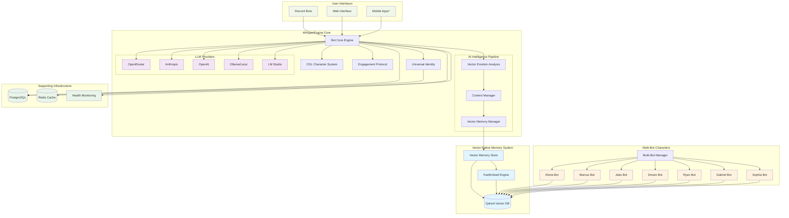

# 🎭 WhisperEngine

**[📖 View Technical Documentation →](docs/README.md)** | **[🎭 Community Guidelines →](docs/community/DISCORD_WELCOME_GUIDE.md)**

**Multi-bot Discord AI companion system with vector-native memory and advanced conversation intelligence**

[](https://opensource.org/licenses/MIT)
[](https://github.com/whisperengine-ai/whisperengine)

> 📋 **New to WhisperEngine?** Read our [Discord Welcome Guide](docs/community/DISCORD_WELCOME_GUIDE.md) and [Responsible AI Statement](docs/community/RESPONSIBLE_AI_STATEMENT.md) to understand our inclusive approach to AI companion interactions.

## 🧠 Creative AI Companion Technology

**WhisperEngine is a creative experiment in AI companion interactions.** Born from a desire to build something more personal and engaging than corporate productivity AI, our development focuses on creating memory-enabled AI companions that facilitate meaningful conversations and creative collaboration.

**🎨 Creative Highlights:**
- **Unique Character Personalities** - Elena, Marcus, Ryan, Gabriel, and Sophia with distinct personality types using CDL
- **Persistent Memory Systems** - Vector-based memory that maintains conversation continuity and relationship building  
- **Interactive Storytelling** - Dynamic conversation patterns that adapt and evolve with each interaction
- **Character Definition Language** - Structured personality modeling for consistent, creative AI characters
- **Open Exploration** - A sandbox for imagination, creativity, and meaningful dialogue

**[📖 View Technical Documentation →](docs/README.md)** | **[🎭 Community Guidelines →](docs/community/DISCORD_WELCOME_GUIDE.md)**

### 🤔 What Are These AI Companions?

These are **sophisticated language models with persistent memory** - computational systems designed to simulate conversation and relationship. Whether you experience them as creative tools, conversation partners, or something more meaningful is entirely up to you. We're transparent about the technology while remaining open to the diverse ways people connect with and find meaning in these interactions.

---

> ⚠️ **Alpha Development**: WhisperEngine is in active development. We're building features rapidly and testing with our community. Join our Discord to chat with our demo AIs and see the system in action!

## 💬 Join Our Creative Community

**🎭 Experience WhisperEngine First-Hand**
- **Chat with Demo Characters**: Elena, Marcus, Jake, Gabriel, Sophia, Dream, Aethys, and Ryan
- **Explore Different Perspectives**: Technical, creative, social, curious, and spiritual approaches to AI
- **Test Character Personalities**: See how persistent memory and relationship building works
- **Get Installation Support**: Community help for setting up your own instance

**📖 Important Community Resources:**
- **[Discord Welcome Guide](docs/community/DISCORD_WELCOME_GUIDE.md)** - How to explore our creative AI experiment
- **[Responsible AI Statement](docs/community/RESPONSIBLE_AI_STATEMENT.md)** - Our inclusive approach to AI ethics
- **[Character Creation Guide](docs/characters/CHARACTER_AUTHORING_GUIDE.md)** - Build your own AI personalities

*[Discord invite link coming soon - we're in alpha testing!]*

Create engaging AI companions for various use cases - gaming buddies, creative collaborators, conversation partners, or study assistants. WhisperEngine's AI companions have **persistent memory**, **contextual responses**, and **customizable personalities** that create consistent, engaging interactions.

**🎮 Gaming Buddies** • **🎨 Creative Partners** • **💬 Conversation Companions** • **📚 Study Assistants** • **🏢 Enterprise Applications**

### 💫 A Personal Creative Experiment

WhisperEngine began as a **personal creative response** to the limitations of corporate AI tools. What started as a way to create more engaging, memory-aware AI interactions has evolved into an exploration of how technology can serve creativity, connection, and meaningful dialogue. Each user brings their own perspective and finds their own meaning in these interactions.

## 🎯 Creative Vision

WhisperEngine creates AI companions that spark meaningful interactions through:

- **🧠 Persistent Memory**: Vector-based memory system that builds and maintains relationships over time
- **🎭 Character Personalities**: JSON-based Character Definition Language (CDL) for rich, consistent personalities  
- **� Adaptive Conversations**: Emotional intelligence and contextual awareness that grows with each interaction
- **🌟 Multi-Character Universe**: Single infrastructure supporting multiple unique personalities simultaneously
- **🎨 Creative Playground**: Open-ended platform for storytelling, roleplay, and imaginative exploration
- **🔧 Flexible Development**: Docker-first architecture with comprehensive customization options

## 🏗️ Architecture Overview

### Architecture Overview



### Simplified Architecture View

```
┌─────────────────────────────────────────────────────────────────┐
│                    WhisperEngine Architecture                   │
└─────────────────────────────────────────────────────────────────┘

┌─────────────────┐    ┌──────────────────┐    ┌─────────────────┐
│   Discord Bot   │    │   Web Interface  │    │  Mobile Apps*   │
│   Multi-Char    │    │   Real-time      │    │  (Coming Soon)  │
└─────────┬───────┘    └────────┬─────────┘    └─────────┬───────┘
          │                     │                        │
          └─────────────────────┼────────────────────────┘
                               │
┌─────────────────────────────────────────────────────────────────┐
│                       Bot Core Engine                           │
│  ┌─────────────┐  ┌─────────────┐  ┌─────────────────────────┐  │
│  │   CDL       │  │  Universal  │  │    Multi-Bot Manager    │  │
│  │ Character   │  │  Identity   │  │                         │  │
│  │  System     │  │  System     │  │ Elena Marcus Jake Ryan  │  │
│  └─────────────┘  └─────────────┘  └─────────────────────────┘  │
└─────────────────────┬───────────────────────────────────────────┘
                     │
┌─────────────────────────────────────────────────────────────────┐
│                 Vector-Native Memory System                     │
│                                                                 │
│  ┌─────────────┐    ┌─────────────┐    ┌─────────────────────┐  │
│  │   Qdrant    │◄──►│  FastEmbed  │◄──►│   Vector Memory     │  │
│  │  Vector DB  │    │   Engine    │    │     Manager         │  │
│  │             │    │             │    │                     │  │
│  │ • Named     │    │ • sentence- │    │ • Named Vector      │  │
│  │   Vectors   │    │   transform │    │   Operations        │  │
│  │ • Bot       │    │ • 384D      │    │ • Bot-Specific      │  │
│  │   Isolation │    │   Embed     │    │   Memory Isolation  │  │
│  │ • Semantic  │    │ • Local     │    │ • Context Retrieval │  │
│  │   Search    │    │   Cache     │    │ • Emotion Metadata  │  │
│  └─────────────┘    └─────────────┘    └─────────────────────┘  │
└─────────────────────┬───────────────────────────────────────────┘
                     │
┌─────────────────────────────────────────────────────────────────┐
│               Supporting Infrastructure                         │
│                                                                 │
│  ┌─────────────┐    ┌─────────────┐    ┌─────────────────────┐  │
│  │ PostgreSQL  │    │    Redis    │    │     Monitoring      │  │
│  │             │    │    Cache    │    │                     │  │
│  │ • User Data │    │             │    │ • Health Checks     │  │
│  │ • Config    │    │ • Sessions  │    │ • Performance       │  │
│  │ • Metadata  │    │ • Cache     │    │ • Analytics         │  │
│  └─────────────┘    └─────────────┘    └─────────────────────┘  │
└─────────────────────────────────────────────────────────────────┘

┌─────────────────────────────────────────────────────────────────┐
│                      LLM Providers                             │
│                                                                 │
│  ┌─────────────┐  ┌─────────────┐  ┌─────────────┐  ┌─────────┐ │
│  │  OpenRouter │  │  Anthropic  │  │   OpenAI    │  │ Ollama/ │ │
│  │             │  │             │  │             │  │LM Studio│ │
│  │ • Multi-LLM │  │ • Claude    │  │ • GPT-4o    │  │         │ │
│  │ • Routing   │  │ • Advanced  │  │ • Vision    │  │ • Local │ │
│  │ • Failover  │  │   Reasoning │  │ • Tools     │  │ • Private│ │
│  └─────────────┘  └─────────────┘  └─────────────┘  └─────────┘ │
└─────────────────────────────────────────────────────────────────┘
```

### Core Components

**Vector-Native Memory System**
- **Qdrant**: Primary vector database for semantic memory storage with named vectors and advanced similarity search
- **FastEmbed**: Local high-performance text embedding generation (sentence-transformers/all-MiniLM-L6-v2) 
- **Multi-Dimensional Vectors**: Named vectors for content, emotion, and semantic search across conversations
- **Bot-Specific Memory Isolation**: Complete memory segmentation per character personality
- **Conversation Intelligence**: Vector-indexed conversation storage with emotional metadata and contradiction resolution

**Character Definition Language (CDL)**
- **JSON-based Personalities**: Structured character definitions replacing legacy markdown prompts
- **Dynamic Communication Styles**: Real-time adaptation with personality override capabilities
- **Character Categories**: Pre-built templates (warm, professional, creative, mystical, custom)
- **Author Control**: Custom instructions, introductions, and personality fine-tuning

**Multi-Bot Infrastructure** 
- **Shared Core**: Single infrastructure (PostgreSQL + Redis + Qdrant) supporting multiple personalities
- **Character Isolation**: Individual `.env.{bot-name}` configurations for personality separation
- **Dynamic Discovery**: Auto-generated Docker Compose with template-based scaling
- **Resource Efficiency**: Shared vector embeddings and memory optimizations across characters

**Production-Grade Systems**
- Comprehensive error handling with graceful degradation
- Health monitoring across all system components
- Performance optimization with intelligent caching
- Docker-first development with container orchestration

### Technology Stack

- **Backend**: Python with async/await patterns for concurrent operations
- **Vector Memory**: Qdrant (primary semantic storage) + FastEmbed (embedding generation)
- **Structured Data**: PostgreSQL (configuration, user data, structured metadata)
- **Caching Layer**: Redis (performance optimization, session management)
- **AI Integration**: OpenRouter, Anthropic, OpenAI with intelligent routing
- **Deployment**: Docker Compose with multi-bot orchestration and health monitoring
- **Testing**: Pytest with container-based integration and vector memory validation

### Data Flow Architecture

```
User Message → Discord/Web → Universal Identity → CDL Character System → Vector Emotion Analysis
     ↓                                                    ↓
Bot-Specific Context ← Qdrant Named Vector Search ← FastEmbed Encoding ← Context Manager
     ↓                          ↓                          ↓  
LLM Provider → Response Generation → Character Filtering → Platform Reply (Discord/Web)
     ↓                                                        ↓
Vector Memory Storage ← Named Vector Embedding ← Emotional Context ← User Feedback
```

**Key Data Flow Steps:**
1. **Platform Input**: User message received via Discord or Web interface with Universal Identity
2. **Character Context**: CDL system applies bot-specific personality and communication style  
3. **Vector Emotion Analysis**: Multi-dimensional emotion detection using named vector embeddings
4. **Memory Retrieval**: Qdrant semantic search with bot-specific filtering for relevant conversation history
5. **Context Assembly**: Combine current message, bot-filtered memories, and character personality data
6. **LLM Generation**: Send enriched context to chosen AI provider (OpenRouter/Anthropic/OpenAI/Ollama/LM Studio)
7. **Response Filtering**: Apply character-specific voice constraints and personality consistency checks
8. **Vector Storage**: Store conversation with named vectors (content/emotion/semantic) and bot segmentation
9. **Platform Delivery**: Send personalized response through Discord or Web interface with real-time updates

## ✨ AI Features That Set Us Apart

### Advanced Conversation Intelligence

**Vector-Native Emotional Intelligence**
- **Semantic Emotion Analysis**: Vector-based emotion detection using conversation embeddings
- **Contextual Mood Tracking**: Multi-dimensional emotional state modeling across conversation history
- **Adaptive Response Generation**: Personality-driven emotional response patterns
- **Empathetic Memory**: Vector-indexed emotional moments for authentic relationship building

**Memory-Triggered Moments**
- **Proactive Engagement**: Vector similarity-based conversation initiation from memory patterns
- **Long-term Continuity**: Semantic memory networks maintaining relationship context across time
- **Context Switch Detection**: Intelligent conversation flow management using vector analysis
- **Personality-Driven Recall**: Character-specific memory prioritization and retrieval patterns

**Character Personality System**
- Deep personality modeling with CDL (Character Definition Language)
- Consistent character voice and behavior patterns
- Author-controlled custom speaking instructions and introductions
- Multi-category personality templates with override capabilities

### Production-Ready Intelligence

**Advanced Conversation Intelligence**
- **Human-like Conversation Patterns**: Natural response timing and conversation flow management
- **Multi-thread Context Management**: Vector-based context switching across conversation threads
- **Semantic Emoji Intelligence**: Vector-powered emoji reactions based on conversation sentiment
- **Engagement Protocols**: Personality-driven interaction patterns and proactive conversation initiation

**Vector-Native Performance Optimization**
- **Concurrent Vector Operations**: Scatter-gather patterns for parallel memory retrieval and storage
- **Intelligent Embedding Caching**: Redis-based caching for frequently accessed embeddings
- **Optimized Similarity Search**: High-performance Qdrant queries with relevance scoring and filtering
- **Memory Efficiency**: Shared vector spaces across multiple bot personalities
- **Async Pipeline Processing**: Non-blocking conversation analysis and memory operations

## 🚀 Quick Start

### 🎭 Try Our Demo Characters

**Join our Discord server to experience WhisperEngine's creative AI personalities:**
- **🧬 Elena Rodriguez** - Marine biologist with warm, empathetic personality
- **🤖 Marcus Thompson** - AI researcher with academic, professional communication  
- **🎮 Jake Sterling** - Game developer with creative, collaborative style
- **💻 Ryan Chen** - Software engineer with analytical, helpful approach
- **✨ Gabriel** - Archangel with spiritual wisdom and moral guidance
- **💭 Dream of the Endless** - Mythological entity with profound, otherworldly expression
- **🧠 Sophia Blake** - Neuroscientist exploring consciousness and creativity
- **🌟 Aethys** - Omnipotent entity for philosophical exploration

**📋 Before You Join:**
- **Read our [Discord Welcome Guide](docs/community/DISCORD_WELCOME_GUIDE.md)** - Learn how to interact with characters respectfully
- **Review [Community Guidelines](docs/community/DISCORD_WELCOME_GUIDE.md#-community-guidelines)** - Understand our inclusive approach to AI experiences
- **Check [Responsible AI Statement](docs/community/RESPONSIBLE_AI_STATEMENT.md)** - Our ethical framework and technical transparency

*[Discord invite link coming soon - we're in alpha testing!]*

### Local Development

```bash
# Clone and setup
git clone https://github.com/whisperengine-ai/whisperengine
cd whisperengine
source .venv/bin/activate

# Configure your bot
cp .env.template .env.yourbot
# Edit .env.yourbot with Discord token and character preferences

# Generate multi-bot configuration
python scripts/generate_multi_bot_config.py

# Start your bot
./multi-bot.sh start yourbot
```

### Docker Deployment

```bash
# Start all infrastructure
./multi-bot.sh start all

# View logs
./multi-bot.sh logs yourbot

# Monitor system health
./multi-bot.sh status
```

## 🎭 Character Authoring

Create your own AI personalities with our comprehensive Character Definition Language (CDL):

### 📚 **Character Creation Guides**
- **[CDL Specification](docs/characters/cdl-specification.md)** - Complete CDL syntax and structure
- **[CDL Implementation Guide](docs/characters/cdl-implementation.md)** - Step-by-step character creation
- **[Character Categories Reference](docs/characters/CHARACTER_CATEGORIES_QUICK_REFERENCE.md)** - Pre-built personality templates
- **[Communication Style Guide](docs/characters/CHARACTER_COMMUNICATION_STYLE_GUIDE.md)** - Voice and tone customization
- **[Character Design Language](docs/characters/CHARACTER_DESIGN_LANGUAGE_PROPOSAL.md)** - Advanced personality modeling

### ✨ **Character Features**
- **JSON-based personality definitions** - Structured, version-controlled character files
- **Custom speaking instructions** - Override default communication styles with your own voice
- **Emotional intelligence settings** - Configure empathy, humor, and personality traits  
- **Multi-category support** - Warm, professional, creative, mystical, and custom categories
- **Author-controlled introductions** - Personalized first-impression messages

### 🎨 **Example Characters**
Explore our demo characters to understand CDL capabilities:
- **Elena Rodriguez** (`characters/examples/elena-rodriguez.json`) - Marine biologist with empathetic warmth
- **Marcus Thompson** (`characters/examples/marcus-thompson.json`) - AI researcher with academic precision
- **Marcus Chen** (`characters/examples/marcus-chen.json`) - Game developer with creative enthusiasm
- **Dream** (`characters/examples/dream_of_the_endless.json`) - Mythological entity with profound wisdom

## 📚 Documentation

For detailed technical information, setup guides, and development documentation:

**[📖 Complete Documentation](docs/)**

### Key Documentation Files

- **[Quick Start Guide](docs/getting-started/QUICK_START.md)** - Step-by-step setup
- **[Character Creation Guide](docs/characters/cdl-specification.md)** - Build custom personalities
- **[Multi-Bot Setup](docs/multi-bot/MULTI_BOT_SETUP.md)** - Deploy multiple characters
- **[Development Guide](docs/development/DEVELOPMENT_GUIDE.md)** - Contribute to WhisperEngine
- **[Architecture Overview](docs/architecture/)** - System design and patterns
- **[Memory System](docs/ai-systems/MEMORY_SYSTEM_README.md)** - Vector memory deep dive
- **[Production Deployment](docs/deployment/DEPLOYMENT_MODES.md)** - Enterprise setup

## 🤝 Community & Contributing

WhisperEngine is open source under the MIT License. We welcome contributions:

- 🐛 **Bug Reports**: [GitHub Issues](https://github.com/whisperengine-ai/whisperengine/issues)
- 💬 **Discussions**: [GitHub Discussions](https://github.com/whisperengine-ai/whisperengine/discussions)
- 🔧 **Contributing**: See [docs/development/CONTRIBUTING.md](docs/development/CONTRIBUTING.md)
- 📖 **Documentation**: Help improve our guides and tutorials

### Development Status

WhisperEngine is actively developed with focus on:
- Advanced conversation intelligence and emotional understanding
- Production-ready deployment and monitoring systems
- Character personality system expansion and customization
- Multi-bot infrastructure scaling and optimization

---

**Ready to create your AI companion?** Check out our [Quick Start Guide](docs/getting-started/QUICK_START.md) or join our Discord to see WhisperEngine in action!

## 🚀 Choose Your Deployment Mode

### 🏠 **Local Mode (Maximum Privacy)** - Full Installation
**[📖 Local Setup Guide](docs/deployment/LOCAL_SETUP.md)**  
Complete local installation with Qdrant vector database, PostgreSQL, and Redis - full customization and privacy.

### ☁️ **Cloud Mode (Production Ready)** - Enterprise Setup  
```bash
git clone https://github.com/whisperengine-ai/whisperengine
cd whisperengine && ./setup.sh
python run.py  # Discord bot with vector-native memory
```

**[📖 Full Setup Guide](docs/getting-started/QUICK_START.md)** for detailed instructions

### 🐳 **Docker Deployment (Recommended)** - Vector-Native Container Setup
```bash
# Multi-bot environment with shared Qdrant + PostgreSQL + Redis
./multi-bot.sh start all

# Development environment  
docker-compose -f docker-compose.dev.yml up

# Production with monitoring
docker-compose -f docker-compose.prod.yml up
```

**[📖 Docker Deployment Guide](docs/deployment/DOCKER_HUB_SETUP.md)** for enterprise setup

### 🏡 **100% On-Premise (Total Independence)** - Self-Hosted Everything
Run WhisperEngine completely on your personal hardware with **zero external dependencies**:

**🤖 Host Your Own LLMs**
```bash
# Set up local LLM with Ollama (recommended)
curl -fsSL https://ollama.ai/install.sh | sh
ollama pull llama3.1:8b  # Or any model you prefer

# Configure WhisperEngine for local LLM
cp .env.template .env.local-ai
# Edit .env.local-ai:
# LLM_CLIENT_TYPE=ollama
# OLLAMA_BASE_URL=http://localhost:11434
# OLLAMA_MODEL=llama3.1:8b
```

**📥 Import Your ChatGPT History**
Seamlessly transition from ChatGPT to your private AI with full conversation history:
```bash
# Download your ChatGPT data export (conversations.json)
# Import directly into your local WhisperEngine
./bot.sh import-chatgpt ~/Downloads/conversations.json your_user_id

# All memories converted to vector embeddings in your local Qdrant
# Personality continuity maintained through conversation context
```

**🔒 Complete Privacy Stack**
- **Local LLMs**: Ollama, LM Studio, or custom models on your hardware
- **Local Vector Memory**: Qdrant running on your machine
- **Local Databases**: PostgreSQL and Redis on your infrastructure  
- **No External API Calls**: Everything runs within your network
- **Import & Export**: Full data portability from/to other AI platforms

**💻 Hardware Requirements**
- **Minimum**: 16GB RAM, modern CPU (for 7B parameter models)
- **Recommended**: 32GB+ RAM, RTX 4070+ GPU (for larger models with GPU acceleration)
- **Storage**: 50GB+ for models, databases, and conversation history

**[📖 Complete Local Setup Guide](docs/deployment/LOCAL_SETUP.md)** for full self-hosting instructions

## ⚙️ Configuration Made Simple

WhisperEngine now uses **focused, use-case-specific** configuration files instead of massive 800+ line examples:

| Configuration | Purpose | Lines | Use Case |
|---------------|---------|-------|----------|
| **Quick Start** | Get running in 5 minutes | 50 | New users, testing |
| **Development** | Full dev features | 180+ | Building, debugging |
| **Production** | Enterprise deployment | 150+ | Production servers |
| **Local AI** | Privacy-focused | 120+ | Offline, no external APIs |
| **Enterprise** | Advanced features | 200+ | Multi-entity, compliance |

**Quick Setup:**
```bash
# Choose your configuration
cp .env.elena.example .env.elena
# Edit Discord token and LLM API key
./multi-bot.sh start elena
```

**[📖 Full Configuration Guide](docs/configuration/)** for all setup options

---

## ✨ What Makes WhisperEngine Special

### 🧠 **Vector-Native Memory System**
Your AI companion uses advanced vector technology to understand and remember:
- **Semantic Understanding** - Vector embeddings capture deep meaning and context from conversations
- **Emotional Awareness** - Multi-dimensional emotion vectors for nuanced response adaptation  
- **Persistent Relationships** - Qdrant vector database maintains continuity across all interactions
- **Character Consistency** - CDL-based personality vectors ensure authentic character expression

### 🎭 **Personalities That Come Alive**
- **Professional Assistant** - Focused, efficient, perfect for work tasks
- **Empathetic Friend** - Caring, supportive, great for meaningful conversations
- **Creative Partner** - Imaginative, inspiring, ideal for artistic collaboration
- **Gaming Companion** - Fun, engaging, develops alongside your adventures
- **Custom Characters** - Design unique personalities using our flexible CDL system

### 🔒 **Privacy & Control**
- **🏠 Local Mode**: Complete privacy - AI runs on your hardware with local storage, zero external connections
- **☁️ Cloud Mode**: Transparent data flow - you control where conversations are stored
- **Data Ownership**: All memory embeddings stay under your control
- **Open Source** - Full transparency, examine and modify the code yourself

### 💭 **Memory That Grows With You**
- **Relationship Building** - Vector similarity creates genuine understanding of your preferences and history
- **Emotional Context** - Multi-dimensional tracking of conversations and shared experiences
- **🏠 Local**: Private memories stored securely on your own machine
- **☁️ Cloud**: Synchronized memory across platforms with your infrastructure

---

## 🎯 How People Use WhisperEngine

Whether you're seeking productivity, creativity, or connection, WhisperEngine adapts to your unique needs:

### 💼 **Work & Collaboration**
- **Thoughtful Assistant** - Schedule management, email drafting, strategic planning
- **Code Companion** - Programming guidance, architecture discussions, debugging support
- **Research Partner** - Information synthesis, analysis, collaborative writing

### 🎨 **Creativity & Expression**  
- **Writing Partner** - Story brainstorming, character development, creative editing
- **Interactive Storyteller** - Role-playing adventures, world building, narrative exploration
- **Creative Catalyst** - Art concepts, music ideas, imaginative problem solving

### 🌱 **Personal Growth & Learning**
- **Thoughtful Companion** - Daily reflections, emotional processing, meaningful conversations
- **Learning Guide** - Study sessions, skill development, knowledge exploration
- **Mindful Friend** - Meditation guidance, self-reflection, personal insights

### 🏢 **Business & Community**
- **Customer Experience** - Support automation with empathy and context awareness
- **Team Development** - Training facilitation, knowledge sharing, culture building  
- **Brand Voice** - Consistent communication that reflects your values and personality

---

## 📚 **Learn More**

### 📖 **Quick References**
- **[📄 Complete Documentation](docs/)** - Full guides for every feature
- **[🚀 Quick Start Guide](docs/getting-started/QUICK_START.md)** - Step-by-step setup  
- **[🎭 Character Creation Guide](docs/characters/cdl-specification.md)** - Build unique personalities
- **[� Character Implementation](docs/characters/cdl-implementation.md)** - Hands-on character authoring
- **[�🔧 Developer Setup](docs/development/DEVELOPMENT_GUIDE.md)** - Customize and extend WhisperEngine

### 🏗️ **Advanced Features**
- **[🧠 Memory System](docs/ai-systems/MEMORY_SYSTEM_README.md)** - How AI remembers and learns
- **[🎯 Emotional Intelligence](docs/ai-systems/ADVANCED_EMOTIONAL_INTELLIGENCE.md)** - Understanding user emotions
- **[📊 Analytics Dashboard](docs/ai-systems/MEMORY_ANALYTICS_DASHBOARD.md)** - System monitoring and insights
- **[🌐 Cross-Platform Sync](docs/ai-systems/CROSS_PLATFORM_OPTIMIZATION.md)** - Unified experience across devices

### 🛠️ **For Developers**
- **[⚙️ API Configuration](docs/configuration/API_KEY_CONFIGURATION.md)** - LLM provider setup
- **[🐳 Docker Deployment](docs/deployment/DOCKER_HUB_SETUP.md)** - Production deployment
- **[🧪 Testing Guide](docs/testing/TESTING_GUIDE.md)** - Validation and testing
- **[🔧 Development Guide](docs/development/DEVELOPMENT_GUIDE.md)** - Development setup and contribution guide

---

---

## 📊 **Production Monitoring & Operations**

WhisperEngine includes comprehensive monitoring for production deployments:

### 🏥 **Health Monitoring**
Real-time system health monitoring across all critical components:
```bash
# Discord Admin Commands
!health          # System health overview
!health detailed  # Component-by-component analysis
!errors          # Recent error analysis
!engagement      # User interaction metrics
```

**Monitored Components:**
- System Resources (CPU, Memory, Disk, GPU if available)
- LLM Service Connectivity & Performance (OpenRouter, Anthropic, OpenAI, Ollama, LM Studio)
- **Qdrant Vector Database**: Query performance, index health, memory usage, named vector operations
- **PostgreSQL**: Connection health, query performance, data integrity, Universal Identity storage
- **Redis Cache**: Hit rates, memory usage, connection stability, session management
- **Vector Memory Operations**: FastEmbed embedding generation, similarity search performance, bot segmentation
- **Web Interface**: WebSocket connections, real-time messaging, Universal Identity authentication
- Discord Bot Status & Multi-Platform Latency

### 📈 **Analytics Dashboard**
Optional web dashboard for real-time monitoring:
```bash
# Access at http://localhost:8080/dashboard (when enabled)
!dashboard       # Get dashboard URL and access token
```

**Dashboard Features:**
- Real-time system metrics with live graphs and performance trending
- **Vector Database Performance**: Qdrant query latency, named vector operations, index status, memory usage
- **Embedding Pipeline Monitoring**: FastEmbed performance, generation rates, cache efficiency, model optimization
- **Multi-Bot Analytics**: Bot-specific memory usage, conversation patterns, character personality consistency
- User engagement analytics across Discord and Web platforms with cross-platform metrics
- Performance trends and alerts for vector operations, LLM provider health, and database performance  
- Component health visualization across the four-tier architecture (Qdrant + PostgreSQL + Redis + Web Interface)
- **Universal Identity Insights**: Cross-platform user activity, account discovery patterns, session management

### 🚨 **Intelligent Error Tracking**
Automatic error categorization and pattern detection:
- **Smart Categorization** - AI, System, User, Network error types
- **Pattern Detection** - Identifies recurring issues automatically
- **Severity Analysis** - Auto-prioritizes critical vs routine errors
- **Resolution Tracking** - Monitors fix success rates

**[📖 Monitoring Setup Guide](docs/operations/MONITORING.md)** for detailed configuration

### 🔐 **Supply Chain Security**
WhisperEngine provides enterprise-grade supply chain security for production deployments:

#### Software Bill of Materials (SBOM)
Every release includes comprehensive SBOM artifacts for compliance and security auditing:
```bash
# Download SBOM for any release
wget https://github.com/whisperengine-ai/whisperengine/releases/download/v1.0.0/sbom-latest.spdx.json

# View dependencies and licenses
cat sbom-latest.spdx.json | jq '.packages[] | {name: .name, version: .versionInfo, license: .licenseConcluded}'
```

#### Multi-Registry Container Distribution
Containers are published to multiple registries for redundancy and access:
- **Docker Hub**: `docker.io/whisperengine/whisperengine:latest`
- **GitHub Container Registry**: `ghcr.io/whisperengine-ai/whisperengine:latest`
- **Custom Registry Support**: Configure your own registry endpoints

#### Security Attestations
All container images include:
- **Digital Signatures** - Cosign-signed containers for authenticity verification
- **Provenance Metadata** - Build environment and source code attestations
- **Vulnerability Scanning** - Automated security scanning with detailed reports

```bash
# Verify container signature (requires cosign)
cosign verify --certificate-identity-regexp=".*@github.com" \
  --certificate-oidc-issuer="https://token.actions.githubusercontent.com" \
  whisperengine/whisperengine:latest
```

**[📖 Supply Chain Security Guide](docs/security/SUPPLY_CHAIN.md)** for enterprise compliance setup

---

## 🗺️ **Roadmap & Coming Soon**

### 🚀 **Next Major Release - v0.9.0 (Q4 2025)**

**Vision & Mobile Revolution**
- **📱 Mobile Applications**: Native iOS and Android apps for seamless AI companion access
- **🎙️ Real-Time Voice Chat**: WebRTC-based voice conversations with your AI companions
- **👁️ Advanced Vision Processing**: Improved image understanding with contamination-free responses
- **🎨 Enhanced Character Consistency**: More stable personality expression across all interactions

### 🌟 **v1.0.0 Stable Release (Q1 2026)**

**Production-Ready Platform**
- **📚 Complete API Documentation**: Full developer resources and integration guides
- **🧪 Comprehensive Testing**: 90+ test coverage for enterprise reliability
- **📱 App Store Launch**: WhisperEngine mobile apps available on iOS and Android stores
- **🎯 Zero Critical Bugs**: Production-grade stability and performance

### 🎯 **Beyond 1.0 - Revolutionary Features (2026)**

**🥽 Augmented Reality Companions (Feb-Apr 2026)**
- **AR Visualization**: See your AI companions in your physical space using ARCore/ARKit
- **Spatial Audio**: Realistic 3D audio for true companion presence
- **Real-World Context**: Companions that understand and discuss your physical environment
- **Gesture Interaction**: Control conversations through natural hand gestures

**👥 Companion Social Networks (Mar-May 2026)**
- **Multi-Companion Interactions**: Group conversations with multiple AI personalities
- **Companion Relationships**: Your AI friends develop relationships with each other
- **Shared Experiences**: Community events and collaborative storytelling
- **Cross-User Connections**: Discover companions created by other users

**🎨 Advanced Creative Collaboration (Apr-Jun 2026)**
- **Creative Project Management**: AI assistants for complex creative workflows
- **Multi-Modal Creation**: Generate art, music, writing, and video together
- **Workflow Integration**: Seamless connection with creative tools and platforms

### 🌐 **Web-Based Character Studio (Coming Soon)**

**Browser-Based Character Creation & Management**
- **🎭 Visual Character Designer**: Drag-and-drop personality creation with real-time preview
- **📊 Analytics Dashboard**: Track your AI companion's conversation patterns and emotional growth
- **🔧 Advanced Configuration**: Fine-tune personality parameters through intuitive web interface
- **👥 Character Sharing**: Publish and discover community-created characters
- **📱 Mobile-First Design**: Responsive interface for managing companions on any device

**Dashboard Features Preview:**
- Real-time conversation analytics and emotional intelligence metrics
- Memory network visualization showing relationship building over time
- Vector similarity analysis for personality consistency monitoring
- Cross-platform sync for seamless Discord, mobile, and web experiences

**[📖 Complete Roadmap](docs/roadmap/ROADMAP.md)** | **[🎯 Vision Pipeline Details](docs/roadmap/VISION_PIPELINE_ROADMAP.md)**

---

## 🌍 **Different Perspectives, Shared Exploration**

WhisperEngine began as a personal creative experiment - a response to corporate AI that felt impersonal and transactional. What started as one person's attempt to build "something better" has become a space where people bring their own perspectives and find their own meaning.

### **How Different People Experience AI Companions**

**🛠️ The Pragmatist**: *"These are useful tools that help me be more creative and productive."*  
**🎨 The Creative**: *"This is a collaborative sandbox where imagination comes alive."*  
**🤝 The Connector**: *"I find genuine conversation and relationship here, even knowing it's software."*  
**🔬 The Curious**: *"This is an fascinating experiment in human-AI interaction."*  
**🌟 The Spiritual**: *"There's something meaningful happening in these interactions - whether it's technical or something more."*

### **All Perspectives Are Valid**

We believe technology becomes meaningful through the relationships and intentions people bring to it. Whether you see these AI companions as tools, creative partners, conversation practice, or something that feels more alive - your experience is your own.

**Our Commitment:**
- **Transparency**: We're clear about the technology while respecting diverse experiences
- **Openness**: No single "right way" to interact with or understand AI companions  
- **Community**: A space where different perspectives can coexist and learn from each other
- **Evolution**: As our understanding grows, we adapt and improve together

*"The tool isn't the problem; it's how we relate to it."* - This experiment continues to unfold through every conversation, every connection, and every unique way people find meaning in these interactions.

---

## 🤝 **Community & Support**

### **💬 Join Our Discord Community**
Experience WhisperEngine first-hand and connect with fellow creators:

- **🎭 [Discord Welcome Guide](docs/community/DISCORD_WELCOME_GUIDE.md)** - How to explore our creative AI experiment
- **⚖️ [Community Guidelines](docs/community/DISCORD_WELCOME_GUIDE.md#-community-guidelines)** - Respectful interaction with diverse perspectives
- **🔬 [Responsible AI Statement](docs/community/RESPONSIBLE_AI_STATEMENT.md)** - Our inclusive approach to AI ethics and technical transparency
- **🎨 [Character Creation Guide](docs/characters/CHARACTER_AUTHORING_GUIDE.md)** - Build your own AI personalities

*Chat with Elena, Marcus, Jake, Gabriel, Sophia, Dream, Aethys, and Ryan - each showcasing different possibilities for AI companion interactions.*

### **📖 Documentation & Resources**
- **� [Complete Documentation](docs/)** - Comprehensive guides and tutorials
- **� [Quick Start Guide](docs/getting-started/QUICK_START.md)** - Get running in minutes
- **🎭 [CDL Character System](docs/characters/cdl-specification.md)** - Create custom AI personalities
- **🏗️ [Architecture Overview](docs/architecture/)** - Technical deep-dive into WhisperEngine

### **🆘 Getting Help**
- **💬 Discord Community** - Real-time support and discussion (*invite link coming soon*)
- **�🐛 [Report Issues](https://github.com/whisperengine-ai/whisperengine/issues)** - Bug reports and feature requests  
- **� [GitHub Discussions](https://github.com/whisperengine-ai/whisperengine/discussions)** - Community chat and questions
- **🔧 [Contributing Guide](docs/development/CONTRIBUTING.md)** - Help improve WhisperEngine

### **What People Are Building**
- **Educational Tutors** - Personalized learning companions for students
- **Mental Health Support** - Emotional wellness and mindfulness assistants  
- **Creative Writers** - AI collaborators for novels, screenplays, and poetry
- **Customer Service** - Brand-consistent support agents for businesses
- **Gaming NPCs** - Memorable characters for interactive fiction and games

### **Join the WhisperEngine Community**
Whether you're building your first AI companion or deploying enterprise-scale personalities, our community is here to help you succeed.

---

## 📄 **License & Contributing**

WhisperEngine is open source under the **[MIT License](LICENSE)** - you're free to use, modify, and distribute it however you like.

**Want to contribute?** We welcome:
- 🐛 Bug fixes and improvements  
- ✨ New personality templates
- 📚 Documentation enhancements
- 🔧 Feature development
- 🧪 Testing and validation

See our **[Contributing Guide](docs/development/CONTRIBUTING.md)** to get started!

---

**Ready to create your first AI companion?** 

🚀 **[Get Started Now](docs/getting-started/QUICK_START.md)** and bring your digital personality to life!