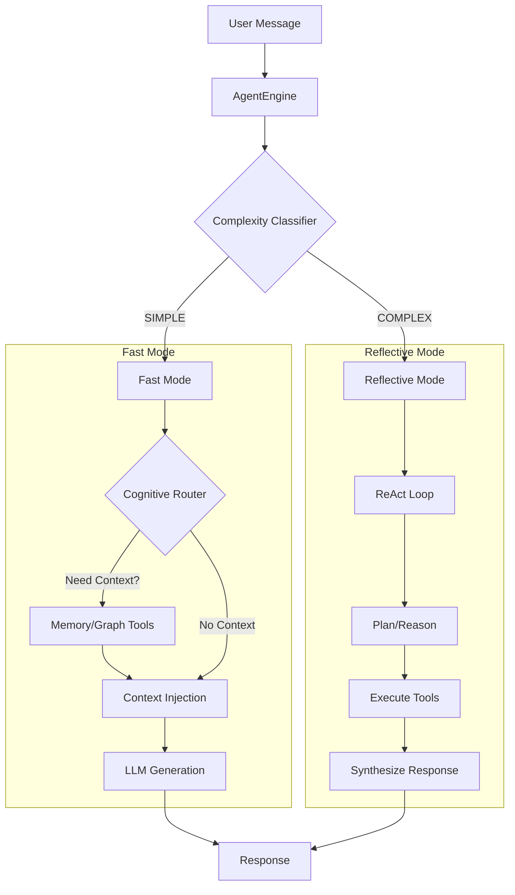

# Cognitive Engine Architecture

The **Cognitive Engine** (`src_v2/agents/engine.py`) is the brain of WhisperEngine v2. It orchestrates the flow of information from user input to character response, managing context, memory retrieval, and tool execution.

## Architectural Theory: Dual Process Theory (System 1 vs. System 2)

The design of the Cognitive Engine is inspired by **Daniel Kahneman's Dual Process Theory**, which posits that the human brain has two distinct modes of thought:

*   **System 1 (Fast, Intuitive, Automatic)**:
    *   *In Humans*: Recognizing a face, driving on an empty road, answering "2+2".
    *   *In WhisperEngine*: **Fast Mode**. The bot responds quickly to greetings, small talk, or simple questions using cached context or simple vector search. It prioritizes low latency (<2s).
*   **System 2 (Slow, Deliberative, Logical)**:
    *   *In Humans*: Solving a complex math problem, planning a trip, philosophical reasoning.
    *   *In WhisperEngine*: **Reflective Mode**. The bot "stops to think," engaging a ReAct (Reasoning + Acting) loop. It breaks down the problem, queries multiple data sources (Graph + Vector), synthesizes an answer, and potentially updates its own knowledge base. It prioritizes depth and accuracy over speed.

### Design Choice: The Complexity Classifier
To implement this efficiently, we use a lightweight **Complexity Classifier** as a "Gateway". Instead of running the expensive System 2 loop for every message (which would be slow and costly), we only trigger it when necessary.

## Core Components

### 1. AgentEngine (`src_v2/agents/engine.py`)
The central coordinator. It does not contain business logic itself but orchestrates the other components.

**Responsibilities:**
*   **Context Injection**: Builds the system prompt by combining:
    *   Static Character Definition (CDL).
    *   Dynamic Evolution State (Trust, Mood).
    *   Active Goals.
    *   User Preferences.
*   **Mode Switching**: Decides between "Fast Mode" (Standard) and "Reflective Mode" (Deep Thinking).
*   **Response Generation**: Calls the LLM with the final prompt.

### 2. Complexity Classifier (`src_v2/agents/classifier.py`)
A lightweight LLM call that analyzes the user's message to determine intent and complexity.

*   **Input**: User message + Recent history.
*   **Output**: `SIMPLE` or `COMPLEX`.
*   **Logic**:
    *   `SIMPLE`: Greetings, small talk, factual questions. -> **Fast Mode**.
    *   `COMPLEX`: Emotional venting, philosophical questions, multi-step reasoning. -> **Reflective Mode**.

### 3. Cognitive Router (`src_v2/agents/router.py`)
Used in **Fast Mode** to determine if external tools are needed.

*   **Function**: "Do I need to look something up to answer this?"
*   **Tools**:
    *   `search_memories`: Query Qdrant for past conversations.
    *   `query_graph`: Query Neo4j for specific facts.
*   **Output**: Retrieves context *before* the final response generation, reducing latency compared to multi-turn tool loops.

### 4. Reflective Agent (`src_v2/agents/reflective.py`)
Used in **Reflective Mode** for deep processing.

*   **Architecture**: ReAct (Reasoning + Acting) Loop.
*   **Capabilities**:
    *   Can call multiple tools in sequence.
    *   Can "think" out loud (Chain of Thought).
    *   Can update the Knowledge Graph (save new facts).
    *   Can update Self-Knowledge (evolution).

## Request Flow



## Dynamic Context Injection

The engine dynamically assembles the system prompt at runtime. This ensures the character "feels" the current state of the relationship.

### Context Assembly Diagram

```mermaid
graph LR
    subgraph "Static Sources"
        CDL[Character Definition (.md)]
    end
    
    subgraph "Dynamic Sources"
        Vector[(Qdrant: Summaries)]
        Graph[(Neo4j: Facts)]
        SQL[(Postgres: Trust Score)]
        Goals[(Goal Manager)]
    end
    
    CDL --> Builder[Prompt Builder]
    Vector -->|Relevant Memories| Builder
    Graph -->|User Facts| Builder
    SQL -->|Relationship Level| Builder
    Goals -->|Active Objective| Builder
    
    Builder -->|Final System Prompt| LLM
```

**Injection Layers:**
1.  **Base Identity**: `character.md` (Static).
2.  **Past Summaries**: Relevant long-term memories (from Qdrant).
3.  **Relationship Status**: "Trust Level: 3 (Friend)" (from Neo4j/Postgres).
4.  **User Insights**: "User is sensitive about topic X" (from Feedback Analyzer).
5.  **Active Goal**: "Current Goal: Cheer up user" (from Goal Manager).
