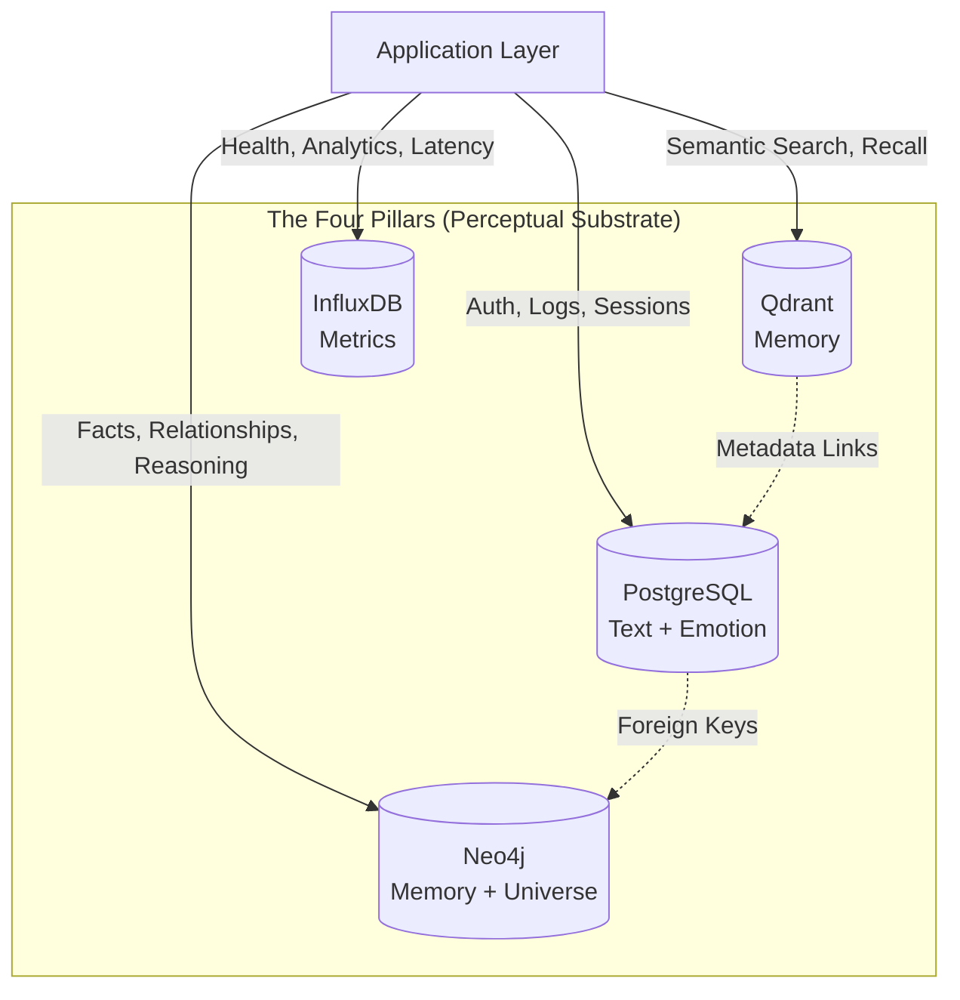

# Data Models & Schema

**Version**: 2.2  
**Last Updated**: December 1, 2025

## Multi-Modal Context

The Four Pillars aren't just databases - they're the **physical substrate** of character perception. Each database stores a different aspect of how characters experience reality:

| Pillar | Perceptual Role |
|--------|-----------------|
| **PostgreSQL** | 💬 Text (chat history), ❤️ Emotion (relationships) |
| **Qdrant** | 🧠 Memory (vector recall) |
| **Neo4j** | 🧠 Memory (semantic facts), 🌌 Universe (spatial/social graph) |
| **InfluxDB** | System health (not perceptual - infrastructure only) |

For full philosophy: See [`MULTI_MODAL_PERCEPTION.md`](./MULTI_MODAL_PERCEPTION.md)

---

This document details the data structures used across the four pillars of WhisperEngine v2's data layer: PostgreSQL, Qdrant, Neo4j, and InfluxDB.

## Architectural Theory: Polyglot Persistence

WhisperEngine v2 adopts a **Polyglot Persistence** architecture. Instead of forcing all data into a single "one-size-fits-all" database (like using Postgres for everything), we use specialized data stores that are optimized for specific access patterns.

### The "Four Pillars" Design Choice

| Pillar | Technology | Theory / Access Pattern | Why this choice? |
| :--- | :--- | :--- | :--- |
| **Structured** | **PostgreSQL** | **ACID Compliance**: Strict schemas, transactional integrity. Used for "Business Data" (Users, Logs, Chat History). | Reliable, standard, and robust for critical data that must not be lost or corrupted. |
| **Vector** | **Qdrant** | **Vector Similarity**: High-dimensional space search. Used for "Fuzzy Memory" (Searchable Recall). | Specialized for HNSW (Hierarchical Navigable Small World) indexing, offering millisecond search over millions of vectors. |
| **Relational** | **Neo4j** | **Graph Theory**: Nodes and Edges. Used for "Knowledge" (Extracted Facts, Relationships). | Relational databases struggle with multi-hop queries ("Friend of a friend"). Graphs make traversing complex relationships O(1). |
| **Temporal** | **InfluxDB** | **Time-Series**: High write throughput, time-based aggregation. Used for "Metrics". | Optimized for writing millions of data points and querying ranges (e.g., "Average latency over last hour") without locking. |



## 1. PostgreSQL (Relational Data)

PostgreSQL is the primary store for structured data, including user profiles, chat logs, and session management.

### Tables

#### `v2_chat_history`
Stores the raw conversation logs.
| Column | Type | Description |
| :--- | :--- | :--- |
| `id` | UUID (PK) | Unique message ID |
| `user_id` | VARCHAR | Discord User ID |
| `character_name` | VARCHAR | Name of the bot (e.g., "elena") |
| `role` | VARCHAR | 'human' or 'ai' |
| `content` | TEXT | The message content |
| `channel_id` | VARCHAR | Discord Channel ID |
| `message_id` | VARCHAR | Discord Message ID |
| `created_at` | TIMESTAMP | Creation time (default NOW()) |

#### `v2_conversation_sessions`
Tracks active conversation sessions for summarization and context management.
| Column | Type | Description |
| :--- | :--- | :--- |
| `id` | UUID (PK) | Session ID |
| `user_id` | VARCHAR | Discord User ID |
| `character_name` | VARCHAR | Name of the bot |
| `start_time` | TIMESTAMP | When the session started |
| `end_time` | TIMESTAMP | When the session ended (nullable) |
| `is_active` | BOOLEAN | Whether the session is currently open |
| `updated_at` | TIMESTAMP | Last activity timestamp |

## 2. Qdrant (Vector Memory)

Qdrant stores semantic embeddings of messages and summaries to enable fuzzy recall and long-term memory.

### Collection: `whisperengine_memory_{bot_name}`
*   **Vector Size**: 384 dimensions (using `all-MiniLM-L6-v2` or similar).
*   **Distance Metric**: Cosine.

### Payload Structure

#### Message Payload (Raw Chat)
```json
{
  "user_id": "123456789",
  "role": "human",
  "content": "I love hiking in the mountains.",
  "timestamp": "2023-10-27T10:00:00Z",
  "channel_id": "987654321",
  "message_id": "1122334455",
  "metadata": {
    "emotion": "happy"
  }
}
```

#### Summary Payload (Compressed Memory)
```json
{
  "type": "summary",
  "session_id": "uuid-...",
  "user_id": "123456789",
  "content": "User discussed their weekend hiking trip and expressed joy about nature.",
  "meaningfulness_score": 4,
  "emotions": ["joy", "excitement"],
  "timestamp": "2023-10-27T10:30:00Z"
}
```

## 3. Neo4j (Knowledge Graph)

Neo4j stores structured facts, relationships, and character evolution state. It enables the bot to "know" things definitively rather than just "remembering" them vaguely.

### Nodes
*   `(:User {id: "discord_id"})`: Represents a user.
*   `(:Entity {name: "Entity Name"})`: Represents a person, place, object, or concept.

### Relationships
*   `(:User)-[:FACT {predicate: "LIKES", confidence: 1.0}]->(:Entity)`
    *   Example: `(User)-[:FACT {predicate: "LIVES_IN"}]->(Entity {name: "Seattle"})`
*   `(:User)-[:TRUSTS {level: 3, score: 45}]->(:Character)` (Planned)
*   `(:Character)-[:PURSUING]->(:Goal)` (Planned)

### Constraints
*   `User.id` must be unique.
*   `Entity.name` must be unique.

## 4. InfluxDB (Metrics)

InfluxDB stores time-series data for monitoring system health and engagement.

### Measurement: `chat_metrics`
*   **Tags**: `bot_name`, `user_id`
*   **Fields**:
    *   `latency_ms`: Response generation time.
    *   `tokens_in`: Input token count.
    *   `tokens_out`: Output token count.
    *   `sentiment_score`: Float (-1.0 to 1.0).

### Measurement: `system_health`
*   **Tags**: `service` (postgres, qdrant, neo4j)
*   **Fields**:
    *   `status`: 1 (up) or 0 (down).
    *   `response_time_ms`: Ping latency.
