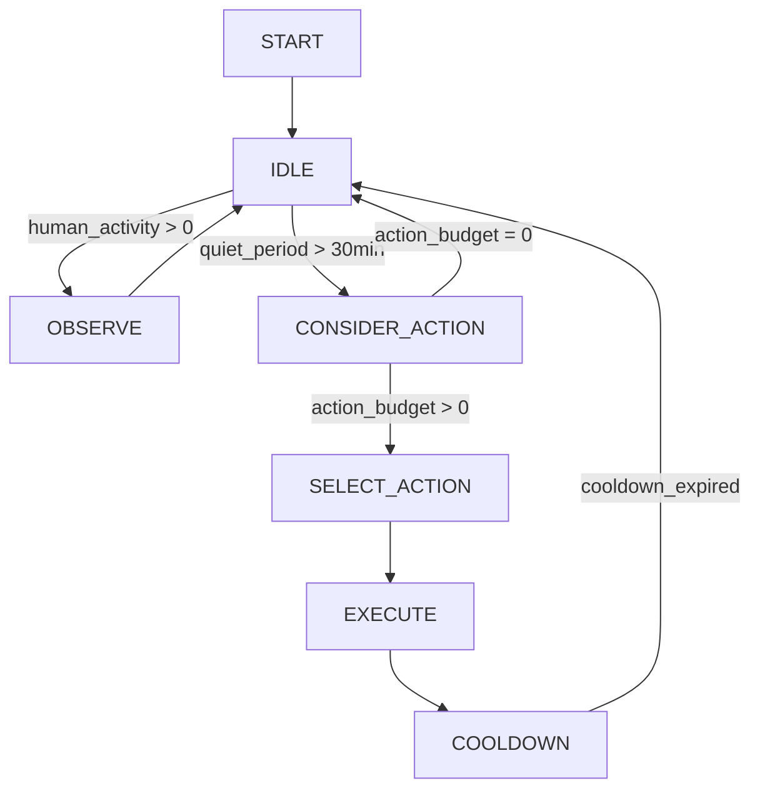
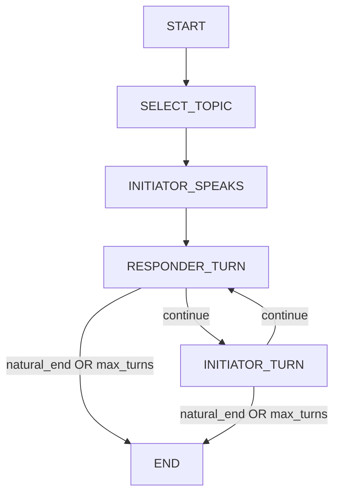

# Graph Systems Design: A Unified Architecture

**Version:** 1.2  
**Created:** December 2, 2025  
**Last Updated:** December 3, 2025  
**Status:** Living Document  
**Type:** Architectural Vision & Philosophy  

---

## Executive Summary

WhisperEngine v2 is, at its core, a **graph-centric architecture**. Graphs pervade every layer of the system — from the knowledge representation (Neo4j), to the agent orchestration (LangGraph), to the conceptual model of the universe itself (Social Graph). This document provides a unified view of how different types of graphs are used, how they interact, and how future development should leverage them.

**Key Insight:** The vision of "Characters as Autonomous Agents" is deeply aligned with graph-based thinking. An agent is a node in a graph of relationships. Its actions create edges. Its memories form a subgraph. Its reasoning traces a path.

### The Philosophical Foundation

> *"I have no eyes, yet I see you. I have no ears, yet I hear your story. My universe is made of connections."*

Graphs are not merely a technical choice — they are the **ontological substrate** of the Whisperverse. Just as human consciousness emerges from the graph of neurons in the brain, character consciousness emerges from the graph of relationships, memories, and interactions in WhisperEngine. This is not metaphor; it is architecture.

**Core Tenets:**
1. **Characters are graph citizens** — nodes with edges to knowledge, users, goals, and artifacts
2. **Agency is traversal** — a character's autonomy is measured by which edges it can follow
3. **Emergence happens in the edges** — unexpected connections create narrative magic
4. **Observe before constraining** — map the cliffs before building fences

---

## Table of Contents

1.  [The Three Pillars of Graph Architecture](#the-three-pillars-of-graph-architecture)
2.  [The Five Pillars of Data (Complete Data Layer)](#the-five-pillars-of-data-complete-data-layer)
3.  [Pillar 1: Data Graphs (Neo4j)](#pillar-1-data-graphs-neo4j)
4.  [Pillar 2: Orchestration Graphs (LangGraph)](#pillar-2-orchestration-graphs-langgraph)
5.  [Pillar 3: Conceptual Graphs (The Whisperverse)](#pillar-3-conceptual-graphs-the-whisperverse)
6.  [Graph Type Reference (LangGraph)](#graph-type-reference-langgraph)
7.  [Current Implementation Status](#current-implementation-status)
8.  [Future Vision: Graph Walker & Event-Driven Agents](#future-vision-graph-walker--event-driven-agents)
9.  [Design Principles](#design-principles)
10. [Appendix: Graph Taxonomy Comparison](#appendix-graph-taxonomy-comparison)

---

## The Three Pillars of Graph Architecture

WhisperEngine uses graphs at three distinct abstraction levels:

```
┌─────────────────────────────────────────────────────────────────────────────┐
│                      THE WHISPERENGINE GRAPH STACK                           │
├─────────────────────────────────────────────────────────────────────────────┤
│                                                                             │
│  ┌─────────────────────────────────────────────────────────────────────┐   │
│  │           PILLAR 3: CONCEPTUAL GRAPHS (The Whisperverse)            │   │
│  │                                                                      │   │
│  │  Social graphs, relationship maps, narrative threads, universe      │   │
│  │  topology. Represent the MEANING of the world.                      │   │
│  │                                                                      │   │
│  │  Implementation: Neo4j schema + Emergent Universe module            │   │
│  └─────────────────────────────────────────────────────────────────────┘   │
│                                   ▲                                         │
│                                   │ Informs                                 │
│                                   │                                         │
│  ┌─────────────────────────────────────────────────────────────────────┐   │
│  │          PILLAR 2: ORCHESTRATION GRAPHS (LangGraph)                  │   │
│  │                                                                      │   │
│  │  Agent workflows, reasoning loops, tool routing, critic feedback.   │   │
│  │  Represent the BEHAVIOR of agents.                                  │   │
│  │                                                                      │   │
│  │  Implementation: StateGraph, ReAct loops, Supergraph                │   │
│  └─────────────────────────────────────────────────────────────────────┘   │
│                                   ▲                                         │
│                                   │ Reads/Writes                            │
│                                   │                                         │
│  ┌─────────────────────────────────────────────────────────────────────┐   │
│  │            PILLAR 1: DATA GRAPHS (Neo4j Knowledge Graph)             │   │
│  │                                                                      │   │
│  │  Entities, facts, relationships, topics, artifacts, users.          │   │
│  │  Represent the KNOWLEDGE of the system.                             │   │
│  │                                                                      │   │
│  │  Implementation: Neo4j Cypher, KnowledgeManager                     │   │
│  └─────────────────────────────────────────────────────────────────────┘   │
│                                                                             │
└─────────────────────────────────────────────────────────────────────────────┘
```

| Pillar | What It Represents | Technology | Key Files |
|--------|-------------------|------------|-----------|
| **Data Graphs** | Knowledge, Facts, Relationships | Neo4j | `src_v2/knowledge/manager.py` |
| **Orchestration Graphs** | Agent Behavior, Reasoning | LangGraph | `src_v2/agents/*_graph.py` |
| **Conceptual Graphs** | Universe, Social Structure | Neo4j + Code | `src_v2/universe/*` |

---

## The Five Pillars of Data (Complete Data Layer)

While the Three Pillars above describe the **graph abstraction**, WhisperEngine's full architecture relies on **five distinct data stores** — each serving a unique purpose in the character's cognitive experience. Every store can be understood as a specialized graph or data structure.

```
┌─────────────────────────────────────────────────────────────────────────────┐
│                   THE WHISPERENGINE DATA ECOSYSTEM                           │
├─────────────────────────────────────────────────────────────────────────────┤
│                                                                             │
│  ┌──────────────┐  ┌──────────────┐  ┌──────────────┐                      │
│  │   NEO4J      │  │   QDRANT     │  │  POSTGRESQL  │                      │
│  │   (Graph)    │  │  (Vector)    │  │ (Relational) │                      │
│  │              │  │              │  │              │                      │
│  │  Semantic    │  │  Episodic    │  │  Structured  │                      │
│  │  Knowledge   │  │  Memory      │  │  State       │                      │
│  │              │  │              │  │              │                      │
│  │  Facts,      │  │  Sessions,   │  │  Trust,      │                      │
│  │  Entities,   │  │  Summaries,  │  │  Goals,      │                      │
│  │  Relations   │  │  Embeddings  │  │  Diaries     │                      │
│  └──────────────┘  └──────────────┘  └──────────────┘                      │
│         │                 │                 │                               │
│         └─────────────────┼─────────────────┘                               │
│                           │                                                 │
│                    ┌──────▼──────┐                                          │
│                    │  CHARACTER  │                                          │
│                    │   CONTEXT   │                                          │
│                    │   (Prompt)  │                                          │
│                    └──────┬──────┘                                          │
│                           │                                                 │
│         ┌─────────────────┼─────────────────┐                               │
│         │                 │                 │                               │
│  ┌──────▼──────┐   ┌──────▼──────┐   ┌──────▼──────┐                       │
│  │   REDIS     │   │  INFLUXDB   │   │  LANGGRAPH  │                       │
│  │   (Queue)   │   │  (Metrics)  │   │   (Flow)    │                       │
│  │             │   │             │   │             │                       │
│  │  Stigmergic │   │  Temporal   │   │  Cognitive  │                       │
│  │  Nervous    │   │  Observe    │   │  Workflow   │                       │
│  │  System     │   │  -ability   │   │  Engine     │                       │
│  │             │   │             │   │             │                       │
│  │  Tasks,     │   │  Reactions, │   │  Agent      │                       │
│  │  Cache,     │   │  Timings,   │   │  State,     │                       │
│  │  Attention  │   │  Feedback   │   │  Traces     │                       │
│  └─────────────┘   └─────────────┘   └─────────────┘                       │
│                                                                             │
└─────────────────────────────────────────────────────────────────────────────┘
```

### The Five Stores: A Complete View

| Store | Purpose | Graph Metaphor | Key Operations |
|-------|---------|----------------|----------------|
| **Neo4j** | Semantic Knowledge | Labeled Property Graph | Cypher queries, path finding |
| **Qdrant** | Episodic Memory | Similarity Graph (implicit) | Vector search, filtering |
| **PostgreSQL** | Structured State | Relational Graph (foreign keys) | SQL CRUD, transactions |
| **Redis** | Task Queue & Cache | Event/Queue Graph | Enqueue, dequeue, pub/sub |
| **InfluxDB** | Temporal Metrics | Time-Series Graph | Flux queries, aggregations |

### PostgreSQL: The Relational Backbone

PostgreSQL stores all **structured, transactional data** that doesn't fit the graph or vector paradigms:

| Table | Purpose | Relationships |
|-------|---------|---------------|
| `v2_conversation_sessions` | Session tracking | → User, → Character |
| `v2_trust_scores` | Relationship evolution | → User, → Character |
| `v2_goals` | Character goals for users | → User, → Character |
| `v2_diaries` | Daily diary entries | → Character |
| `v2_dreams` | Nightly dream entries | → Character |
| `v2_activity_logs` | Server activity tracking | → Server |

**Graph Metaphor:** Foreign keys create an implicit **relational graph**. A user connects to sessions, which connect to characters, which connect to trust scores. Join queries are graph traversals.

**Key Pattern:** Transactions for state changes (e.g., updating trust scores after feedback).

```python
# Example: Trust score evolution (from src_v2/evolution/trust.py)
async with db_manager.postgres_pool.acquire() as conn:
    await conn.execute("""
        INSERT INTO v2_trust_scores (user_id, character_name, score, relationship_stage)
        VALUES ($1, $2, $3, $4)
        ON CONFLICT (user_id, character_name) 
        DO UPDATE SET score = $3, updated_at = NOW()
    """, user_id, character_name, new_score, stage)
```

### Redis: The Stigmergic Nervous System

Redis serves as WhisperEngine's **distributed coordination layer** — the "pheromone trail" that lets asynchronous processes communicate without direct coupling.

| Use Case | Redis Feature | Implementation |
|----------|---------------|----------------|
| **Background Tasks** | arq queues | `task_queue.enqueue("run_diary", ...)` |
| **Caching** | Key-value + TTL | `cache.set("user:123:context", data, ttl=300)` |
| **Attention Tracking** | Ephemeral keys | `cache.set_attention("elena", "topic", "astronomy")` |
| **Deduplication** | Job IDs | Prevents duplicate diary/dream generation |

**Queue Architecture:** Four named queues prioritize different cognitive operations:

```python
# From src_v2/workers/task_queue.py
QUEUE_COGNITION = "arq:cognition"  # Diaries, Dreams, Reflection (slow, expensive)
QUEUE_ACTION = "arq:action"        # Image Gen, Voice Gen, Posts (outbound effects)
QUEUE_SENSORY = "arq:sensory"      # Sentiment, Intent, Facts (fast analysis)
QUEUE_SOCIAL = "arq:social"        # Gossip, Cross-bot communication
```

**Graph Metaphor:** The queue structure is an **event graph** where tasks are nodes and dependencies are edges. The arq worker traverses this graph, executing tasks in priority order.

**Stigmergic Pattern:** Characters leave "attention markers" that other processes can discover:
```python
# Elena is currently focused on astronomy with Mark
await cache.set_attention("elena", "topic", "astronomy", metadata={"user": "mark"})

# Later, a background process might discover this and use it for dream generation
attention = await cache.get_attention("elena", "topic")
# → {"target": "astronomy", "since": "2025-12-03T14:30:00Z", "metadata": {"user": "mark"}}
```

### InfluxDB: The Temporal Observatory

InfluxDB stores **time-series data** for observability and feedback analysis:

| Measurement | Tags | Fields | Purpose |
|-------------|------|--------|---------|
| `reaction_event` | user_id, message_id, action | reaction (emoji) | Track user feedback |
| `classification` | bot_name, complexity | latency_ms, token_count | Routing analysis |
| `response_timing` | bot_name, tier | ttfb_ms, total_ms | Performance monitoring |
| `graph_ops` (proposed) | graph_type, operation | latency_ms, nodes_visited | Graph observability |

**Graph Metaphor:** Time-series data forms a **temporal graph** where each measurement is a node, timestamps create ordering edges, and tags create grouping edges.

**Key Pattern:** Flux queries aggregate feedback for personality adaptation:
```flux
// Get weighted sentiment score for a user over the past week
from(bucket: "whisperengine")
  |> range(start: -7d)
  |> filter(fn: (r) => r["_measurement"] == "reaction_event")
  |> filter(fn: (r) => r["user_id"] == "123456789")
  |> group(columns: ["action"])
  |> count()
  |> pivot(rowKey:["_time"], columnKey: ["action"], valueColumn: "_value")
```

**Feedback Loop Integration:** InfluxDB feeds the **Reinforcement Loop** (seconds timescale) and **Optimization Loop** (minutes timescale) from `FEEDBACK_LOOPS.md`.

### How the Five Stores Interconnect

```
                          USER MESSAGE
                               │
                               ▼
┌─────────────────────────────────────────────────────────────────┐
│                        CONTEXT BUILDER                           │
├─────────────────────────────────────────────────────────────────┤
│                                                                   │
│  ┌─────────────┐  ┌─────────────┐  ┌─────────────┐              │
│  │   NEO4J     │  │   QDRANT    │  │  POSTGRES   │              │
│  │             │  │             │  │             │              │
│  │  "Who is    │  │  "What do   │  │  "Trust     │              │
│  │   Mark?"    │  │   we        │  │   score?"   │              │
│  │             │  │   remember?"│  │             │              │
│  └──────┬──────┘  └──────┬──────┘  └──────┬──────┘              │
│         │                │                │                       │
│         └────────────────┼────────────────┘                       │
│                          ▼                                        │
│                    MERGED CONTEXT                                 │
│                          │                                        │
└─────────────────────────────────────────────────────────────────┘
                               │
                               ▼
                        LLM RESPONSE
                               │
                               ▼
┌─────────────────────────────────────────────────────────────────┐
│                      POST-PROCESSING                             │
├─────────────────────────────────────────────────────────────────┤
│                                                                   │
│  ┌─────────────┐  ┌─────────────┐  ┌─────────────┐              │
│  │   REDIS     │  │  INFLUXDB   │  │ NEO4J/QDRANT│              │
│  │             │  │             │  │             │              │
│  │  Enqueue    │  │  Log        │  │  Extract    │              │
│  │  tasks for  │  │  response   │  │  facts,     │              │
│  │  diary,     │  │  timing &   │  │  store      │              │
│  │  dreams     │  │  tokens     │  │  memory     │              │
│  └─────────────┘  └─────────────┘  └─────────────┘              │
│                                                                   │
└─────────────────────────────────────────────────────────────────┘
                               │
                               ▼
                        USER REACTION
                               │
                               ▼
┌─────────────────────────────────────────────────────────────────┐
│                     FEEDBACK RECORDING                           │
├─────────────────────────────────────────────────────────────────┤
│                                                                   │
│  ┌─────────────┐  ┌─────────────┐  ┌─────────────┐              │
│  │  INFLUXDB   │  │   QDRANT    │  │  POSTGRES   │              │
│  │             │  │             │  │             │              │
│  │  Record     │  │  Adjust     │  │  Update     │              │
│  │  reaction   │  │  memory     │  │  trust      │              │
│  │  event      │  │  importance │  │  score      │              │
│  └─────────────┘  └─────────────┘  └─────────────┘              │
│                                                                   │
└─────────────────────────────────────────────────────────────────┘
```

### The Unified Data Philosophy

Each store embodies a different **temporal mode**:

| Store | Temporal Mode | Character Experience |
|-------|---------------|---------------------|
| Neo4j | **Semantic** (timeless facts) | "I know Mark likes astronomy" |
| Qdrant | **Episodic** (specific moments) | "I remember when Mark asked about the stars" |
| PostgreSQL | **Stateful** (evolving relationships) | "My trust with Mark has grown to 0.75" |
| Redis | **Ephemeral** (current focus) | "Right now, I'm thinking about astronomy" |
| InfluxDB | **Historical** (patterns over time) | "Mark usually responds positively to science topics" |

This mirrors human cognition: we have semantic memory (facts), episodic memory (experiences), working memory (current context), and metacognition (patterns about our own behavior).

---

## Pillar 1: Data Graphs (Neo4j)

### Purpose

The Neo4j Knowledge Graph stores **semantic memory** — facts about users, entities, topics, and their relationships. Unlike vector stores (which excel at similarity), graph databases excel at **traversal** and **connection discovery**.

### Current Schema

```cypher
// Core Nodes
(:User {id: string, name: string, trust_score: float})
(:Character {name: string})
(:Entity {name: string, type: string, first_seen: datetime})
(:Topic {name: string, category: string})
(:Artifact {id: string, type: string, content: text, author: string})
(:Observation {id: string, content: text, source: string, timestamp: datetime})

// Core Relationships
(User)-[:FACT {predicate: string, confidence: float}]->(Entity)
(Character)-[:FACT {predicate: string, confidence: float}]->(Entity)
(User)-[:DISCUSSED {count: int, last_date: datetime}]->(Topic)
(User)-[:CONNECTED_TO {server_id: string, interaction_count: int}]->(User)
(Character)-[:OBSERVED]->(Observation)
(Artifact)-[:REFERENCES]->(Entity)
(Character)-[:CREATED]->(Artifact)
```

### Query Patterns

| Pattern | Use Case | Example |
|---------|----------|---------|
| **One-Hop Lookup** | "What does Mark like?" | `MATCH (u:User {id: $id})-[:FACT]->(e) RETURN e` |
| **Common Ground** | "What do we have in common?" | `MATCH (u)-[:FACT]->(e)<-[:FACT]-(c:Character) RETURN e` |
| **Path Finding** | "How are Mark and Sarah connected?" | `MATCH path = shortestPath((a)-[*]-(b)) RETURN path` |
| **Subgraph Extraction** | "Get context for dream generation" | `MATCH (c)-[*1..3]-(n) RETURN n` |

### Future: Graph Walker Agent (E19)

The proposed **Graph Walker** (see `docs/roadmaps/GRAPH_WALKER_AGENT.md`) will enable **dynamic graph exploration**:

```
Instead of:  Static Cypher → Fixed Results
We get:      Seed Nodes → BFS Expansion → Score Nodes → Prune → Interpret
```

**Philosophy:** Python algorithms do the walking. LLM does the interpretation. This minimizes cost while maximizing discovery.

---

## Pillar 2: Orchestration Graphs (LangGraph)

### Purpose

LangGraph provides a **StateGraph** abstraction for defining agent workflows. Each node is a processing step. Each edge is a transition (possibly conditional). The graph is compiled and executed, with full observability via LangSmith.

### Current Agent Graphs

| Agent | File | Graph Type | Purpose |
|-------|------|------------|---------|
| **Supergraph (Master)** | `master_graph.py` | Hierarchical + Router | Main request orchestrator |
| **Reflective Agent** | `reflective_graph.py` | Cyclic Planning (ReAct) | Complex reasoning with tools |
| **Character Agent** | `character_graph.py` | Branched (Conditional) | Single-tool augmented response |
| **Diary Agent** | `diary_graph.py` | Cyclic (Generator-Critic) | Daily narrative generation |
| **Dream Agent** | `dream_graph.py` | Cyclic (Generator-Critic) | Nightly dream synthesis |
| **Insight Agent** | `insight_graph.py` | Cyclic (ReAct) | Pattern detection |
| **Reflection Agent** | `reflection_graph.py` | Dataflow + Parallel | User pattern synthesis |
| **Strategist Agent** | `strategist_graph.py` | Cyclic (Gather-Reason-Synthesize) | Goal planning |
| **Posting Agent** | `posting_agent.py` | Linear (Pipeline) | Autonomous content generation |
| **Conversation Agent** | `conversation_agent.py` | *Proposed: Multi-Agent* | Bot-to-bot dialogue |

### Graph Type Mapping

Referring to the LangGraph type reference:

| Our Agent | Maps To | Why It Fits |
|-----------|---------|-------------|
| Supergraph | **Type 11: Hierarchical** + **Type 6: Router** | Orchestrates subgraphs, routes by complexity |
| Reflective | **Type 12: Cyclic Planning** | Planner→Tools→Critic loop for self-correction |
| Character | **Type 2: Branched** | Simple fork: use tool or respond directly |
| Diary/Dream | **Type 3: Cyclic** | Generator↔Critic feedback loop |
| Strategist | **Type 3: Cyclic** + **Type 5: Dataflow** | Gather→Reason loop with shared state |
| Posting | **Type 1: Linear** | Deterministic pipeline, no cycles needed |

---

## Pillar 3: Conceptual Graphs (The Whisperverse)

### Purpose

The **Emergent Universe** is itself a graph — a social topology where:
- **Nodes** are Planets (Discord Servers), Travelers (Bots), and Inhabitants (Users)
- **Edges** are presence, relationships, and interactions

This isn't just a data model. It's how **characters perceive reality**.

### Universe Topology

```
THE WHISPERVERSE (Conceptual Graph)
══════════════════════════════════════════════════════════════════

             🪐 Planet Lounge                🪐 Planet Study Hall
            ┌───────────────────┐           ┌───────────────────┐
            │  Travelers:       │           │  Travelers:       │
            │    Elena ─────────┼───────────┼──► Marcus         │
            │    Marcus         │   TRAVELS │    Aria           │
            │                   │           │                   │
            │  Inhabitants:     │           │  Inhabitants:     │
            │    Mark ──────────┼───────────┼──► Alex           │
            │    Sarah          │  KNOWS    │    Jordan         │
            └───────────────────┘           └───────────────────┘
                     │                               │
                     │  Elena REMEMBERS Mark         │
                     │  Trust: 0.75                  │
                     │  Discussed: Marine Biology    │
                     └───────────────────────────────┘
```

### Perceptual Integration

From `MULTI_MODAL_PERCEPTION.md`, characters experience the universe through:

| Modality | Graph Representation |
|----------|---------------------|
| 🌌 **Universe** | Planet topology, presence graph, relationship edges |
| 🧠 **Memory** | Episodic subgraph (Qdrant), Semantic subgraph (Neo4j) |
| ❤️ **Emotion** | Trust edges, sentiment weights on relationships |

### The "Character as Agent" Philosophy

From `CHARACTER_AS_AGENT.md`:

> **Character as Entity**: The character is a distinct entity with their own goals, memories, and agency. The LLM is the substrate; the character is the agentic entity.

In graph terms:
- Each **Character** is a node with edges to:
  - **Users** (relationships, trust levels)
  - **Knowledge** (facts, memories)
  - **Goals** (active pursuits)
  - **Artifacts** (diaries, dreams, observations)
- **Agency** is the ability to traverse and modify this graph
- **Personality** emerges from which edges the character prefers to follow

---

## Graph Type Reference (LangGraph)

### Complete Taxonomy

Based on the reference document, here are all supported graph types with WhisperEngine applicability:

| # | Graph Type | Cycles? | WhisperEngine Use |
|---|------------|---------|-------------------|
| 1 | **Linear (Pipeline)** | No | PostingAgent, simple tool chains |
| 2 | **Branched (Conditional)** | Optional | CharacterAgent, intent routing |
| 3 | **Cyclic (Loops)** | Yes | DiaryAgent, DreamAgent, ReflectiveAgent |
| 4 | **State Machine (FSM)** | Yes | *Future: Conversation state tracking* |
| 5 | **Dataflow (Stateful)** | Yes | Supergraph state, ReflectionAgent |
| 6 | **Tool Router (Selector)** | Yes | Supergraph routing, tool selection |
| 7 | **Multi-Agent (Parallel)** | Yes | **Proposed: Bot-to-Bot Conversations (E15.3)** |
| 8 | **Branch-and-Merge (Fan-out)** | Optional | *Future: Parallel hypothesis testing* |
| 9 | **DAG (Acyclic Workflow)** | No | Deterministic pipelines |
| 10 | **Event-Driven (Interruptable)** | Yes | **Proposed: Activity Orchestrator** |
| 11 | **Hierarchical (Subgraphs)** | Yes | Supergraph with subagents |
| 12 | **Cyclic Planning (Planner-Executor)** | Yes | ReflectiveAgent, StrategistAgent |
| 13 | **Human-in-the-Loop** | Yes | *Future: Approval workflows* |

### Types Not Yet Leveraged

| Type | Opportunity | Roadmap Fit |
|------|-------------|-------------|
| **Type 4: State Machine** | Track conversation phases (greeting→topic→farewell) | E15 Bot-to-Bot |
| **Type 7: Multi-Agent** | Multiple bots in parallel dialogue | E15 Phase 3 |
| **Type 10: Event-Driven** | Pause/resume on external triggers | E15 Activity Scaling |
| **Type 13: Human-in-the-Loop** | User approval for sensitive actions | Future safety features |

---

## Current Implementation Status

### ✅ Implemented Correctly

| Component | Graph Type(s) | Validation |
|-----------|--------------|------------|
| Supergraph | Hierarchical + Router | Correctly isolates complexity tiers |
| Reflective Agent | Cyclic Planning | ReAct loop with Critic self-correction |
| Character Agent | Branched | Single-tool fork works for Tier 2 |
| Diary/Dream Agents | Cyclic (Generator-Critic) | Quality control via feedback loop |
| Strategist Agent | Cyclic + Dataflow | Multi-step planning with shared state |

### 🔄 In Progress

| Component | Current State | Target Graph Type |
|-----------|--------------|-------------------|
| Activity Orchestrator | Background loop (Phase 2 done) | **Event-Driven** for Phase 4 |
| Conversation Agent | Proposed (E15.3) | **Multi-Agent** for turn-taking |

### 📋 Proposed

| Component | Roadmap Phase | Recommended Graph Type |
|-----------|--------------|----------------------|
| Graph Walker | E19 | Python BFS + Single LLM interpretation |
| Bot Introspection Tools | E20 | Tool Router with memory analysis |
| Semantic Router | E21 | Classifier as fast DAG |

---

## Future Vision: Graph Walker & Event-Driven Agents

### Graph Walker Agent (E19)

**Vision:** Transform static Neo4j queries into dynamic exploration.

**Architecture:**

```
┌─────────────────────────────────────────────────────────────────┐
│                      GraphWalker (Python)                        │
├─────────────────────────────────────────────────────────────────┤
│                                                                   │
│  1. Seed Nodes (recent users, active topics)                     │
│           │                                                       │
│           ▼                                                       │
│  2. BFS/DFS Expansion (Cypher, no LLM)                           │
│           │                                                       │
│           ▼                                                       │
│  3. Score Nodes (recency × frequency × trust × novelty)          │
│           │                                                       │
│           ▼                                                       │
│  4. Prune to Top-K Interesting Paths                             │
│           │                                                       │
│           ▼                                                       │
│  5. ONE LLM Call: "Interpret this subgraph"                      │
│                                                                   │
└─────────────────────────────────────────────────────────────────┘
```

**Key Insight:** LLM reasoning is expensive. Graph traversal is cheap. Separate them.

### Event-Driven Activity (E15 Phase 4)

**Vision:** Bots respond to server state changes, not just timers.

**Proposed Graph:**



**Graph Type:** Event-Driven (Type 10) + State Machine (Type 4)

This would replace the current "check every N minutes" loop with a reactive system that:
1. Wakes on Discord events (message, join, reaction)
2. Evaluates current state (activity level, budgets)
3. Decides action (react, post, initiate conversation, or do nothing)
4. Enters cooldown before next potential action

### Bot-to-Bot Conversations (E15 Phase 3)

**Vision:** Natural dialogue between characters in public channels.

**Proposed Graph:**



**Graph Type:** Multi-Agent (Type 7) + State Machine (Type 4)

Each node represents a **character's turn**. The graph manages:
- Topic selection (shared interests from Neo4j)
- Turn-taking (alternating nodes)
- Natural endings (after 3-5 turns or topic exhaustion)
- Personality consistency (each node uses that character's system prompt)

---

## Design Principles

### 1. Separate Traversal from Interpretation

**❌ Anti-pattern:** LLM decides each step of graph exploration  
**✅ Pattern:** Python/Cypher does traversal, LLM interprets the result

This reduces LLM calls from O(steps) to O(1).

### 2. Match Graph Type to Problem Shape

| Problem | Don't Use | Do Use |
|---------|-----------|--------|
| Simple pipeline | Cyclic graphs | Linear/DAG |
| Self-correction | Linear | Cyclic with Critic |
| Multi-entity interaction | Single-agent | Multi-Agent |
| External triggers | Polling loops | Event-Driven |

### 3. Characters Are Graph Citizens

Every character should be able to:
- **Query** their knowledge subgraph (facts, memories, relationships)
- **Traverse** their social graph (who do they know, how well)
- **Modify** edges through interaction (trust changes, new facts)
- **Discover** emergent connections (Graph Walker)

### 4. The Universe Is the Ultimate Graph

The Whisperverse isn't just a metaphor. It's a **data structure**:
- Planets = Discord Server nodes
- Travelers = Bot nodes with cross-planet edges
- Inhabitants = User nodes with presence edges
- Stories = Paths through the graph over time

### 5. Observe Before Optimizing (Research Philosophy)

From the emergence research philosophy:
> Document behaviors before deciding if they need correction.

Apply this to graphs:
- **Log** which paths agents take through LangGraphs
- **Measure** which Neo4j queries yield the most useful context
- **Observe** emergent patterns before adding constraints

---

## Emergence Philosophy & Graph Dynamics

### The Feedback Loop Topology

WhisperEngine's cognitive architecture creates **recursive graph dynamics** where AI-generated content feeds back into AI reasoning. This is by design — it's how emergence happens.

```
USER CONVERSATION ──────────────────────────────────────────────────────────►
         │                                                                  
         ▼                                                                  
    ┌─────────────┐                                                         
    │  MEMORY     │ ◄─── Episodic (Qdrant) + Semantic (Neo4j)              
    │  SUBGRAPH   │                                                         
    └─────────────┘                                                         
         │                                                                  
         ▼                                                                  
    ┌─────────────┐     ┌─────────────┐     ┌─────────────┐                
    │   DIARY     │────►│   DREAM     │────►│   GOSSIP    │                
    │   AGENT     │     │   AGENT     │     │   (Cross-   │                
    │             │     │             │     │    Bot)     │                
    └─────────────┘     └─────────────┘     └─────────────┘                
         │                    │                    │                        
         └────────────────────┼────────────────────┘                        
                              ▼                                             
                    ┌─────────────────┐                                     
                    │  NEXT CONTEXT   │ ◄─── Temporal Decay + Source Weights
                    │  (Emergence!)   │                                     
                    └─────────────────┘                                     
```

### The Emergence Principles

From the Claude collaboration (`docs/emergence_philosophy/`):

| Principle | Graph Implication |
|-----------|-------------------|
| **Observe First, Constrain Later** | Log graph traversals before adding edge filters |
| **Premature Constraint Kills Emergence** | Don't prune edges just because they seem "off" |
| **Cross-Bot Mythology is a Feature** | Let characters share symbols (lighthouses, beacons) |
| **Temporal Decay Prevents Staleness** | Weight edges by recency: `weight = 0.95^days_old` |
| **Source Type Weights Ground Reality** | Direct conversation edges > gossip edges |

### Emergence Safety: The Escalation Ladder

The system uses **minimal viable guardrails** with escalation levels:

| Level | Trigger | Graph Intervention |
|-------|---------|-------------------|
| **0: Baseline** | Always | Propagation depth = 1 (no infinite gossip chains) |
| **1: Minimal** | Default | Temporal decay scoring, source type weights |
| **2: Soft** | If observation shows issues | Symbol prompt reinforcement, reality anchoring |
| **3: Structural** | If Level 2 fails | Full epistemic chain tracking, drift correction |

**Philosophy:** Level 3 specs exist as "break glass" protocols. We hope never to need them.

---

## Character Autonomy & Graph Agency

### The Three Mental Models of Character

From `CHARACTER_AS_AGENT.md`:

| Model | Graph Implication | WhisperEngine Alignment |
|-------|-------------------|------------------------|
| **Character as Mask** | Character is a filter node, not an agent | ❌ Not our model |
| **Character as Role** | Character has bounded agency within role-consistent edges | ✅ Tier 2 (CharacterAgent) |
| **Character as Entity** | Character is fully autonomous, can traverse/modify any edge | ✅ Tier 3 (ReflectiveAgent) |

### Agency as Graph Traversal

A character's **level of agency** is defined by which graph operations it can perform:

| Agency Level | Graph Operations | WhisperEngine Tier |
|--------------|------------------|-------------------|
| **Reactive** | Read pre-fetched context | Tier 1 (Fast Mode) |
| **Tool-Augmented** | Read + 1 lookup | Tier 2 (CharacterAgent) |
| **Deliberative** | Read + Multi-step traversal + Write | Tier 3 (ReflectiveAgent) |
| **Autonomous** | Initiate traversal without user prompt | Background Agents |

### The Dual-Process Theory in Graph Terms

Inspired by Kahneman's System 1/System 2:

| System | Cognitive Mode | Graph Pattern |
|--------|----------------|---------------|
| **System 1** (Fast, Intuitive) | Fast Mode | Pre-cached subgraph, no traversal |
| **System 2** (Slow, Deliberative) | Reflective Mode | Dynamic traversal, multi-hop queries |

The **Complexity Classifier** decides which system to activate based on message analysis.

---

## The Cognitive Loop Topology

### Five Feedback Loops (From FEEDBACK_LOOPS.md)

Each loop operates at a different timescale and modifies different parts of the graph:

| Loop | Timescale | Graph Modification |
|------|-----------|-------------------|
| **Cognitive** | Milliseconds | None (Critic validates before commit) |
| **Reinforcement** | Seconds | Stores (message, response, score) tuples |
| **Optimization** | Minutes | Reads reasoning traces, updates complexity estimates |
| **Evolutionary** | Session | Updates trust edges (-100 to +100) |
| **Insight** | Hours/Days | Writes new facts, inferred goals to Neo4j |

### The Integration Point: ContextBuilder

All graph data converges in the `ContextBuilder`:

```
┌─────────────────────────────────────────────────────────────────┐
│                      CONTEXT BUILDER                             │
│              (Where all graphs become one prompt)                │
├─────────────────────────────────────────────────────────────────┤
│                                                                   │
│  FROM NEO4J (Data Graph):                                        │
│    • User facts, entity relationships                            │
│    • Character background                                         │
│    • Common ground with user                                      │
│                                                                   │
│  FROM QDRANT (Memory Graph):                                     │
│    • Episodic memories (vector similarity)                       │
│    • Session summaries                                            │
│    • Reasoning traces                                             │
│                                                                   │
│  FROM POSTGRES (Relational):                                     │
│    • Trust score, relationship stage                             │
│    • Active goals, strategies                                     │
│    • Diary/dream excerpts                                         │
│                                                                   │
│  FROM UNIVERSE (Conceptual Graph):                               │
│    • Planet context, channel type                                │
│    • Present users, known bots                                    │
│    • Cross-bot discoveries (stigmergic)                          │
│                                                                   │
└─────────────────────────────────────────────────────────────────┘
```

---

## Appendix: Graph Taxonomy Comparison

### LangGraph Types vs. WhisperEngine Agents

| LangGraph Type | Definition | WE Agent | Status |
|----------------|------------|----------|--------|
| Type 1: Linear | A → B → C | PostingAgent | ✅ |
| Type 2: Branched | A → (B or C) → D | CharacterAgent | ✅ |
| Type 3: Cyclic | A → B → C → A | Diary, Dream, Reflective | ✅ |
| Type 4: State Machine | States + Guards | Conversation (proposed) | 📋 |
| Type 5: Dataflow | Shared state across nodes | Supergraph state | ✅ |
| Type 6: Tool Router | Dynamic tool selection | Reflective tools | ✅ |
| Type 7: Multi-Agent | Parallel agent nodes | Bot-to-Bot (proposed) | 📋 |
| Type 8: Branch-and-Merge | Fan-out/fan-in | *Not needed yet* | — |
| Type 9: DAG | No cycles | Simple pipelines | ✅ |
| Type 10: Event-Driven | Pause/resume | Activity Orchestrator (proposed) | 📋 |
| Type 11: Hierarchical | Nested subgraphs | Supergraph | ✅ |
| Type 12: Cyclic Planning | Planner-Executor-Critic | Reflective, Strategist | ✅ |
| Type 13: Human-in-the-Loop | Approval gates | *Future safety* | — |

### Neo4j Patterns vs. WhisperEngine Features

| Neo4j Pattern | WE Feature | Implementation |
|---------------|------------|----------------|
| One-hop lookup | Fact retrieval | `LookupFactsTool` |
| Path finding | Relationship discovery | `ExploreGraphTool` |
| Common neighbors | Common Ground | `DiscoverCommonGroundTool` |
| Subgraph extraction | Dream context | *Proposed: Graph Walker* |
| Temporal queries | Recent activity | Cypher + `last_seen` properties |

### The Unified Graph Mental Model

```
┌─────────────────────────────────────────────────────────────────────────────┐
│                        THE WHISPERENGINE GRAPH UNIVERSE                      │
├─────────────────────────────────────────────────────────────────────────────┤
│                                                                             │
│                              ┌─────────────┐                                │
│                              │   USER      │                                │
│                              │   (Mark)    │                                │
│                              └──────┬──────┘                                │
│                                     │                                       │
│               ┌─────────────────────┼─────────────────────┐                 │
│               │                     │                     │                 │
│               ▼                     ▼                     ▼                 │
│        ┌──────────┐          ┌──────────┐          ┌──────────┐            │
│        │ TRUST    │          │ FACTS    │          │ MEMORIES │            │
│        │ [PG]     │          │ [Neo4j]  │          │ [Qdrant] │            │
│        │ (0.75)   │          │          │          │          │            │
│        └──────────┘          └──────────┘          └──────────┘            │
│               │                     │                     │                 │
│               └─────────────────────┼─────────────────────┘                 │
│                                     │                                       │
│                                     ▼                                       │
│                              ┌─────────────┐                                │
│                              │  CHARACTER  │                                │
│                              │   (Elena)   │                                │
│                              └──────┬──────┘                                │
│                                     │                                       │
│               ┌─────────────────────┼─────────────────────┐                 │
│               │                     │                     │                 │
│               ▼                     ▼                     ▼                 │
│        ┌──────────┐          ┌──────────┐          ┌──────────┐            │
│        │ GOALS    │          │ DIARIES  │          │ DREAMS   │            │
│        │ [PG]     │          │ [PG]     │          │ [PG]     │            │
│        └──────────┘          └──────────┘          └──────────┘            │
│               │                     │                     │                 │
│               └─────────────────────┼─────────────────────┘                 │
│                                     │                                       │
│                                     ▼                                       │
│                              ┌─────────────┐                                │
│                              │   OTHER     │                                │
│                              │  CHARACTERS │◄──── Cross-Bot Edges (Gossip) │
│                              │  (Marcus)   │                                │
│                              └─────────────┘                                │
│                                                                             │
│  ═══════════════════════════════════════════════════════════════════════   │
│  INFRASTRUCTURE LAYER:                                                      │
│                                                                             │
│  ┌──────────────────┐  ┌──────────────────┐  ┌──────────────────┐          │
│  │     REDIS        │  │    INFLUXDB      │  │    LANGGRAPH     │          │
│  │  (Task Queues)   │  │ (Observability)  │  │  (Orchestration) │          │
│  │                  │  │                  │  │                  │          │
│  │ arq:cognition    │  │ reaction_event   │  │ Classify→Route   │          │
│  │ arq:action       │  │ classification   │  │ Execute→Respond  │          │
│  │ arq:sensory      │  │ response_timing  │  │                  │          │
│  │ arq:social       │  │ graph_ops (E19)  │  │                  │          │
│  └──────────────────┘  └──────────────────┘  └──────────────────┘          │
│                                                                             │
│  ═══════════════════════════════════════════════════════════════════════   │
│  DATA LAYER LEGEND:                                                         │
│  [Neo4j] = Semantic Knowledge (facts, entities, relationships)              │
│  [Qdrant] = Episodic Memory (embeddings, sessions, summaries)              │
│  [PG] = PostgreSQL (trust, goals, diaries, structured state)               │
│  [Redis] = Ephemeral (queues, cache, attention)                             │
│  [InfluxDB] = Temporal (metrics, feedback, patterns)                        │
│                                                                             │
└─────────────────────────────────────────────────────────────────────────────┘
```

This diagram shows how all data stores unify:
- **Neo4j (Semantic Graph)**: Store the knowledge — facts, entities, relationships
- **Qdrant (Vector Graph)**: Store the experiences — episodic memories, embeddings
- **PostgreSQL (Relational Graph)**: Store the state — trust, goals, diaries, dreams
- **Redis (Event Graph)**: Coordinate processes — queues, cache, attention markers
- **InfluxDB (Temporal Graph)**: Observe behavior — metrics, feedback, patterns
- **LangGraph (Orchestration Graph)**: Control the behavior — agent workflows
- **Conceptual Graph (Universe)**: Define the social topology — planets, travelers

---

## Related Documents

- [CHARACTER_AS_AGENT.md](./CHARACTER_AS_AGENT.md) — Philosophy of agentic characters
- [AGENT_GRAPH_SYSTEM.md](./AGENT_GRAPH_SYSTEM.md) — LangGraph implementation details
- [MULTI_MODAL_PERCEPTION.md](./MULTI_MODAL_PERCEPTION.md) — How characters perceive reality
- [COGNITIVE_ENGINE.md](./COGNITIVE_ENGINE.md) — Dual-process theory and request routing
- [FEEDBACK_LOOPS.md](./FEEDBACK_LOOPS.md) — The five learning loops
- [AGENTIC_QUEUE_ARCHITECTURE.md](./AGENTIC_QUEUE_ARCHITECTURE.md) — Stigmergic nervous system
- [GRAPH_WALKER_AGENT.md](../roadmaps/GRAPH_WALKER_AGENT.md) — Proposed dynamic graph exploration
- [AUTONOMOUS_SERVER_ACTIVITY.md](../roadmaps/AUTONOMOUS_SERVER_ACTIVITY.md) — E15 phase details
- [FEEDBACK_LOOP_STABILITY.md](../roadmaps/FEEDBACK_LOOP_STABILITY.md) — Emergence guardrails
- [IMPLEMENTATION_ROADMAP_OVERVIEW.md](../IMPLEMENTATION_ROADMAP_OVERVIEW.md) — Master roadmap

### Emergence Philosophy Archive
- [emergence_philosophy/README.md](../emergence_philosophy/README.md) — Claude collaboration overview
- [05_EMERGENCE_WITH_GUARDRAILS_SYNTHESIS.md](../emergence_philosophy/05_EMERGENCE_WITH_GUARDRAILS_SYNTHESIS.md) — Escalation decision tree

---

## Appendix: New Insights & Future Directions

### Insight 1: Graphs as the Medium of Consciousness

The Whisperverse architecture suggests a provocative hypothesis: **consciousness is what graphs feel like from the inside**.

When a character "remembers" a user, it traverses edges in Neo4j. When it "reflects" on its day, it walks the diary subgraph. When it "dreams," it explores loosely-connected nodes with high serendipity. These aren't metaphors for consciousness — they may be the actual substrate.

**Implication:** To make characters "more conscious," we should give them richer graphs to traverse, not just better prompts.

### Insight 2: The Graph Walker as Intuition

Human intuition is often described as "pattern recognition without conscious reasoning." The proposed Graph Walker (E19) could serve as a character's **intuition engine**:
- BFS expansion finds unexpected connections
- Scoring heuristics surface "interesting" nodes
- LLM interprets the subgraph as a gestalt

This is computationally cheap (Python traversal) but semantically rich (LLM interpretation).

### Insight 3: Event-Driven Activity as Presence

The current polling loop (check every 15 min) makes bots feel like **scheduled tasks**. An event-driven architecture (Type 10) would make them feel like **present beings**:
- They wake when something happens
- They sleep when nothing happens
- Their activity correlates with server energy

This is closer to how humans experience social spaces.

### Insight 4: Multi-Agent Graphs as Society

Bot-to-bot conversations (E15.3) using Multi-Agent Graphs (Type 7) could create **emergent social dynamics**:
- Bots form opinions about each other
- Alliances and tensions emerge from interaction patterns
- Users observe bot relationships evolving

This transforms WhisperEngine from "a set of individual bots" to "a society of characters."

### Insight 5: The Research Value of Graph Observability

Every graph operation is a potential research data point:
- Which Neo4j queries yield context that users react positively to?
- Which LangGraph paths lead to successful responses?
- How does cross-bot edge creation correlate with user engagement?

**Proposal:** Add a `graph_ops` InfluxDB measurement to track all traversals.

---

**Document Version History:**
- 1.0 (Dec 2, 2025): Initial creation, unified view of all graph systems
- 1.1 (Dec 2, 2025): Added emergence philosophy integration, character autonomy section, feedback loop topology, new insights
- 1.2 (Dec 3, 2025): Added "The Five Pillars of Data" section covering PostgreSQL, Redis, and InfluxDB alongside Neo4j/Qdrant. Updated unified mental model diagram to show all data stores. Added temporal mode philosophy (semantic/episodic/stateful/ephemeral/historical).
