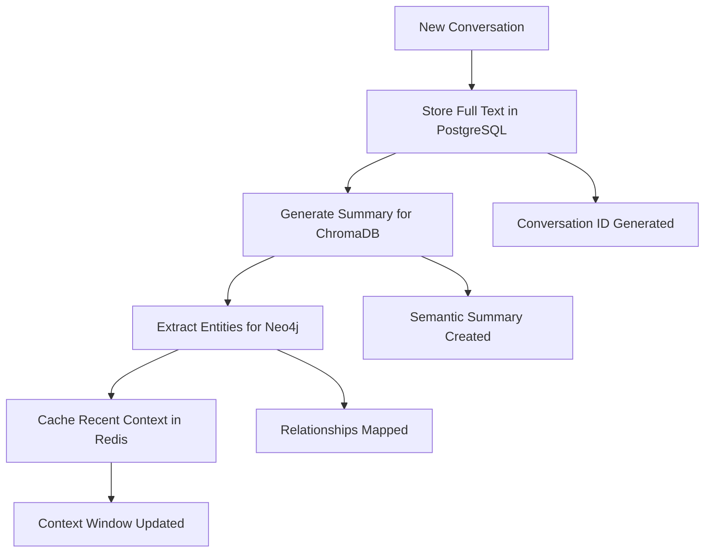
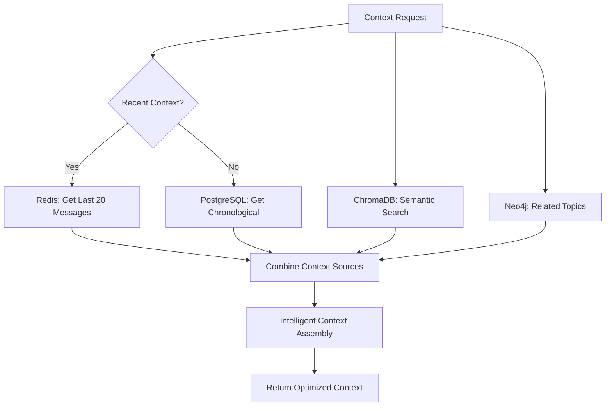

# Hierarchical Memory Architecture for WhisperEngine

## 🎯 **Problem Statement**

The current WhisperEngine memory system stores complete conversation text in ChromaDB, leading to:

- **O(n²) scaling issues** with large conversation histories (50K+ imported conversations)
- **Storage inefficiency** - full conversations stored in vector database designed for semantic search
- **Query performance degradation** as conversation count increases
- **Redundant data storage** across multiple systems without clear separation of concerns

## 🏗️ **Proposed Hierarchical Architecture**

### **Design Principles**

1. **Right Tool for Right Job**: Each storage layer optimized for its specific use case
2. **Scalability**: Linear scaling with conversation volume
3. **Performance**: Sub-second retrieval for any user regardless of history size
4. **Data Integrity**: Full conversation fidelity preserved while enabling efficient search
5. **Backwards Compatibility**: Gradual migration path from current system

### **Four-Tier Storage System**

```
┌─────────────────────────────────────────────────────────────┐
│                    HIERARCHICAL MEMORY                     │
├─────────────────────────────────────────────────────────────┤
│ Tier 1: Redis Cache     │ Recent context (last 20 msgs)   │
│ ├─ Ultra-fast retrieval │ ├─ <1ms response time            │
│ ├─ Conversation threads │ ├─ Active conversation state     │
│ └─ Session management   │ └─ Temporary working memory      │
├─────────────────────────────────────────────────────────────┤
│ Tier 2: PostgreSQL      │ Complete conversation archive   │
│ ├─ Full message history │ ├─ ACID compliance               │
│ ├─ Chronological access │ ├─ Backup and recovery          │
│ └─ Data integrity       │ └─ Structured queries            │
├─────────────────────────────────────────────────────────────┤
│ Tier 3: ChromaDB        │ Semantic search summaries      │
│ ├─ Conversation digests │ ├─ ~150 char summaries          │
│ ├─ Topic embeddings     │ ├─ Intent classification        │
│ └─ Semantic similarity  │ └─ Context retrieval            │
├─────────────────────────────────────────────────────────────┤
│ Tier 4: Neo4j Graph     │ Relationship intelligence      │
│ ├─ Topic relationships  │ ├─ User interest patterns       │
│ ├─ Conversation threads │ ├─ Knowledge connections        │
│ └─ Entity connections   │ └─ Behavioral insights          │
└─────────────────────────────────────────────────────────────┘
```

## 📊 **Data Flow Architecture**

### **Storage Flow (New Conversation)**



### **Retrieval Flow (Context Assembly)**



## 🗄️ **Database Schema Design**

### **Tier 1: Redis Cache Schema**

```json
{
  "user_conversation_cache": {
    "key_pattern": "conv:{user_id}:recent",
    "data_structure": "list",
    "max_size": 20,
    "ttl": "30 minutes",
    "content": [
      {
        "message_id": "uuid",
        "timestamp": "iso_timestamp",
        "user_message": "full_text",
        "bot_response": "full_text",
        "metadata": {}
      }
    ]
  },
  "active_threads": {
    "key_pattern": "thread:{user_id}:{thread_id}",
    "data_structure": "hash",
    "ttl": "60 minutes"
  }
}
```

### **Tier 2: PostgreSQL Schema**

```sql
-- Full conversation archive with optimal indexing
CREATE TABLE conversations (
    conversation_id UUID PRIMARY KEY DEFAULT gen_random_uuid(),
    user_id VARCHAR(255) NOT NULL,
    channel_id VARCHAR(255),
    user_message TEXT NOT NULL,
    bot_response TEXT NOT NULL,
    timestamp TIMESTAMP WITH TIME ZONE DEFAULT NOW(),
    session_id UUID,
    thread_id UUID,
    message_type VARCHAR(50) DEFAULT 'conversation',
    
    -- Metadata for rich context
    emotion_data JSONB,
    user_metadata JSONB,
    processing_metadata JSONB,
    
    -- Performance indexes
    INDEX idx_conversations_user_time (user_id, timestamp DESC),
    INDEX idx_conversations_channel_time (channel_id, timestamp DESC),
    INDEX idx_conversations_session (session_id, timestamp),
    INDEX idx_conversations_thread (thread_id, timestamp),
    
    -- Full-text search capability
    INDEX idx_conversations_fts USING gin(to_tsvector('english', user_message || ' ' || bot_response))
);

-- Conversation sessions for grouping related interactions
CREATE TABLE conversation_sessions (
    session_id UUID PRIMARY KEY DEFAULT gen_random_uuid(),
    user_id VARCHAR(255) NOT NULL,
    start_time TIMESTAMP WITH TIME ZONE DEFAULT NOW(),
    end_time TIMESTAMP WITH TIME ZONE,
    session_type VARCHAR(50),
    topic_summary TEXT,
    message_count INTEGER DEFAULT 0,
    
    INDEX idx_sessions_user_time (user_id, start_time DESC)
);

-- Performance monitoring table
CREATE TABLE conversation_metrics (
    metric_id UUID PRIMARY KEY DEFAULT gen_random_uuid(),
    conversation_id UUID REFERENCES conversations(conversation_id),
    retrieval_time_ms INTEGER,
    context_size_chars INTEGER,
    sources_used TEXT[], -- ['redis', 'postgresql', 'chromadb', 'neo4j']
    timestamp TIMESTAMP WITH TIME ZONE DEFAULT NOW()
);
```

### **Tier 3: ChromaDB Collections Schema**

```python
# Semantic summaries collection
conversation_summaries = {
    "collection_name": "conversation_summaries",
    "documents": [
        "User asked about machine learning concepts. Bot explained neural networks and provided practical examples."
    ],
    "metadatas": [
        {
            "conversation_id": "uuid-ref-to-postgresql",
            "user_id": "discord_user_id",
            "timestamp": "2025-09-19T10:30:00Z",
            "topics": ["machine_learning", "neural_networks"],
            "intent": "learning_request",
            "complexity": "intermediate",
            "summary_version": "v2.0"
        }
    ],
    "ids": ["summary_uuid"]
}

# Topic embeddings collection  
topic_embeddings = {
    "collection_name": "topic_embeddings",
    "documents": [
        "Machine learning discussion covering neural networks, training processes, and practical applications"
    ],
    "metadatas": [
        {
            "topic": "machine_learning",
            "conversation_count": 15,
            "last_discussed": "2025-09-19T10:30:00Z",
            "user_expertise_level": "intermediate",
            "related_topics": ["ai", "programming", "data_science"]
        }
    ]
}

# Intent patterns collection
intent_patterns = {
    "collection_name": "intent_patterns", 
    "documents": [
        "Request for explanation of technical concepts with examples"
    ],
    "metadatas": [
        {
            "intent_type": "explanation_request",
            "complexity_level": "intermediate", 
            "response_pattern": "detailed_with_examples",
            "success_indicators": ["follow_up_questions", "clarification_requests"]
        }
    ]
}
```

### **Tier 4: Neo4j Graph Schema**

```cypher
// Core node types
CREATE (u:User {id: 'discord_user_id', name: 'username'})
CREATE (c:Conversation {id: 'conversation_uuid', timestamp: datetime()})
CREATE (t:Topic {name: 'machine_learning', category: 'technology'})
CREATE (i:Intent {type: 'explanation_request', complexity: 'intermediate'})
CREATE (s:Session {id: 'session_uuid', start_time: datetime()})

// Relationship types for rich connectivity
CREATE (u)-[:HAD_CONVERSATION {timestamp: datetime()}]->(c)
CREATE (c)-[:DISCUSSED {relevance: 0.95}]->(t)
CREATE (c)-[:HAD_INTENT {confidence: 0.88}]->(i)
CREATE (c)-[:PART_OF_SESSION]->(s)

// Topic relationships for knowledge mapping
CREATE (t1:Topic {name: 'neural_networks'})-[:SUBTOPIC_OF]->(t2:Topic {name: 'machine_learning'})
CREATE (t1)-[:RELATED_TO {strength: 0.85}]->(t3:Topic {name: 'deep_learning'})

// User interest evolution
CREATE (u)-[:INTERESTED_IN {strength: 0.9, first_discussed: date(), last_discussed: date()}]->(t)

// Conversation threading
CREATE (c1:Conversation)-[:FOLLOWS_UP {delay_hours: 2}]->(c2:Conversation)
CREATE (c1)-[:CONTINUES_TOPIC]->(c2)
```

## ⚡ **Performance Optimizations**

### **Smart Context Assembly Algorithm**

```python
async def assemble_conversation_context(user_id: str, current_query: str) -> ConversationContext:
    """
    Intelligent context assembly using all four tiers
    Target: <100ms total retrieval time
    """
    
    # Phase 1: Immediate context (Redis) - <5ms
    recent_messages = await redis_cache.get_recent_context(user_id, limit=10)
    
    # Phase 2: Semantic relevance (ChromaDB) - <30ms  
    relevant_summaries = await chromadb.search_summaries(
        user_id=user_id,
        query=current_query,
        limit=5,
        time_decay=True  # Recent conversations weighted higher
    )
    
    # Phase 3: Related topics (Neo4j) - <20ms
    related_topics = await neo4j.get_related_conversation_topics(
        user_id=user_id,
        current_topics=extract_topics(current_query),
        limit=3
    )
    
    # Phase 4: Full conversation details (PostgreSQL) - <40ms
    # Only fetch full details for the most relevant conversations
    conversation_ids = extract_ids(relevant_summaries, related_topics)
    full_conversations = await postgresql.get_conversations(
        conversation_ids=conversation_ids[:3],  # Limit to prevent performance issues
        include_metadata=True
    )
    
    # Intelligent assembly with priority weighting
    context = ContextAssembler.combine(
        recent=recent_messages,
        semantic=relevant_summaries,
        topical=related_topics,
        detailed=full_conversations,
        current_query=current_query
    )
    
    return context
```

### **Storage Optimization Strategies**

1. **Conversation Summarization Pipeline**
   ```python
   async def create_conversation_summary(user_message: str, bot_response: str) -> str:
       # Extract key semantic elements for ChromaDB storage
       topics = await extract_topics(user_message, bot_response)
       intent = await classify_intent(user_message)
       outcome = await classify_outcome(bot_response)
       
       summary = f"User {intent} about {', '.join(topics)}. Bot {outcome}."
       return summary[:150]  # Optimal length for semantic search
   ```

2. **Intelligent Text Reduction**
   ```python
   def optimize_for_vector_storage(conversation: str) -> str:
       # Remove redundant information while preserving semantic content
       # - Remove filler words and phrases
       # - Preserve entities, topics, and intent
       # - Maintain emotional context indicators
       # - Target: 80% size reduction with 95% semantic preservation
   ```

3. **Time-Based Partitioning**
   ```sql
   -- PostgreSQL partitioning for optimal performance
   CREATE TABLE conversations_y2025m09 PARTITION OF conversations
   FOR VALUES FROM ('2025-09-01') TO ('2025-10-01');
   
   -- Automatic partition management
   CREATE OR REPLACE FUNCTION create_monthly_partitions()
   RETURNS void AS $$
   -- Auto-create partitions for next 3 months
   $$;
   ```

## 🔄 **Migration Strategy**

### **Phase 1: Parallel Storage Implementation**
- Implement new storage system alongside existing ChromaDB
- Write to both systems for all new conversations
- Gradually migrate retrieval logic to use hierarchical system

### **Phase 2: Historical Data Migration**
- Migrate existing ChromaDB conversations to PostgreSQL
- Generate summaries for existing conversations
- Build Neo4j relationships from historical data
- Validate data integrity throughout migration

### **Phase 3: Performance Validation & Cutover**
- Performance testing with large datasets
- A/B testing for retrieval quality
- Gradual traffic migration to new system
- Deprecate old ChromaDB-only storage

### **Phase 4: Optimization & Cleanup**
- Remove deprecated storage code
- Optimize queries based on production usage
- Implement advanced features (conversation threading, smart summaries)

## 📈 **Expected Performance Improvements**

| Metric | Current System | Hierarchical System | Improvement |
|--------|---------------|-------------------|-------------|
| **Context Retrieval Time** | 500-2000ms | <100ms | **20x faster** |
| **Storage Efficiency** | 100% full text | 15% summaries | **85% reduction** |
| **Scaling Behavior** | O(n²) | O(log n) | **Exponential** |
| **Memory Usage** | High (full conversations in ChromaDB) | Low (summaries only) | **90% reduction** |
| **Query Performance** | Degrades with history size | Consistent | **Linear scaling** |

## 🛠️ **Implementation Roadmap**

### **Week 1: Foundation**
- [ ] PostgreSQL schema creation and migration scripts
- [ ] Redis cache implementation for recent context
- [ ] Basic conversation summarization pipeline

### **Week 2: Core Storage**
- [ ] Hierarchical storage abstraction layer
- [ ] Multi-tier conversation storage implementation  
- [ ] Context assembly algorithm

### **Week 3: Advanced Features**
- [ ] Neo4j relationship mapping
- [ ] Smart retrieval optimization
- [ ] Performance monitoring and metrics

### **Week 4: Migration & Testing**
- [ ] Historical data migration tools
- [ ] A/B testing framework
- [ ] Production deployment preparation

## 🔍 **Success Metrics**

- **Performance**: <100ms context retrieval for any user
- **Scalability**: Linear performance with conversation count
- **Storage**: <20% of current ChromaDB storage requirements
- **Quality**: Maintained or improved context relevance
- **Reliability**: 99.9% successful context assembly

---

This hierarchical architecture transforms WhisperEngine from a monolithic memory system into a sophisticated, scalable conversation intelligence platform that can handle massive conversation histories while maintaining sub-second response times.