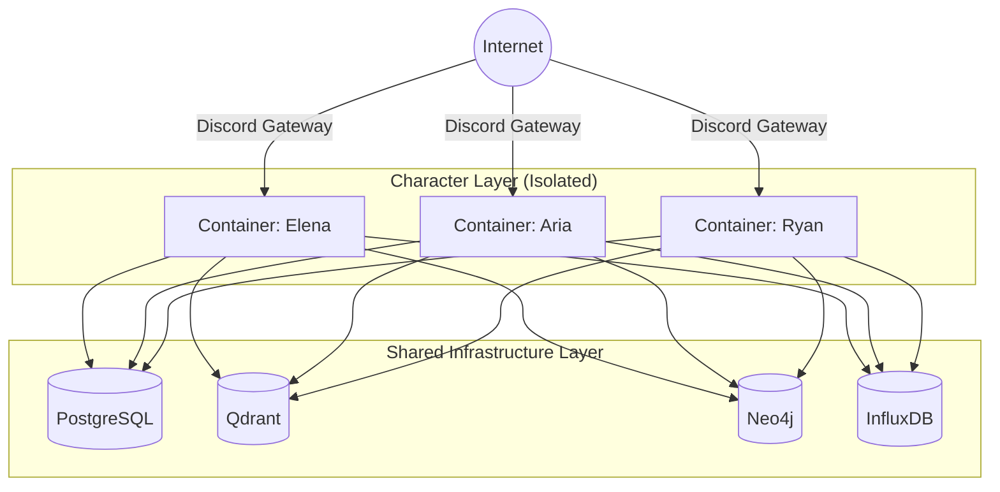

# Infrastructure & Deployment

WhisperEngine v2 uses a containerized microservices architecture orchestrated by Docker Compose. This ensures isolation, scalability, and ease of deployment.

## Architectural Theory: The "Sidecar" & Isolation Patterns

### Design Choice: One Container Per Character
In many multi-bot systems, a single process handles all characters (Multi-Tenancy). WhisperEngine v2 deliberately chooses **Process Isolation** (One Container Per Character).

*   **Fault Isolation**: If "Elena" crashes due to a bad memory update or infinite loop, "Aria" and "Ryan" remain unaffected.
*   **Resource Quotas**: We can assign more CPU/RAM to popular characters and limit resource-heavy ones using Docker limits.
*   **Independent Lifecycles**: We can restart or update one character without downtime for the others.

### Service Mesh Diagram



## Service Architecture

### 1. Core Infrastructure (Shared)
These services are shared across all character instances.

*   **PostgreSQL (`postgres`)**:
    *   **Port**: 5432
    *   **Role**: Primary relational store.
    *   **Volume**: `postgres_data`
*   **Qdrant (`qdrant`)**:
    *   **Port**: 6333 (API), 6334 (GRPC)
    *   **Role**: Vector database for semantic memory.
    *   **Volume**: `qdrant_data`
*   **Neo4j (`neo4j`)**:
    *   **Port**: 7474 (HTTP), 7687 (Bolt)
    *   **Role**: Knowledge graph.
    *   **Volume**: `neo4j_data`
*   **InfluxDB (`influxdb`)**:
    *   **Port**: 8086
    *   **Role**: Metrics and time-series data.
    *   **Volume**: `influxdb_data`

### 2. Character Containers (Isolated)
Each character runs in its own isolated container. This prevents a crash in one bot from affecting others and allows for independent resource scaling.

*   **Service Name**: `bot_{name}` (e.g., `bot_elena`)
*   **Image**: `whisperengine-v2:latest`
*   **Command**: `python run_v2.py {name}`
*   **Environment**:
    *   `DISCORD_BOT_NAME`: The name of the character (loads `characters/{name}/`).
    *   `DISCORD_TOKEN`: Specific token for that bot.
    *   `OPENAI_API_KEY`: Shared or specific key.
    *   Database URLs (pointing to shared infra).

## Deployment Workflow

### 1. Build
```bash
docker compose -f docker-compose.v2.yml build
```

### 2. Run Infrastructure
Start the databases first to ensure they are ready.
```bash
docker compose -f docker-compose.v2.yml up -d postgres qdrant neo4j influxdb
```

### 3. Run Characters
Start specific characters or all of them.
```bash
# Start Elena
docker compose -f docker-compose.v2.yml up -d bot_elena

# Start All
docker compose -f docker-compose.v2.yml up -d
```

## Configuration Management

Configuration is handled via **Pydantic Settings** (`src_v2/config/settings.py`) and **Environment Files**.

### Hierarchy
1.  **Environment Variables** (Highest Priority)
2.  **`.env.{bot_name}`** (Character-specific overrides)
3.  **`.env`** (Global defaults)
4.  **Default Values** (in `settings.py`)

### Critical Settings
*   `DISCORD_BOT_NAME`: Determines which character profile to load.
*   `OPENAI_API_KEY`: Required for LLM generation.
*   `NEO4J_URL`, `POSTGRES_URL`, `QDRANT_URL`: Database connection strings.

## Networking
*   All services communicate over a default Docker bridge network (`whisperengine-v2_default`).
*   Service discovery is done via container names (e.g., `postgres`, `qdrant`).
*   External access is mapped to host ports (e.g., `localhost:5432`).
