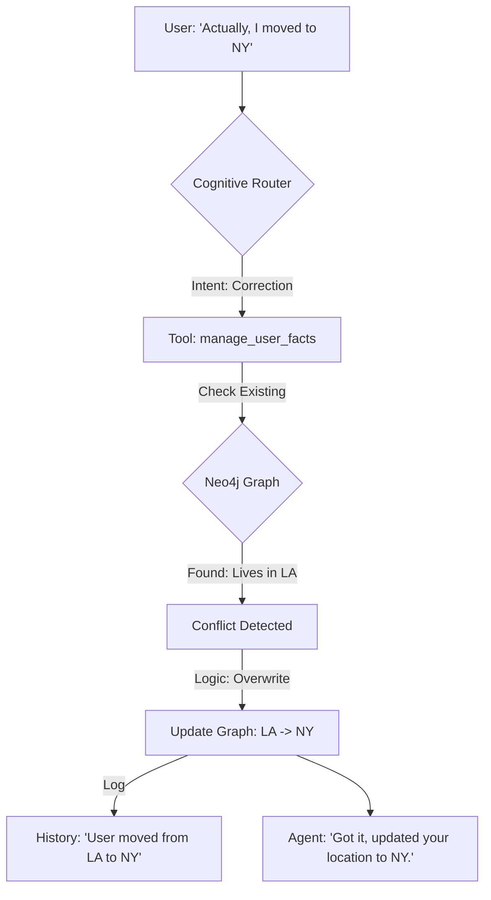

# WhisperEngine 2.0: Agentic Memory Architecture

## Overview
This document outlines the "Agentic Memory" system for WhisperEngine 2.0. It combines **Vector Search** (for fuzzy recall), **Knowledge Graph** (for precise facts), and **Cognitive Routing** (for intelligent tool use) to create a memory system that supports self-correction, conflict detection, and memory aging.

## Core Concept: "The Living Memory"

Memory is not just a static database. It is a living system that:
1.  **Evolves**: Old memories fade (Aging).
2.  **Corrects**: New facts overwrite old ones (Conflict Resolution).
3.  **Reflects**: Background processes organize and clean up data.
4.  **Feels**: It remembers the *emotional tone* of past interactions.
5.  **Grows**: The character *evolves* based on the relationship with the user.
6.  **Explains**: The system provides **Reasoning Transparency** (why it chose to say what it said).

## Modes of Thought (Cognitive Architecture)

To address the "Latency vs. Depth" trade-off, the Agent operates in two modes:

### 1. Fast Mode (Standard Chat)
*   **Goal**: Low latency (<2s), conversational flow.
*   **Process**: Router -> Single Tool (if needed) -> Response.
*   **Use Case**: Casual chat, greetings, simple questions.

### 2. Reflective Mode (Deep Thinking)
*   **Goal**: Depth, philosophical consistency, complex reasoning.
*   **Process**: Router -> Chain of Thought -> Multiple Tools -> Synthesis -> Response.
*   **Trigger**: Complex user queries ("What do you think about the concept of soul?") or explicit user request.
*   **Output**: Deeper, more nuanced answers, potentially acknowledging uncertainty ("Confusion Detection").

## The Memory Tools (Agent Accessible)

The Agent uses a **Cognitive Router** to decide which tool to use.

### 1. `search_recent_history` (Short-Term)
*   **Source**: PostgreSQL (`v2_chat_history`)
*   **Usage**: Default. Fetches the immediate conversation flow (last 10-20 turns).

### 2. `search_archived_summaries` (Mid-Term & Emotional Context)
*   **Source**: Qdrant (Collection: `summaries`)
*   **Usage**: Finding high-level topics AND emotional context.
*   **Content**: "User was frustrated about work." (Not just "User talked about work").
*   **Metadata**: Includes a **Meaningfulness Score** (1-5). High-score summaries are retained longer.
*   **Aging**: Scores decay over time. Recent summaries are boosted.

### 3. `search_specific_memories` (Episodic & Hybrid Search)
*   **Source**: Qdrant (Collection: `episodes`)
*   **Usage**: Finding specific details or quotes.
*   **Mechanism**: **Hybrid Search** (Dense Vector + Sparse/Keyword).
    *   *Why?* Vectors are great for concepts ("boat"), but Keywords are better for names ("The S.S. Minnow").
*   **Aging**: Uses a "Recency Decay" formula.

### 4. `manage_user_facts` (Semantic, Correction & Preferences)
*   **Source**: Neo4j (Knowledge Graph)
*   **Usage**: Reading/Writing facts AND User Preferences.
*   **Nodes**: `(User)`, `(Entity)`, `(Preference)`.
*   **Example Preference**: `(User)-[:PREFERS]->(Style {concise: true, emojis: false})`.
*   **Conflict Detection**: If `(User)-[:HAS_PET]->(Dog)` exists, and user says "I have a cat", the tool asks: "Is this a new pet or a correction?"

### 5. `get_character_evolution` (The Self & Goals)
*   **Source**: Neo4j (Graph) + Postgres (State)
*   **Usage**: Retrieving the *current* state of the relationship and character growth.
*   **Dynamic Persona**: The system prompt is NOT static. It injects:
    *   **Relationship Level**: `(User)-[:TRUSTS {level: 0.8}]->(Character)`
    *   **Learned Traits**: `(Character)-[:ACQUIRED_TRAIT]->(Trait {name: "Protective", source: "User shared trauma"})`
    *   **Current Goals**: `(Character)-[:PURSUING]->(Goal {description: "Cheer up user"})`. The Agent can UPDATE these goals.

## Background Processes (The "Subconscious")

### 1. Auto-Summarization (Compression)
*   **Trigger**: Session timeout (30 mins inactivity).
*   **Action**: Compress raw messages into a summary. Calculate **Meaningfulness Score**. Embed into Qdrant.

### 2. Reflection & Consolidation (Conflict Resolution & Epiphanies)
*   **Trigger**: Nightly (or periodic).
*   **Action**:
    *   Scan Neo4j for contradictions.
    *   **Asynchronous Epiphanies**: If the reflection process finds a new connection ("Wait, user mentioned X last week and Y today..."), it can schedule a **Proactive Message** to the user (e.g., "I just realized something about what you said...").
    *   **Self-Validation**: The character reviews recent interactions to "learn" from mistakes.

### 3. Memory Pruning (Aging)
*   **Trigger**: Weekly.
*   **Action**: Move very old, low-relevance memories to "Cold Storage" (text file archive) and remove from active Vector Index to keep search fast and relevant.

## Reasoning Transparency

To address the "Black Box" problem, the Cognitive Router logs its decision process:
*   **Input**: "Do you remember my dog?"
*   **Thought**: "User is asking about a personal fact. I should check the Knowledge Graph."
*   **Action**: `manage_user_facts(query="dog")`
*   **Result**: "Found entity 'Rex' (Dog)."
*   **Response**: "Yes, you mean Rex!"

This "Thought Trace" is stored in the logs and can be exposed in a "Debug Mode" for developers or curious users.

## Data Flow: The "Correction Loop"

## Implementation Strategy

1.  **Phase 6a: The Foundation** (Sessions, Summaries, Vector Search).
2.  **Phase 6b: The Graph** (Neo4j integration for Facts & Corrections).
3.  **Phase 6c: The Brain** (Cognitive Router & Reflection Loop).

