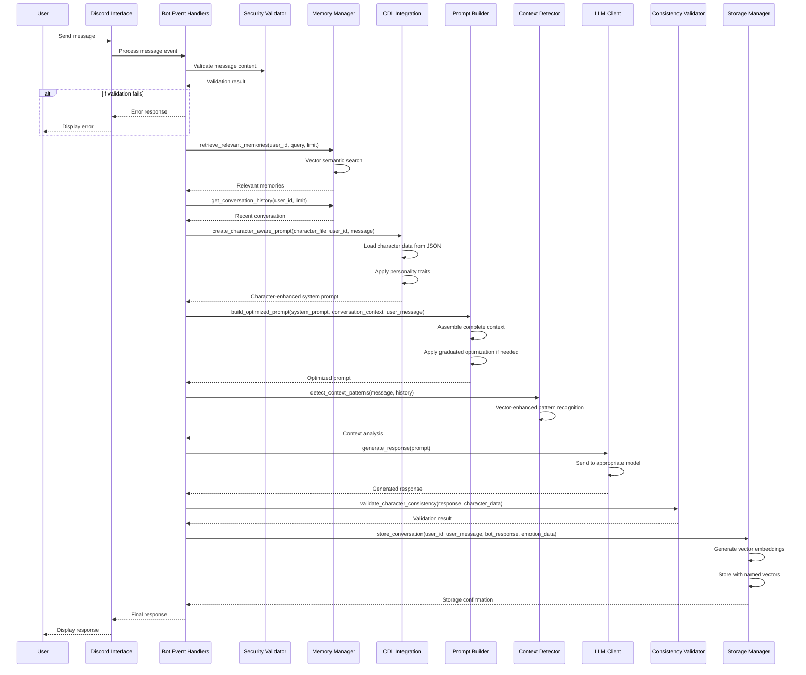

# Message Processing Sequence Diagram

This sequence diagram illustrates the data flow from an incoming message to a response in the WhisperEngine system, showing how messages are processed through various components.

## Detailed Flow Explanation

1. **Initial Message Handling**
   - User sends a message through Discord
   - Discord interface receives the message and forwards to event handlers
   - Event handlers begin processing the message

2. **Security Validation**
   - Message is validated against security policies
   - If validation fails, error response is returned to user
   - If validation passes, processing continues

3. **Memory Retrieval**
   - System retrieves relevant memories using vector semantic search
   - Conversation history is fetched to provide immediate context
   - Both long-term memories and recent conversation provide context

4. **Character Enhancement**
   - CDL Integration loads character data from JSON definition
   - Character personality traits are applied to create a character-aware prompt
   - System prompt is enhanced with character-specific context

5. **Prompt Building**
   - Optimized prompt builder assembles complete context
   - Fidelity-first approach preserves character nuance
   - Graduated optimization applied only if context limit is exceeded

6. **Context Detection**
   - Vector-enhanced pattern recognition analyzes message content
   - Conversation context is determined for appropriate response framing
   - Analysis results inform the response generation

7. **LLM Response Generation**
   - Complete prompt is sent to appropriate LLM model
   - LLM generates response based on provided context and character
   - Generated response is returned to handlers

8. **Consistency Validation**
   - Response is validated for character consistency
   - Ensures the generated content aligns with character personality
   - Validation result determines if response needs adjustment

9. **Memory Storage**
   - Conversation is stored with emotional context for future retrieval
   - Vector embeddings are generated for content, emotion, and semantics
   - Named vectors are stored in Qdrant with bot-specific segmentation

10. **Response Delivery**
    - Final response is returned to Discord interface
    - Discord displays the response to the user
    - Conversation cycle completes

## Key Architectural Patterns

- **Fidelity-First Processing**: Full context preservation until optimization is necessary
- **Vector-Native Operations**: Semantic processing uses existing Qdrant infrastructure
- **Character Consistency**: CDL system ensures authentic personality responses
- **Bot-Specific Memory Isolation**: Memories are segmented by bot name
- **Named Vector Architecture**: Multi-dimensional search with content/emotion/semantic vectors
