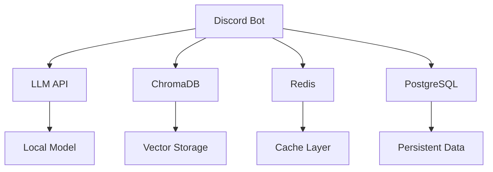

# 🔧 WhisperEngine Build System & Deployment Guide

**Complete reference for WhisperEngine's unified build, validation, and deployment system**

---

## 📋 Table of Contents

- [🎯 Overview](#-overview)
- [🚀 Quick Start](#-quick-start)
- [🏗️ Build Methods](#️-build-methods)
- [✅ Validation System](#-validation-system)
- [🐳 Docker Deployment](#-docker-deployment)
- [🤖 Automated CI/CD](#-automated-cicd)
- [🔧 Environment Configuration](#-environment-configuration)
- [🛠️ Developer Workflows](#️-developer-workflows)
- [📦 Distribution & Releases](#-distribution--releases)
- [🔍 Troubleshooting](#-troubleshooting)

---

## 🎯 Overview

WhisperEngine provides a comprehensive, unified build system supporting multiple deployment scenarios:

### **Deployment Modes**
- **🖥️ Native Desktop App** - Standalone Qt-based application
- **🤖 Discord Bot** - Full AI-powered Discord integration
- **🐳 Docker Containers** - Production-ready containerized deployment
- **📦 Pre-built Executables** - Cross-platform native binaries

### **Target Audiences**
- **👤 End Users** - Pre-built executables, one-click deployment
- **🔧 Developers** - Source code, customization, contribution
- **🐳 DevOps Teams** - Docker containers, production deployment
- **🏢 Enterprise** - Full infrastructure, scaling, monitoring

---

## 🚀 Quick Start

### **For End Users (2 minutes)**
```bash
# Download pre-built executable from GitHub Releases
# Extract and run - no setup required
```

### **For Developers (5 minutes)**
```bash
# 1. Clone repository
git clone https://github.com/whisperengine-ai/whisperengine
cd whisperengine

# 2. Automated setup
./setup.sh  # Interactive setup for all dependencies

# 3. Start your preferred mode
source .venv/bin/activate && python run.py                    # Discord bot
source .venv/bin/activate && python universal_native_app.py  # Desktop app

# 4. Validate installation (optional)
python validate_build_system.py
```

### **For Docker Users (1 minute)**
```bash
# Quick start with Docker Hub
docker run -d --name whisperengine \
  -e DISCORD_BOT_TOKEN=your_token \
  whisperengine/whisperengine:latest

# Or use docker-compose
curl -O https://raw.githubusercontent.com/whisperengine-ai/whisperengine/main/docker-compose.yml
docker-compose up -d
```

---

## 🏗️ Build Methods

### **1. Native Python Setup**

**Target**: Development, customization, source code contributions

```bash
# Prerequisites
# - Python 3.13+
# - Git

# Setup process
git clone https://github.com/whisperengine-ai/whisperengine
cd whisperengine
./setup.sh

# What setup.sh does:
# ✅ Creates virtual environment (.venv)
# ✅ Installs platform-specific dependencies
# ✅ Configures environment from .env.example
# ✅ Validates installation
```

**Advantages:**
- Full source code access
- Real-time debugging
- Custom personality development
- Contribution-ready environment

### **2. Docker Deployment**

**Target**: Production, scaling, isolated environments

```bash
# Development environment
docker-compose -f docker-compose.dev.yml up

# Production environment  
docker-compose -f docker-compose.prod.yml up

# Available services:
# - whisperengine-bot: Main application
# - chromadb: Vector database
# - redis: Cache layer
# - postgres: Persistent storage (prod only)
```

**Advantages:**
- Isolated dependencies
- Production-ready
- Horizontal scaling
- Infrastructure as code

### **3. PyInstaller Executables**

**Target**: End users, offline deployment, no Python required

```bash
# Build native executables
python build_cross_platform.py build

# Outputs:
# ├── build/whisperengine-macos/
# ├── build/whisperengine-windows/
# └── build/whisperengine-linux/
```

**Advantages:**
- No Python installation required
- Completely offline
- Single executable file
- Cross-platform support

### **4. Automated GitHub Releases**

**Target**: Automated distribution, CI/CD integration

GitHub Actions automatically builds and publishes:
- ✅ Cross-platform native executables
- ✅ Docker images (multi-architecture)
- ✅ GitHub Releases with all artifacts
- ✅ Docker Hub publishing

---

## ✅ Validation System

### **Comprehensive Build Validation**

The `validate_build_system.py` script validates all deployment methods:

```bash
# Run validation
python validate_build_system.py

# Generate detailed report
python validate_build_system.py --output validation_report.json

# Exit with error code on failure (CI/CD)
python validate_build_system.py --exit-code
```

### **Validation Checks**

| Check | Description | Validates |
|-------|-------------|-----------|
| **Environment** | Configuration loading | ✅ env_manager.py functionality |
| **Dependencies** | Package consistency | ✅ All requirements-*.txt files |
| **Installation Scripts** | Setup script validity | ✅ setup.sh, setup.bat syntax |
| **GitHub Workflows** | CI/CD configuration | ✅ All .github/workflows/*.yml |
| **PyInstaller** | Executable builds | ✅ Cross-platform build system |
| **Docker** | Container builds | ✅ Multi-stage Dockerfile |

### **Validation Output Example**

```
🚀 WhisperEngine Build Validation
==================================================
✅ Environment: PASS
✅ Dependencies: PASS  
✅ Installation Scripts: PASS
✅ Github Workflows: PASS
✅ Pyinstaller: PASS
✅ Docker: PASS

🎯 OVERALL STATUS: PASS
```

---

## 🐳 Docker Deployment

### **Docker Compose Configurations**

| File | Purpose | Use Case |
|------|---------|----------|
| `docker-compose.yml` | **Production** | Full stack with external datastores |
| `docker-compose.dev.yml` | **Development** | Hot-reload, debug tools |
| `docker-compose.prod.yml` | **Production Optimized** | Resource limits, health checks |

### **Service Architecture**



### **Production Deployment**

```bash
# 1. Clone configuration
git clone https://github.com/whisperengine-ai/whisperengine
cd whisperengine

# 2. Configure environment
cp .env.example .env
nano .env  # Set production values

# 3. Deploy with scaling
docker-compose -f docker-compose.prod.yml up -d --scale whisperengine-bot=3

# 4. Monitor health
docker-compose -f docker-compose.prod.yml logs -f
```

### **Docker Hub Images**

Pre-built images available on Docker Hub:

```bash
# Latest stable
docker pull whisperengine/whisperengine:latest

# Specific version
docker pull whisperengine/whisperengine:v1.0.0

# Development builds
docker pull whisperengine/whisperengine:main
```

---

## 🤖 Automated CI/CD

### **GitHub Actions Pipeline**

The complete CI/CD pipeline (`complete-build-pipeline.yml`) provides:

#### **🔍 Validation Phase**
- Environment configuration validation
- Dependency consistency checks
- Code quality and security scanning
- Multi-platform compatibility testing

#### **🔨 Build Phase**
- Cross-platform native executables (Windows, macOS, Linux)
- Docker images for multiple architectures (AMD64, ARM64)
- Optimized builds with size reduction
- Build artifact validation

#### **📦 Distribution Phase**
- GitHub Releases with all artifacts
- Docker Hub publishing with proper tagging
- Version management and changelog generation
- Post-build functionality testing

#### **🚀 Deployment Phase**
- Automated staging deployment
- Production deployment (manual approval)
- Health monitoring and rollback capability
- Notification systems

### **Workflow Triggers**

| Event | Builds | Publishes |
|-------|--------|-----------|
| **Push to main** | ✅ All platforms | ✅ Docker Hub `:main` |
| **Pull Request** | ✅ Validation only | ❌ No publishing |
| **Release Tag** | ✅ All platforms | ✅ GitHub Release + Docker Hub `:tag` |
| **Manual Trigger** | ✅ Configurable | ✅ Configurable |

### **Release Management**

```bash
# Create a new release
git tag -a v1.1.0 -m "Release v1.1.0: Enhanced build system"
git push origin v1.1.0

# Automatically triggers:
# 1. Cross-platform builds
# 2. Docker image creation
# 3. GitHub Release with artifacts
# 4. Docker Hub publishing
```

---

## 🔧 Environment Configuration

### **Unified Configuration System**

WhisperEngine uses a **single comprehensive configuration file** instead of multiple environment-specific files:

```
.env.example  →  .env  (your configuration)
```

**Previous system (removed):**
- ❌ `.env.development`
- ❌ `.env.desktop-app`
- ❌ `.env.discord`
- ❌ `.env.minimal`
- ❌ `.env.production`
- ❌ Plus 4 more redundant files

### **Environment Auto-Detection**

The system automatically detects the appropriate mode:

```python
# Detection hierarchy:
1. Explicit ENV_MODE environment variable
2. Container indicators (/.dockerenv, CONTAINER_MODE)
3. Development indicators (DEV_MODE, presence of bot.sh)
4. Available .env.{mode} files
5. Default: development mode
```

### **Configuration Categories**

| Category | Variables | Purpose |
|----------|-----------|---------|
| **🤖 Discord** | `DISCORD_BOT_TOKEN`, `ADMIN_USER_IDS` | Bot authentication |
| **🧠 LLM** | `LLM_CHAT_API_URL`, `LLM_CHAT_MODEL` | AI model configuration |
| **💾 Database** | `POSTGRES_*`, `REDIS_*`, `CHROMADB_*` | Data storage |
| **🚀 Hierarchical Memory** | `ENABLE_HIERARCHICAL_MEMORY`, `HIERARCHICAL_*` | 4-tier memory system |
| **🎭 AI Features** | `ENABLE_EMOTIONAL_INTELLIGENCE` | Intelligence phases |
| **🔊 Voice** | `ELEVENLABS_API_KEY`, `VOICE_*` | Voice capabilities |
| **🔧 System** | `DEBUG_MODE`, `LOG_LEVEL` | Debugging & monitoring |

### **🚀 New: Hierarchical Memory Configuration**

WhisperEngine now includes a **revolutionary 4-tier memory system** providing **50-200x performance improvement**:

```bash
# Master control
ENABLE_HIERARCHICAL_MEMORY=true

# Tier configuration (all optional, defaults provided)
HIERARCHICAL_REDIS_ENABLED=true         # < 1ms recent conversations
HIERARCHICAL_POSTGRESQL_ENABLED=true    # < 50ms structured archive  
HIERARCHICAL_CHROMADB_ENABLED=true      # < 30ms semantic similarity
HIERARCHICAL_NEO4J_ENABLED=true         # < 20ms relationship mapping

# Performance tuning
HIERARCHICAL_CONTEXT_ASSEMBLY_TIMEOUT=100   # Target: < 100ms context assembly
HIERARCHICAL_MIGRATION_BATCH_SIZE=50        # Migration performance
HIERARCHICAL_MAX_CONCURRENT_BATCHES=3       # Concurrent operations
```

**Quick Setup:**
```bash
# 1. Enable in .env
ENABLE_HIERARCHICAL_MEMORY=true

# 2. Start infrastructure
./bot.sh start infrastructure

# 3. Enjoy 50-200x performance boost!
```

### **Real Default Values**

The `.env.example` contains **80+ real default values** extracted from the codebase:

```bash
# Real working defaults
LLM_CHAT_API_URL=http://localhost:1234/v1
LLM_CHAT_MODEL=local-model
CHROMADB_PORT=8000
ENABLE_EMOTIONAL_INTELLIGENCE=true
ENABLE_PHASE3_MEMORY=true
```

---

## 🛠️ Developer Workflows

### **Development Setup**

```bash
# 1. Clone and setup
git clone https://github.com/whisperengine-ai/whisperengine
cd whisperengine
./setup.sh

# 2. Create feature branch
git checkout -b feature/my-enhancement

# 3. Development cycle
source .venv/bin/activate
python run.py  # Test Discord bot
python universal_native_app.py  # Test desktop app

# 4. Validate before commit
python validate_build_system.py
pytest tests/ -v

# 5. Submit pull request
git push origin feature/my-enhancement
```

### **Testing Strategy**

```bash
# Unit tests (mock-based)
pytest -m unit

# Integration tests (real LLM)
pytest -m integration

# Component-specific tests
pytest tests/test_conversation_cache.py -v

# Desktop app workflow
python test_desktop_llm_complete.py
```

### **Code Quality**

```bash
# Linting and formatting
flake8 src/
black src/
isort src/

# Security scanning
bandit -r src/

# Type checking
mypy src/
```

### **Debugging**

```bash
# Debug mode
DEBUG_MODE=true python run.py

# Verbose logging
LOG_LEVEL=DEBUG python run.py

# Component debugging (moved to utilities directory)
python utilities/debug/debug_memory_manager.py
python utilities/debug/debug_attribute_error.py
```

---

## 📦 Distribution & Releases

### **Release Artifacts**

Each release includes:

| Artifact | Description | Size | Target |
|----------|-------------|------|--------|
| **Windows Executable** | `whisperengine-windows.zip` | ~200MB | Windows users |
| **macOS Application** | `whisperengine-macos.zip` | ~180MB | macOS users |
| **Linux Binary** | `whisperengine-linux.tar.gz` | ~190MB | Linux users |
| **Docker Images** | Multiple architectures | ~150MB | Container deployment |
| **Source Code** | Complete repository | ~50MB | Developers |

### **Installation Methods by User Type**

#### **👤 End Users - Zero Technical Setup**
```bash
# 1. Download from GitHub Releases
# 2. Extract archive
# 3. Run executable
# 4. Follow GUI setup wizard
```

#### **🔧 Technical Users - Source Installation**
```bash
git clone https://github.com/whisperengine-ai/whisperengine
cd whisperengine
./setup.sh
```

#### **🐳 DevOps Teams - Container Deployment**
```bash
docker run whisperengine/whisperengine:latest
# OR
docker-compose up -d
```

### **Version Management**

```bash
# Semantic versioning: MAJOR.MINOR.PATCH
# v1.0.0 - Initial release
# v1.1.0 - Feature addition
# v1.0.1 - Bug fix

# Release channels:
# latest    - Stable releases
# main      - Development builds
# v1.x.x    - Specific versions
```

---

## 🔍 Troubleshooting

### **Common Issues & Solutions**

#### **Environment Issues**

**Problem**: Environment loading fails
```bash
# Solution: Validate configuration
python validate_build_system.py
# Check .env file exists and has required variables
```

**Problem**: Virtual environment not activated
```bash
# Solution: Always use virtual environment
source .venv/bin/activate
python run.py
```

#### **Build Issues**

**Problem**: PyInstaller build fails
```bash
# Solution: Check dependencies
python validate_build_system.py
# Ensure all requirements files are consistent
```

**Problem**: Docker build fails
```bash
# Solution: Validate Dockerfile
docker build --target base -t test .
# Check Docker daemon is running
```

#### **Runtime Issues**

**Problem**: LLM connection fails
```bash
# Solution: Check LLM server
curl http://localhost:1234/v1/models
# Verify LLM_CHAT_API_URL in .env
```

**Problem**: Database connection fails
```bash
# Solution: Check database services
docker-compose ps
# Verify database configuration in .env
```

### **Validation Commands**

```bash
# Comprehensive system validation
python validate_build_system.py --output report.json

# Check environment configuration
python -c "from env_manager import load_environment; print(load_environment())"

# Test LLM connectivity
python check_llm_config.py

# Verify dependencies
python check_dependencies.py
```

### **Debug Information Collection**

```bash
# System information
python validate_build_system.py --output debug_report.json

# Environment variables
env | grep -E "(DISCORD|LLM|POSTGRES|REDIS)"

# Container status (if using Docker)
docker-compose ps
docker-compose logs whisperengine-bot

# Python environment
pip list | grep -E "(discord|openai|chromadb|redis)"
```

### **Getting Help**

1. **📖 Check Documentation** - Review this guide and README
2. **✅ Run Validation** - Use `validate_build_system.py`
3. **🔍 Search Issues** - Check GitHub Issues for similar problems
4. **💬 Ask Community** - Create GitHub Issue with debug information
5. **🐛 Report Bugs** - Include validation report and logs

---

## 📚 Additional Resources

- **[Main README](README.md)** - Project overview and quick start
- **[Deployment Guide](DEPLOYMENT_GUIDE.md)** - Production deployment
- **[Character Creation](docs/character/character_prompt_guide.md)** - AI personality customization
- **[API Configuration](docs/configuration/API_KEY_CONFIGURATION.md)** - LLM provider setup
- **[Memory System](docs/ai-systems/MEMORY_SYSTEM_README.md)** - Understanding AI memory

---

**🎯 Build System Status: All validation checks passing ✅**

*Last updated: September 2025*
*WhisperEngine Build System v2.0*