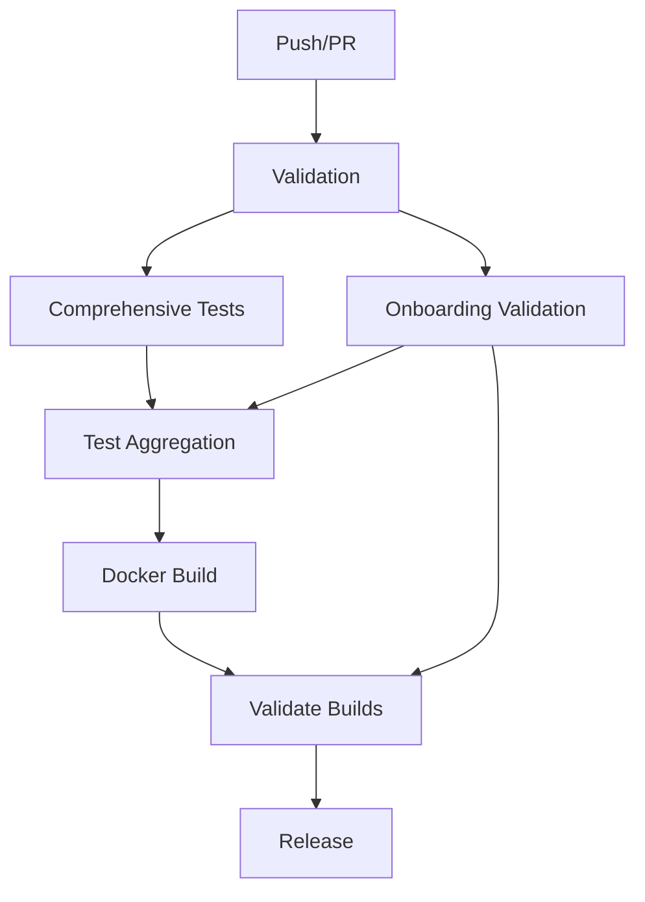

## GitHub Actions Integration Summary

### 🎉 **Integration Complete!**

Your GitHub Actions CI/CD pipeline has been successfully enhanced with comprehensive onboarding validation to support the new onboarding functionality you added to `run.py`.

## ✅ **What Was Added**

### 1. **New Onboarding Validation Job**
- **Job Name**: `onboarding_validation`
- **Purpose**: Tests the complete onboarding experience in a clean environment
- **Location**: `.github/workflows/complete-build-pipeline.yml`

### 2. **Comprehensive Test Coverage**
The onboarding validation includes:

#### **Fresh Installation Testing**
- Tests first-run detection logic
- Validates missing requirements detection
- Verifies configuration file validation

#### **Core Functionality Testing**
- Tests `FirstRunDetector` initialization and detection
- Validates `OnboardingManager` creation and flow
- Tests startup help generation
- Verifies configuration validation with sample configs

#### **Integration Testing**
- Tests `run.py` integration with onboarding
- Validates environment loading with onboarding
- Tests logging setup integration
- Verifies non-first-run behavior

#### **Docker Environment Testing**
- Tests onboarding in containerized environments
- Validates Docker-specific onboarding flows
- Ensures proper CI environment handling

### 3. **Enhanced Test Aggregation**
The test aggregation job now includes:
- Onboarding validation status in summary reports
- Onboarding test results in PR comments
- Integration with existing test categories

### 4. **Docker Integration**
The validate-builds job includes:
- Docker onboarding experience testing
- Container-specific environment validation
- CI flag handling in Docker environments

## 🔧 **Test File Created**

**File**: `tests/test_onboarding.py`
- Comprehensive test suite for onboarding functionality
- Tests for `FirstRunDetector` and `OnboardingManager`
- Integration tests with environment and logging
- Performance benchmarks for onboarding operations

## 🚀 **CI Pipeline Flow**

## 📊 **What Gets Tested**

### **On Every Push/PR:**
1. ✅ Fresh installation detection
2. ✅ Configuration validation logic
3. ✅ OnboardingManager initialization
4. ✅ run.py integration with onboarding
5. ✅ Environment loading compatibility
6. ✅ Docker onboarding experience
7. ✅ CI environment handling

### **Automated Validation:**
- **Unit Tests**: Individual component testing
- **Integration Tests**: Cross-component compatibility
- **Performance Tests**: Onboarding speed benchmarks
- **Docker Tests**: Container environment validation

## 🎯 **Benefits**

### **For Development:**
- Catches onboarding regressions early
- Validates user experience across environments
- Ensures consistent setup experience

### **For Users:**
- Guaranteed working onboarding experience
- Tested across multiple environments
- Reliable first-run detection

### **For Deployment:**
- CI validates onboarding before releases
- Docker deployments include onboarding testing
- Multi-environment compatibility verified

## 📈 **Next Steps**

Your enhanced CI/CD pipeline will now:

1. **Automatically test** onboarding functionality on every code change
2. **Validate** the user experience in fresh installations
3. **Ensure compatibility** across Docker and native environments
4. **Report** onboarding status in pull request summaries
5. **Block releases** if onboarding functionality is broken

The integration is complete and your onboarding functionality is now fully protected by comprehensive automated testing! 🎉

---

**To see it in action:** Make a commit or create a pull request, and watch the new `onboarding_validation` job run alongside your existing tests.