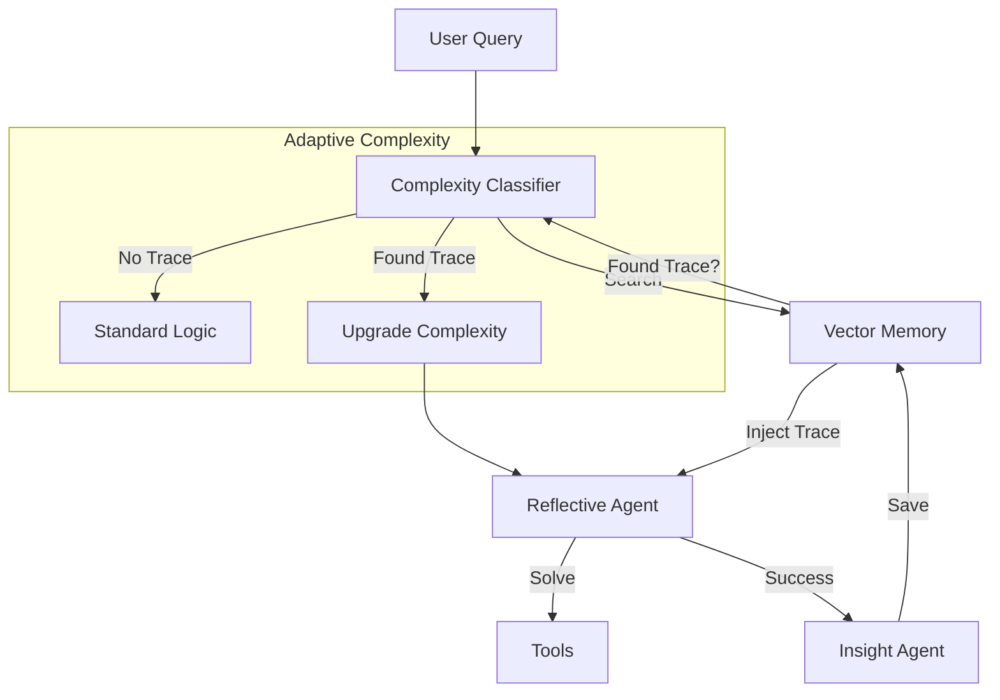

# Trace Learning: The "Muscle Memory" of WhisperEngine

**Technical Deep Dive**

Trace Learning (also known as "Memory of Reasoning") is a meta-learning system that allows WhisperEngine agents to remember *how* they solved complex problems. Instead of just storing the *answer*, the system stores the *process*, allowing the agent to replicate successful strategies for similar future queries.

---

## 1. The Concept: "Muscle Memory" for AI

When a human solves a puzzle for the first time, they struggle. When they solve a similar puzzle later, they remember the strategy ("Start with the corners").

Trace Learning gives AI this same capability.
1.  **Experience:** The agent solves a hard problem using multiple tools.
2.  **Memory:** It saves the "Reasoning Trace" (the steps taken).
3.  **Recall:** When a similar problem appears, it retrieves the trace.
4.  **Adaptation:** It uses the trace as a guide (few-shot example) and automatically adjusts its complexity level.

---

## 2. Architecture & Flow

The system operates in a continuous loop:



---

## 3. Code Implementation

The feature is implemented across three main components.

### A. Saving the Trace (`StoreReasoningTraceTool`)

When the `InsightAgent` (background process) or `ReflectiveAgent` completes a task, it calls this tool to persist the successful pattern.

**File:** `src_v2/tools/insight_tools.py`

```python
class StoreReasoningTraceTool(BaseTool):
    name: str = "save_trace"
    
    async def _arun(self, query_pattern, successful_approach, tools_used, complexity):
        # Stores the trace in Qdrant with rich metadata
        await memory_manager.save_typed_memory(
            memory_type="reasoning_trace",
            content=f"[REASONING TRACE] Pattern: {query_pattern}...",
            metadata={
                "query_pattern": query_pattern,
                "tools_used": tools_used.split(","),
                "complexity": complexity  # e.g., COMPLEX_HIGH
            }
        )
```

### B. Retrieving & Injecting (`TraceRetriever`)

Before the agent starts "thinking" about a new message, it checks if it has solved something similar before.

**File:** `src_v2/agents/reflective_graph.py`

```python
# Inside ReflectiveGraphAgent.run()
if settings.ENABLE_TRACE_LEARNING:
    # 1. Search for similar traces in vector memory
    traces = await trace_retriever.get_relevant_traces(
        query=user_input,
        user_id=user_id
    )
    
    # 2. Format as "Few-Shot" examples
    if traces:
        few_shot_section = trace_retriever.format_few_shot_section(traces)
        
        # 3. Inject into System Prompt
        full_prompt = f"{full_prompt}\n\n{few_shot_section}"
```

**What the LLM sees:**
> *System: Here is a similar problem you solved before:*
> *Problem: "Analyze my dreams"*
> *Approach: 1. Search dream memory. 2. Detect themes. 3. Summarize.*
> *Tools Used: search_memories, detect_themes*

### C. Adaptive Complexity (`ComplexityClassifier`)

This is the most powerful part. The system can "realize" a query is harder than it looks based on past experience.

**File:** `src_v2/agents/classifier.py`

```python
# Inside ComplexityClassifier.classify()

# Check for historical traces
traces = await memory_manager.search_reasoning_traces(text, user_id, limit=1)

if traces and traces[0]['score'] > 0.85:
    # We found a highly similar past problem!
    historical_complexity = traces[0]['metadata']['complexity']
    
    # Override the default classification
    # If the LLM thinks it's "SIMPLE" but history says "COMPLEX_HIGH",
    # we trust history.
    return {"complexity": historical_complexity}
```

---

## 4. Benefits

1.  **Efficiency:** The agent doesn't have to "rediscover" the right tools for recurring tasks.
2.  **Consistency:** If the agent solved a problem well once, it will likely solve it well again.
3.  **Self-Correction:** If a user asks a tricky question that initially fails (classified as SIMPLE), but later succeeds (after manual retry as COMPLEX), the system *learns* that this type of question requires COMPLEX mode.
4.  **Personalization:** The traces are user-specific. The bot learns *your* specific query patterns.

## 5. Example Scenario

1.  **User:** "What's the vibe of our chats lately?"
2.  **Bot (First Time):** Struggles. Tries simple search. Fails. Eventually uses `AnalyzePatternsTool`. Success!
3.  **System:** Saves trace: `Pattern="Chat Vibe Analysis"`, `Tools="AnalyzePatternsTool"`, `Complexity="COMPLEX_MID"`.
4.  **User (One Week Later):** "How's the vibe been this week?"
5.  **Bot (Second Time):**
    *   Classifier sees "vibe" query matches past trace.
    *   Sets complexity to `COMPLEX_MID` immediately.
    *   Injects the past trace: "Use `AnalyzePatternsTool` for vibe checks."
    *   **Result:** Bot instantly calls the right tool and gives a perfect answer.
