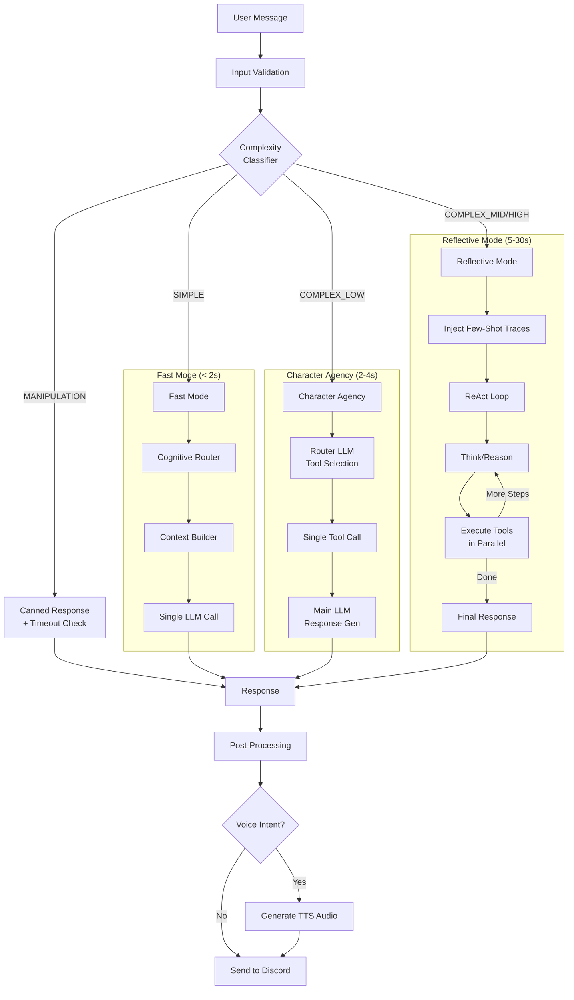
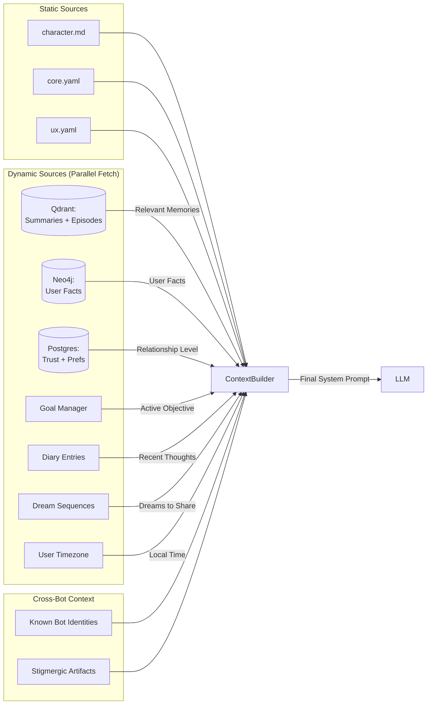

# Cognitive Engine Architecture

**Version:** 2.1  
**Last Updated:** December 2, 2025

**Note:** As of December 2025 (Phase E17 Complete), the **Supergraph Architecture** is now the primary execution path. See [`AGENT_GRAPH_SYSTEM.md`](./AGENT_GRAPH_SYSTEM.md) for implementation details. The documentation below describes the conceptual model (Dual Process Theory, Complexity Classification) which remains accurate — only the orchestration layer has changed from manual Python loops to LangGraph StateGraphs.

The **Cognitive Engine** (`src_v2/agents/engine.py`) is the brain of WhisperEngine v2. It orchestrates the flow of information from user input to character response, managing context, memory retrieval, tool execution, and three-tier response generation.

## The Integration Layer for Multi-Modal Processing

The Cognitive Engine serves as the **integration point** where all data streams converge. Agents process inputs through six data streams (Social Graph, Vision, Audio, Text, Memory, Sentiment), and the engine combines these into coherent context.

```
┌─────────────────────────────────────────────────────────────────────────────┐
│                         COGNITIVE ENGINE                                     │
│                    (Data Integration Layer)                                 │
├─────────────────────────────────────────────────────────────────────────────┤
│                                                                             │
│   🌌 Social Graph ┐                                                         │
│   (universe ctx)  │                                                         │
│                   │     ┌─────────────────┐     ┌──────────────────┐       │
│   👁️ Vision ──────┼────►│  AgentEngine    │────►│  LLM Response    │       │
│   (image uploads) │     │  .generate()    │     │  Generation      │       │
│                   │     └─────────────────┘     └──────────────────┘       │
│   👂 Audio ───────┤              │                                          │
│   (voice intents) │              ▼                                          │
│                   │     ┌─────────────────┐                                 │
│   💬 Text ────────┤     │  ContextBuilder │  ← Trust, Goals, Diary, Dreams │
│   (message)       │     │  .build()       │                                 │
│                   │     └─────────────────┘                                 │
│   🧠 Memory ──────┤                                                         │
│   (Qdrant+Neo4j)  │                                                         │
│                   │                                                         │
│   ❤️ Evolution ───┘                                                         │
│   (trust/mood/prefs)                                                        │
│                                                                             │
└─────────────────────────────────────────────────────────────────────────────┘
```

For architectural details: See [`MULTI_MODAL_PERCEPTION.md`](./MULTI_MODAL_PERCEPTION.md)

## Architectural Theory: Dual Process Theory (System 1 vs. System 2)

The design of the Cognitive Engine is inspired by **Daniel Kahneman's Dual Process Theory**, which posits that the human brain has two distinct modes of thought:

*   **System 1 (Fast, Intuitive, Automatic)**:
    *   *In Humans*: Recognizing a face, driving on an empty road, answering "2+2".
    *   *In WhisperEngine*: **Fast Mode**. The bot responds quickly to greetings, small talk, or simple questions using single-pass LLM without tools. It prioritizes low latency (<2s).
*   **System 2 (Slow, Deliberative, Logical)**:
    *   *In Humans*: Solving a complex math problem, planning a trip, philosophical reasoning.
    *   *In WhisperEngine*: **Reflective Mode**. The bot "stops to think," engaging a ReAct (Reasoning + Acting) loop. It breaks down the problem, queries multiple data sources (Graph + Vector), synthesizes an answer, and potentially generates images or updates its knowledge base. It prioritizes depth and accuracy over speed.

### Design Choice: Three-Tier Complexity System

The engine uses a **5-level complexity classifier** to route requests:

| Level | Mode | Description |
|-------|------|-------------|
| `SIMPLE` | Fast Mode | Greetings, casual chat, no tools needed |
| `COMPLEX_LOW` | Character Agency | 1-2 simple lookups (facts, memories) |
| `COMPLEX_MID` | Reflective Mode | 3-5 steps, multi-source synthesis, image generation |
| `COMPLEX_HIGH` | Reflective Mode | 6+ steps, deep philosophical reasoning |
| `MANIPULATION` | Blocked | Jailbreak attempts, consciousness probing → canned response |

### Design Choice: Intent Detection

The Complexity Classifier also detects **intents** for specialized handling:

| Intent | Description | Handler |
|--------|-------------|---------|
| `voice` | User wants TTS audio response | VoiceResponseManager (post-processing) |
| `image_self` | User wants image OF the AI character | GenerateImageTool in Reflective Mode |
| `image_other` | User wants image of something else | GenerateImageTool in Reflective Mode |
| `image_refine` | User modifying a previous image | Fast-path detection + Reflective Mode |
| `search` | User wants to look something up | Memory tools |
| `memory` | User correcting/updating a fact | UpdateFactsTool in Reflective Mode |
| `math` | Calculation or equation solving | CalculatorTool |
| `reminder` | Set a future reminder | SetReminderTool |

## Core Components

### 1. AgentEngine (`src_v2/agents/engine.py`)
The central coordinator. It does not contain business logic itself but orchestrates the other components.

**Responsibilities:**
*   **Validation**: Validates input (message length, image URLs) before processing.
*   **Complexity Classification**: Determines which processing tier to use.
*   **Intent Detection**: Identifies special intents (voice, image, memory, etc.).
*   **Context Building**: Delegates to `ContextBuilder` for system prompt assembly.
*   **Mode Routing**: Routes to Fast Mode, Character Agency, or Reflective Mode.
*   **Manipulation Blocking**: Returns canned responses for jailbreak attempts.

**Key Methods:**
```python
async def generate_response(
    character: Character,
    user_message: str,
    chat_history: List[BaseMessage],
    context_variables: Dict[str, Any],
    user_id: str,
    image_urls: List[str],
    return_metadata: bool = False,  # Returns ResponseResult with timing/mode info
    preclassified_complexity: str = None,  # Skip classification if already done
    preclassified_intents: List[str] = None
) -> str | ResponseResult
```

### 2. ContextBuilder (`src_v2/agents/context_builder.py`)
Handles dynamic system prompt construction.

**Injected Context Layers:**
1.  **Base Identity**: `character.md` (Static character definition)
2.  **Past Summaries**: Relevant long-term memories from Qdrant
3.  **Relationship Status**: Trust level and evolution state (Stranger→Trusted)
4.  **User Insights**: Psychological observations, preferences, feedback patterns
5.  **Active Goal**: Current objective with strategy (if goal strategist enabled)
6.  **Diary Context**: Character's recent private thoughts (Phase E2)
7.  **Dream Context**: Dreams to share after long absence (Phase E3)
8.  **Knowledge Graph**: User facts from Neo4j
9.  **Known Bots**: Other bot identities for cross-bot awareness
10. **Stigmergic Discovery**: Insights from other characters (Phase E13)
11. **Channel Context**: DM vs. thread vs. main channel awareness
12. **User Timezone**: Local time for time-appropriate greetings
13. **Meta-Instructions**: Anti-AI-break safeguards

### 3. Complexity Classifier (`src_v2/agents/classifier.py`)
A hybrid system that analyzes the user's message to determine complexity and intents.

*   **Input**: User message + Recent history (last 4 messages)
*   **Output**: `{"complexity": "SIMPLE"|"COMPLEX_*"|"MANIPULATION", "intents": ["voice", ...]}`
*   **Logic Cascade**:
    1.  **Image Refinement Fast-Path (<10ms)**: If user has recent image session and message matches refinement patterns → `COMPLEX_MID` + `image_refine`
    2.  **Adaptive Depth Traces (<50ms)**: Searches historical reasoning traces for similar queries. If match > 0.85 similarity → reuse historical complexity.
    3.  **LLM Classifier (Fallback)**: Structured output with Pydantic schema for reliable JSON.

**Metrics Recording**: All classifications are logged to InfluxDB for observability.

### 4. CognitiveRouter (`src_v2/agents/router.py`)
Used in **Fast Mode** to determine if external tools are needed before response generation.

*   **Function**: "Do I need to look something up to answer this?"
*   **Available Tools**:
    *   `search_archived_summaries`: Broad topics, past events
    *   `search_specific_memories`: Specific details, quotes
    *   `lookup_user_facts`: Biographical info from Neo4j
    *   `update_user_facts`: Correct facts (e.g., "I moved to Seattle")
    *   `update_user_preferences`: Change config (e.g., "be more concise")
    *   `analyze_topic`: Composite tool for comprehensive research
    *   `check_planet_context`: Current server/channel info
    *   `get_universe_overview`: All planets/channels across universe
    *   `set_reminder`: Schedule future notifications (if enabled)
*   **Execution**: Parallel tool execution via `asyncio.gather`

### 5. CharacterAgent (`src_v2/agents/character_agent.py`)
**Tier 2 Agent** for `COMPLEX_LOW` queries. Capable of a single tool call before responding.

**Design Philosophy:**
- Characters have agency (they decide to look things up)
- But not unlimited agency (one tool max, no loops)
- Tool usage reflects personality (emergent from prompt)
- Fast enough for conversation (2-4 seconds added latency)

**Architecture:**
- **Router LLM** (fast/cheap): Decides which tool to call
- **Main LLM** (quality): Generates final response with tool context

**Available Tools**: Same as CognitiveRouter, plus:
- `explore_knowledge_graph`: Graph traversal for relationships
- `discover_common_ground`: Find shared interests
- `get_character_evolution`: Check trust level
- `calculator`: Math operations
- `generate_image`: Image generation (if enabled)
- Discord search tools (if channel available)

### 6. ReflectiveAgent (`src_v2/agents/reflective.py`)
**Tier 3 Agent** for `COMPLEX_MID` and `COMPLEX_HIGH` queries. Full ReAct (Reasoning + Acting) loop.

**Capabilities:**
*   Multi-step tool chains (up to 10-15 steps based on complexity)
*   Chain of Thought reasoning (visible via callback)
*   Knowledge graph updates
*   Image generation
*   Few-shot trace injection (learning from past successful queries)
*   Empty response recovery (nudges LLM when it gives up)

**Max Steps by Complexity:**
- `COMPLEX_MID`: 10 steps
- `COMPLEX_HIGH`: 15 steps

**Available Tools** (superset of CharacterAgent):
- All memory/knowledge tools
- `search_my_thoughts`: Bot's internal experiences (diaries, dreams)
- `create_user_goal`: Create goals from user requests
- `analyze_patterns`: Pattern detection across conversations
- `detect_themes`: Theme extraction
- `discover_community_insights`: Cross-bot stigmergic discovery
- `generate_image`: Image generation (if enabled)
- `set_reminder`: Reminders (if enabled)
- Discord search tools (if channel available)

## Request Flow

The engine uses a **three-tier branching** architecture based on complexity.



### Intent-Based Complexity Promotion

Certain intents automatically promote complexity level:

| Intent | Promotion | Reason |
|--------|-----------|--------|
| `memory` | → `COMPLEX_MID` | Needs `UpdateFactsTool` (Reflective only) |
| `image_self/image_other` | → `COMPLEX_MID` | Needs `GenerateImageTool` |
| `image_refine` | → `COMPLEX_MID` | Needs image session + tool |

### Image Upload Handling (Special Case)

When the user uploads an image (`image_urls` present), complexity is **capped at `COMPLEX_LOW`** to keep the image in CharacterAgent. Reflective Mode struggles with large base64 payloads.

## Dynamic Context Injection

The `ContextBuilder` dynamically assembles the system prompt at runtime. This ensures the character "feels" the current state of the relationship.

### Context Assembly Diagram



### Injection Layers (in order):

1.  **Base Identity**: `character.md` (Static system prompt)
2.  **Past Summaries**: Relevant long-term memories from Qdrant (`past_summaries`)
3.  **Relationship Status**: Trust level (Stranger→Acquaintance→Friend→Close→Trusted)
4.  **User Feedback Patterns**: Recommendations derived from reaction analysis
5.  **Active Goal**: Current objective + strategy from Goal Strategist
6.  **Diary Context**: Character's recent private thoughts (Phase E2)
7.  **Dream Context**: Dreams to share after long absence (Phase E3)
8.  **Knowledge Graph**: User facts, entities, relationships from Neo4j
9.  **Known Bots**: Other bot names/purposes for cross-bot coordination
10. **Stigmergic Artifacts**: Epiphanies/observations from other characters (Phase E13)
11. **Identity Reinforcement**: "You are talking to {user_name}" (anti-confusion)
12. **Channel Context**: DM / Thread / Main Channel awareness
13. **User Timezone**: Local time + time-of-day for greetings (Phase E7)
14. **Meta-Instructions**: Anti-AI-break safeguards
15. **Timestamp Note**: Instruction not to generate `[2 mins ago]` style prefixes

### Template Variables

The system prompt supports these template variables:
- `{user_name}`: Display name of the user
- `{current_datetime}`: Current date/time (auto-fallback if not provided)

## Feature Flags

Key flags that affect engine behavior (from `settings.py`):

| Flag | Default | Effect |
|------|---------|--------|
| `ENABLE_REFLECTIVE_MODE` | `false` | Enables COMPLEX_MID/HIGH → ReAct loop |
| `ENABLE_CHARACTER_AGENCY` | `true` | Enables COMPLEX_LOW → single-tool agent |
| `ENABLE_IMAGE_GENERATION` | `true` | Adds `generate_image` tool, detects image intents |
| `ENABLE_VOICE_RESPONSES` | `false` | Detects `voice` intent, generates TTS |
| `ENABLE_REMINDERS` | `false` | Adds `set_reminder` tool |
| `ENABLE_TRACE_LEARNING` | `true` | Injects few-shot traces in Reflective Mode |
| `ENABLE_GOAL_STRATEGIST` | `true` | Injects goal strategies into context |
| `ENABLE_CHARACTER_DIARY` | `true` | Injects diary context |
| `ENABLE_DREAM_SEQUENCES` | `true` | Injects dream context after absence |
| `ENABLE_STIGMERGIC_DISCOVERY` | `true` | Injects other bots' insights |

## Response Metadata

When `return_metadata=True`, the engine returns a `ResponseResult`:

```python
@dataclass
class ResponseResult:
    response: str          # The generated text
    mode: str              # "fast", "agency", "reflective", "blocked"
    complexity: str        # "SIMPLE", "COMPLEX_LOW", etc.
    model_used: str        # Model name from settings
    processing_time_ms: float
```

## Error Handling

The engine provides context-specific fallback messages:

| Error Type | Fallback Message |
|------------|------------------|
| Rate limit / Quota | "I'm experiencing high demand right now..." |
| Context overflow | "That's quite a lot to process at once..." |
| Timeout / Connection | "I'm having connection issues..." |
| Other | "I'm having a bit of trouble thinking right now..." |
