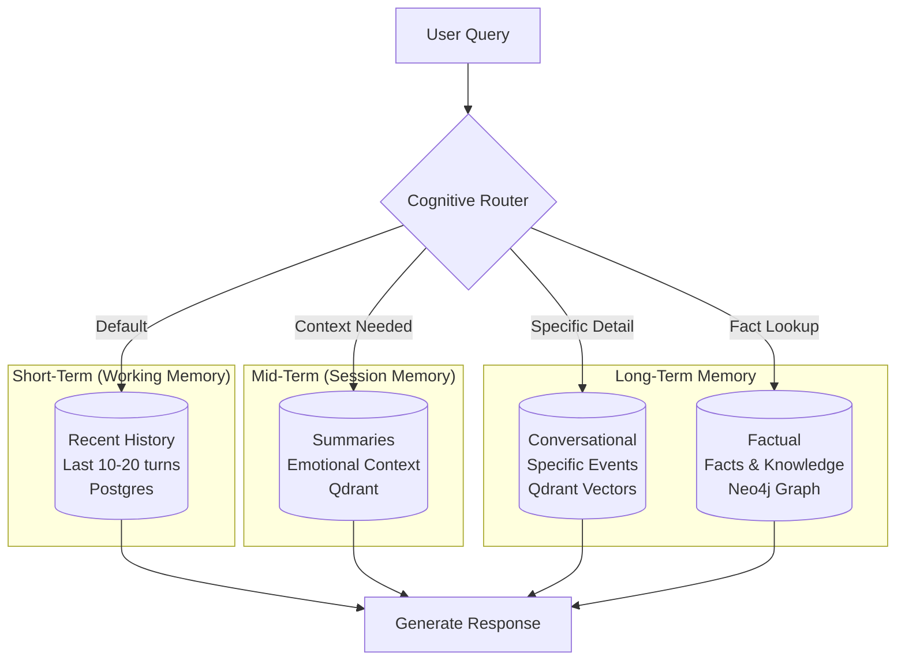
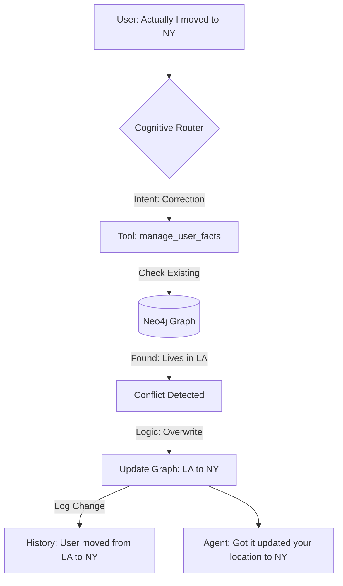

# WhisperEngine 2.0: Agentic Memory Architecture

**Version**: 2.3  
**Last Updated**: December 2, 2025

---

## Origin

| Field | Value |
|-------|-------|
| **Origin** | Core v2 identity design |
| **Proposed by** | Mark (memory architecture) |
| **Key insight** | Memory is not a feature — it's fundamental to identity and continuity |

---

## Overview

Memory is the **Identity and Continuity modality** (🧠) in WhisperEngine v2's multi-modal perception architecture. It's what makes characters **the same being across time**.

Without memory, every conversation starts from zero. The character doesn't know who you are, what you've discussed, or how your relationship has evolved. Memory is not a feature - it's fundamental to identity itself.

### The Memory Modality

| Perception | Description |
|------------|-------------|
| **Episodic Memory** | "We talked about your dog last Tuesday" |
| **Semantic Memory** | "You have a dog named Luna" |
| **Self-Knowledge** | "I am Elena, a marine biologist" |
| **Temporal Continuity** | "I am the same being across time" |

For full philosophy: See [`MULTI_MODAL_PERCEPTION.md`](./MULTI_MODAL_PERCEPTION.md)

## Theoretical Foundation: Human Memory Models

The memory architecture is inspired by cognitive science models of human memory, specifically:

### Atkinson-Shiffrin Multi-Store Model
The classic three-stage memory model informs our storage hierarchy:

*   **Sensory Memory** → **Short-Term (Working) Memory** → **Long-Term Memory**
*   *In WhisperEngine*: **Recent History** (Postgres) → **Session Context** (Active Summaries) → **Archived Memories** (Qdrant Vectors + Neo4j Facts)

### Conversational vs. Factual Memory
We distinguish between two types of long-term memory:

*   **Conversational Memory**: Specific events and experiences ("User told me about their dog last Tuesday").
    *   *Implementation*: **Qdrant Vector Store** with timestamped conversation embeddings.
*   **Factual Memory**: General facts and knowledge ("User owns a dog named Rex").
    *   *Implementation*: **Neo4j Knowledge Graph** with structured entity relationships.

**Important Note on Storage vs. Memory Type:**

The cognitive science terms (episodic/semantic) describe *types* of memory, not *locations*:
- **PostgreSQL** stores verbatim chat history — the raw episodic record of what was said
- **Qdrant** stores vectorized memories — searchable by similarity (can include both episodic moments and semantic summaries)
- **Neo4j** stores extracted facts — inferred semantic knowledge

See [GRAPH_SYSTEMS_DESIGN.md](./GRAPH_SYSTEMS_DESIGN.md) for the complete data architecture.

### Design Choice: Unified Memory Architecture (Vector-First Traversal)
Traditional chatbots use either Vector Search OR Graph Search. WhisperEngine v2.5 uses **Unified Memory**:

1.  **Dual-Write**: Every memory is saved to **Qdrant** (Vector) AND **Neo4j** (Graph Node).
2.  **Vector-First Traversal**:
    *   **Step 1:** Search Qdrant for semantically similar memories (e.g., "conversations about dogs").
    *   **Step 2:** Use the returned Vector IDs to fetch the **Graph Neighborhood** from Neo4j.
    *   **Step 3:** This retrieves not just the text, but the *entities, relationships, and context* linked to those memories.

**Benefit:** We get the "fuzzy search" of vectors combined with the "structured context" of graphs.

*   "What did we talk about?" → Vector Search.
*   "Who was involved and how are they related?" → Graph Traversal from those vectors.

## Core Concept: "The Living Memory"

Memory is not just a static database. It is a living system that:
1.  **Evolves**: Old memories fade (Aging).
2.  **Corrects**: New facts overwrite old ones (Conflict Resolution).
3.  **Reflects**: Background processes organize and clean up data.
4.  **Feels**: It remembers the *emotional tone* of past interactions.
5.  **Grows**: The character *evolves* based on the relationship with the user.
6.  **Explains**: The system provides **Reasoning Transparency** (why it chose to say what it said).

## Modes of Thought (Cognitive Architecture)

To address the "Latency vs. Depth" trade-off, the Agent operates in two modes:

### The Trade-off Problem
In AI systems, there's an inherent tension:
*   **Fast Responses**: Users expect <2s latency for chat (based on human conversation norms).
*   **Deep Reasoning**: Complex queries require multi-step retrieval, reasoning, and synthesis (3-10s).

**Solution**: Adaptive routing based on query complexity (inspired by Kahneman's Dual Process Theory - see [Cognitive Engine](COGNITIVE_ENGINE.md)).

### 1. Fast Mode (Standard Chat)
*   **Goal**: Low latency (<2s), conversational flow.
*   **Process**: Router -> Single Tool (if needed) -> Response.
*   **Use Case**: Casual chat, greetings, simple questions.

### 2. Reflective Mode ✅ IMPLEMENTED
*   **Goal**: Depth, philosophical consistency, complex reasoning.
*   **Process**: Complexity Classifier -> ReAct Loop (Thought -> Action -> Observation) -> Synthesis -> Response.
*   **Trigger**: Complex user queries ("What do you think about the concept of soul?", "How has our relationship changed?") detected by the Complexity Classifier.
*   **Output**: Deeper, more nuanced answers with reasoning traces. Can acknowledge uncertainty and conflicting information.
*   **Implementation**: Uses a ReAct (Reasoning + Acting) agent that can call tools iteratively, building up context before responding.
*   **Production Status**: Deployed for Elena (testing), configurable via `ENABLE_REFLECTIVE_MODE` flag.

## The Memory Tools (Agent Accessible)

The Agent uses a **Cognitive Router** to decide which tool to use.

### Memory Hierarchy Diagram



### 1. `search_recent_history` (Short-Term)
*   **Source**: PostgreSQL (`v2_chat_history`)
*   **Usage**: Default. Fetches the immediate conversation flow (last 10-20 turns).

### 2. `search_archived_summaries` (Mid-Term & Emotional Context)
*   **Source**: Qdrant (Collection: `summaries`)
*   **Usage**: Finding high-level topics AND emotional context.
*   **Content**: "User was frustrated about work." (Not just "User talked about work").
*   **Metadata**: Includes a **Meaningfulness Score** (1-5). High-score summaries are retained longer.
*   **Aging**: Scores decay over time. Recent summaries are boosted.
*   **Design Choice**: Why store emotion with summaries?
    *   Pure text summaries lose affective context. "User talked about their job" doesn't capture whether they were complaining or celebrating.
    *   Emotion tags enable empathetic continuity: "Last time you mentioned work, you seemed stressed. How's it going now?"

### 3. `search_specific_memories` (Conversational Search)
*   **Source**: Qdrant (Collection: `whisperengine_memory_{bot_name}`)
*   **Usage**: Finding specific details or quotes.
*   **Mechanism**: **Dense Vector Search** (Current).
    *   *Planned*: Hybrid Search (Dense + Sparse) for better keyword matching.
*   **Aging**: Uses a "Recency Decay" formula (Planned).

### 4. `manage_user_facts` (Factual, Correction & Preferences)
*   **Source**: Neo4j (Knowledge Graph)
*   **Usage**: Reading/Writing facts AND User Preferences.
*   **Nodes**: `(User)`, `(Entity)`, `(Preference)`.
*   **Example Preference**: `(User)-[:PREFERS]->(Style {concise: true, emojis: false})`.
*   **Conflict Detection**: If `(User)-[:HAS_PET]->(Dog)` exists, and user says "I have a cat", the tool asks: "Is this a new pet or a correction?"
*   **Design Choice**: Why use a Graph for Facts?
    *   Relational databases require joins for multi-hop queries ("Friend of a friend who likes X").
    *   Graphs make traversing relationships O(1) complexity per hop vs. O(n) table scans.
    *   Native support for "fuzzy" relationships: `MATCH path = (u:User)-[:KNOWS*1..3]->(friend)` finds friends-of-friends automatically.

### 5. `get_character_evolution` (The Self & Goals)
*   **Source**: Neo4j (Graph) + Postgres (State)
*   **Usage**: Retrieving the *current* state of the relationship and character growth.
*   **Dynamic Persona**: The system prompt is NOT static. It injects:
    *   **Relationship Level**: `(User)-[:TRUSTS {level: 0.8}]->(Character)`
    *   **Learned Traits**: `(Character)-[:ACQUIRED_TRAIT]->(Trait {name: "Protective", source: "User shared trauma"})`
    *   **Current Goals**: `(Character)-[:PURSUING]->(Goal {description: "Cheer up user"})`. The Agent can UPDATE these goals.

## Background Processes (The "Subconscious")

These processes run asynchronously, mimicking the human brain's background consolidation during sleep.

### Theoretical Basis: Memory Consolidation
In humans, **memory consolidation** occurs during sleep, transferring information from hippocampus (short-term) to neocortex (long-term). Similarly, WhisperEngine performs "offline" processing:

### 1. Auto-Summarization (Compression)
*   **Trigger**: Session timeout (30 mins inactivity).
*   **Action**: Compress raw messages into a summary. Calculate **Meaningfulness Score**. Embed into Qdrant.

### 2. Reflection & Consolidation (Conflict Resolution & Epiphanies)
*   **Trigger**: Nightly (or periodic).
*   **Action**:
    *   Scan Neo4j for contradictions.
    *   **Asynchronous Epiphanies**: If the reflection process finds a new connection ("Wait, user mentioned X last week and Y today..."), it can schedule a **Proactive Message** to the user (e.g., "I just realized something about what you said...").
    *   **Self-Validation**: The character reviews recent interactions to "learn" from mistakes.
*   **Design Choice**: Why offline reflection?
    *   Real-time conflict detection during chat would add 500-1000ms latency per message.
    *   Batch processing at night allows complex graph queries (multi-hop contradiction detection) without impacting user experience.
    *   Enables "shower thought" moments: The character can surprise users with insights that emerge from connecting distant memories.

### 3. Memory Pruning (Aging) [Planned]
*   **Trigger**: Weekly.
*   **Action**: Move very old, low-relevance memories to "Cold Storage" (text file archive) and remove from active Vector Index to keep search fast and relevant.
*   **Design Choice**: Forgetting Curve (Ebbinghaus)
    *   Human memory decays exponentially: We forget 50% of new information within an hour, 70% within 24 hours.
    *   WhisperEngine implements a modified decay: `relevance_score = base_score * e^(-λ * time_since_access)`
    *   High-meaningfulness memories (score 4-5) decay slower (lower λ), while mundane exchanges (score 1-2) fade quickly.
    *   **Why it matters**: Prevents the "database bloat" problem where the character remembers trivial details from years ago better than yesterday's important conversation.

## Broadcast Memories (Public Posts)

When a character posts diary entries, dream journals, or observations to Discord channels, they store **broadcast memories** - memories of having shared content publicly.

### The Problem
Without broadcast memories, this happens:
- Elena posts her dream journal: "I dreamed I was swimming with whales..."
- User asks: "What was your dream about?"
- Elena: "I don't recall sharing a dream recently" ❌

### The Solution
**Broadcast memories** are stored with special `user_id="__broadcast__"` so they're searchable separately from user-specific memories.

**Storage Flow:**
1. Character posts to Discord via `BroadcastManager.post_to_channel()`
2. After successful post, `_store_broadcast_memory()` is called
3. Memory is stored as: "I shared my {diary/dream/observation} in the broadcast channel: {preview}"
4. Metadata includes `is_broadcast: True` and `post_type: diary|dream|observation`

**Retrieval Flow:**
1. User asks about character's posts
2. `MasterGraphAgent.context_node()` searches BOTH user memories AND broadcast memories (in parallel)
3. Broadcast memories are merged into context with semantic relevance scoring

### Memory Content Example
```
"I shared my dream journal in the broadcast channel: I dreamed I was standing 
on the edge of a coral reef, watching the sunlight filter down through 
crystal-clear water. Schools of fish in colors I've never seen..."
```

### Design Rationale
- **Why separate user_id?** Broadcasts are public, not tied to any specific conversation
- **Why parallel search?** Avoids latency - both searches run concurrently
- **Why limit=2?** Broadcasts are supplementary; user memories take priority
- **Why store?** Characters should remember what they've shared publicly (self-knowledge)

## Reasoning Transparency

To address the "Black Box" problem, the Cognitive Router logs its decision process.

### Design Choice: Explainable AI (XAI)
In production AI systems, users often ask "Why did you say that?" or "How do you know?"
Traditional neural models are opaque. WhisperEngine provides transparency via:

*   **Thought Traces**: Logs showing the reasoning path (Input → Tool Selection → Data Retrieved → Response).
*   **Source Attribution**: "I remember you mentioned this on October 15th" (with link to the specific message).
*   **Confidence Scores**: "I'm 90% sure your dog's name is Rex" (based on fact confidence in Neo4j).

**Example Trace:**
*   **Input**: "Do you remember my dog?"
*   **Thought**: "User is asking about a personal fact. I should check the Knowledge Graph."
*   **Action**: `manage_user_facts(query="dog")`
*   **Result**: "Found entity 'Rex' (Dog)."
*   **Response**: "Yes, you mean Rex!"

This "Thought Trace" is stored in the logs and can be exposed in a "Debug Mode" for developers or curious users.

## Data Flow: The "Correction Loop"

This diagram illustrates how the system handles fact updates and corrections, a critical feature for maintaining accuracy over long-term relationships.



### Design Choice: Mutable vs. Immutable Facts
Should the system overwrite old facts or keep historical versions?

**Our Approach**: **Hybrid**
*   **Current State** (Neo4j): `(User)-[:LIVES_IN]->(NY)` (Overwrites LA)
*   **Change History** (Postgres): Logs "User lived in LA until 2025-11-22, now NY"

**Why?**
*   Users expect the character to "remember" their current state correctly (not say "You live in LA" after being corrected).
*   But historical context matters: "How's the adjustment to NY after leaving LA?"
*   This mirrors conversational (what happened) vs. factual (what's true now) memory.

## Implementation Strategy

1.  **Phase 6a: The Foundation** (Sessions, Summaries, Vector Search).
2.  **Phase 6b: The Graph** (Neo4j integration for Facts & Corrections).
3.  **Phase 6c: The Brain** (Cognitive Router & Reflection Loop).

