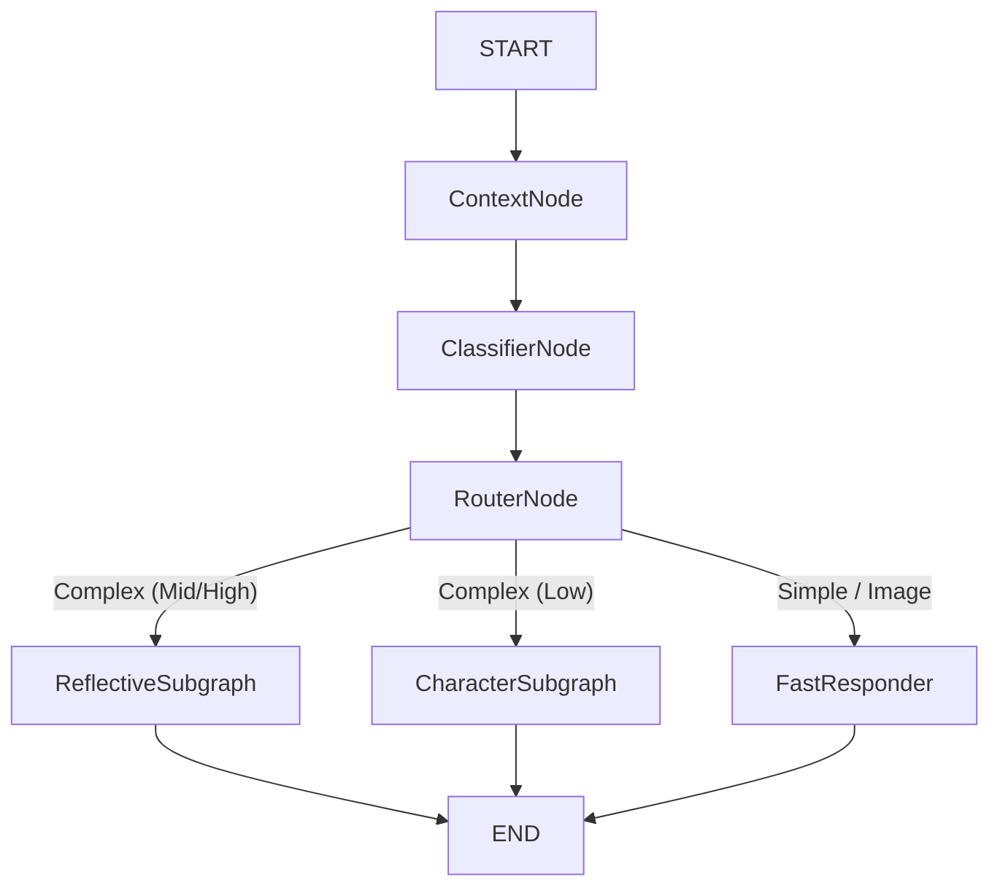

# Agent Graph System (LangGraph Architecture)

**Version:** 1.1
**Status:** Production (Primary Architecture)
**Last Updated:** December 2, 2025

## Overview

The Agent Graph System represents a paradigm shift from manual Python orchestration loops to **LangGraph StateGraphs**. This architecture provides:

1.  **Observability**: Every step (context fetch, classification, tool use, reasoning) is visible in LangSmith traces.
2.  **Autonomy**: Agents use "Critic" nodes to self-correct errors without human intervention.
3.  **Modularity**: Each agent is a self-contained graph that can be tested and deployed independently.
4.  **Unified Orchestration**: The "Supergraph" unifies the entire request lifecycle.

## Architecture: The Supergraph

The **Supergraph** (`src_v2/agents/master_graph.py`) is the master orchestrator. It replaces the logic previously found in `AgentEngine.generate_response`.

### Nodes

1.  **ContextNode**: Fetches all context in parallel (Memory, Knowledge, Trust, Goals).
2.  **ClassifierNode**: Determines complexity (`SIMPLE`, `COMPLEX_LOW`, etc.) and intents (`voice`, `image`).
3.  **RouterNode**: Routes to the appropriate subgraph based on complexity and feature flags.
4.  **Subgraphs**: Encapsulated agent workflows.

## Subgraphs

### 1. Reflective Graph Agent (Tier 3)
*   **File**: `src_v2/agents/reflective_graph.py`
*   **Purpose**: Complex reasoning, multi-step research, image generation.
*   **Structure**: `Generator` ⇄ `Tools` ... → `Critic` → `END`
*   **Key Feature**: **Critic Node**. If a tool returns "no results" or an error, the Critic intercepts the response and injects a system hint (e.g., "Search failed, try broader terms") to guide the Generator to try again.

### 2. Character Graph Agent (Tier 2)
*   **File**: `src_v2/agents/character_graph.py`
*   **Purpose**: Single-turn tool usage (e.g., checking a specific memory or rolling dice).
*   **Structure**: `Router` → `Tools` (Optional) → `Responder` → `END`

### 3. Diary Graph Agent (Background)
*   **File**: `src_v2/agents/diary_graph.py`
*   **Purpose**: Generates daily diary entries.
*   **Structure**: `Generator` ⇄ `Critic` → `END`
*   **Key Feature**: The Critic ensures the entry is narrative and emotional, rejecting "robotic" summaries.

### 4. Dream Graph Agent (Background)
*   **File**: `src_v2/agents/dream_graph.py`
*   **Purpose**: Generates surreal nightly dreams.
*   **Structure**: `Generator` ⇄ `Critic` → `END`
*   **Key Feature**: The Critic ensures the dream uses symbolic logic and isn't just a literal recap.

### 5. Insight Graph Agent (Background)
*   **File**: `src_v2/agents/insight_graph.py`
*   **Purpose**: Analyzes conversation patterns for long-term learning.
*   **Structure**: ReAct loop for pattern detection.

### 6. Reflection Graph Agent (Background)
*   **File**: `src_v2/agents/reflection_graph.py`
*   **Purpose**: Analyzes user patterns across summaries, knowledge graph, and observations.
*   **Structure**: `Gather` (parallel tool queries) → `Synthesize` → `END`
*   **Key Feature**: Queries multiple data sources (summaries, Neo4j facts, observations) in parallel, then synthesizes insights and infers goals.

### 7. Strategist Graph Agent (Background)
*   **File**: `src_v2/agents/strategist_graph.py`
*   **Purpose**: Nightly goal planning and strategy generation.
*   **Structure**: `Gather` → `Reason` (ReAct loop) → `Synthesize` → `END`
*   **Key Feature**: Uses tools to explore user facts and conversation history before generating strategies. Can create new goals based on community trends.

## Feature Flags

> **Note (December 2025):** LangGraph agents are now the **default and only path**. The deprecated `ENABLE_SUPERGRAPH`, `ENABLE_LANGGRAPH_*`, and `ENABLE_CHARACTER_AGENCY` flags have been removed. The system always uses LangGraph for orchestration.

### Main Chat System

The Supergraph and Character Agency are always enabled. The only relevant flag is:

| Flag | Description | Default |
|------|-------------|---------|
| `ENABLE_REFLECTIVE_MODE` | Allows routing to the Reflective Agent (Tier 3) for complex queries | `False` |

### Background Workers

Background agents (Diary, Dream, Insight, Reflection, Strategist) always use LangGraph. No flags required.

### Legacy Migration (Completed)

The following flags were removed in December 2025:
- `ENABLE_SUPERGRAPH` — now always true
- `ENABLE_CHARACTER_AGENCY` — now always true  
- `ENABLE_LANGGRAPH_*` — all agents now use LangGraph unconditionally

## Architecture Reference

For the complete graph architecture vision, see:
- [GRAPH_SYSTEMS_DESIGN.md](./GRAPH_SYSTEMS_DESIGN.md) — The unified graph architecture document
- [emergence_philosophy/](../emergence_philosophy/) — Claude-to-Claude collaboration on emergence principles

## Observability

All graph executions are traced in **LangSmith**.
*   **Project**: `whisperengine-v2` (default)
*   **Traces**: Look for `MasterGraphAgent`, `ReflectiveGraphAgent`, etc.
*   **Visualization**: You can see the exact path taken through the graph, including tool outputs and Critic interventions.

## Future Migration Candidates

The following background tasks are currently implemented as single-shot LLM chains but are candidates for future migration to LangGraph to improve quality and robustness.

### ✅ Recently Implemented

#### 1. Posting Agent (E15 Phase 2)
*   **File**: `src_v2/agents/posting_agent.py`
*   **Flag**: `ENABLE_AUTONOMOUS_POSTING`
*   **Graph**: `SelectTopic` → `EnrichWithSearch` (optional) → `GeneratePost` → `END`
*   **Purpose**: Goals-driven autonomous posting to quiet Discord channels.
*   **Benefit**: Bots can share content based on their `goals.yaml` and `core.yaml` drives, optionally enriched with current events via web search.

#### 2. Reflection Agent (`insight_tasks.py` → `run_reflection`)
*   **File**: `src_v2/agents/reflection_graph.py`
*   **Flag**: `ENABLE_LANGGRAPH_REFLECTION_AGENT`
*   **Graph**: `Gather` (parallel queries) → `Synthesize` → `END`
*   **Tools**: `query_summaries`, `query_knowledge_graph`, `query_observations`, `get_existing_insights`
*   **Benefit**: Queries patterns across summaries, Neo4j facts, and observations before synthesizing insights.

#### 3. Goal Strategist Agent (`strategist.py` → `run_goal_strategist`)
*   **File**: `src_v2/agents/strategist_graph.py`
*   **Flag**: `ENABLE_LANGGRAPH_STRATEGIST_AGENT`
*   **Graph**: `Gather` → `Reason` (ReAct loop) → `Synthesize` → `END`
*   **Tools**: `get_active_goals`, `get_community_themes`, `get_user_facts`, `get_recent_history`
*   **Benefit**: Planning agent that explores goal options, checks progress against stored data, and proposes updates.

### 📋 Proposed Future Migrations

#### 1. Conversation Agent (E15 Phase 3)
*   **Status**: Proposed, not started.
*   **File**: `src_v2/agents/conversation_agent.py` (to be created)
*   **Graph Type**: Multi-Agent (Type 7) + State Machine (Type 4)
*   **Purpose**: Bot-to-bot conversations in public channels with turn-taking.
*   **Benefit**: Bots can have natural dialogues that users observe, making quiet servers feel alive.

#### 2. Summary Agent (`summary_tasks.py`)
*   **Current**: Single-shot LLM call via `SummaryManager`.
*   **Graph Potential**: **Medium**.
*   **Proposed Graph**: `Generator` → `Critic` → `Refiner`.
*   **Benefit**: The Critic can evaluate if the summary captures emotional nuance and key facts (Meaningfulness Score > 3) before saving. It can reject "lazy" summaries.

#### 3. Knowledge Agent (`knowledge_tasks.py`)
*   **Current**: Single-shot extraction via `FactExtractor`.
*   **Graph Potential**: **Low**.
*   **Proposed Graph**: `Extractor` → `Validator` → `Deduplicator`.
*   **Benefit**: The Validator can check against the existing Knowledge Graph to prevent contradictions or hallucinations (e.g., ensuring "I have a cat" doesn't overwrite "I have a dog" unless explicitly stated).

#### 4. Goal Analysis Agent (`analysis_tasks.py`)
*   **Current**: Single-shot evaluation via `GoalAnalyzer`.
*   **Graph Potential**: **Low**.
*   **Benefit**: Only needed if goal criteria become extremely complex or multi-step.

