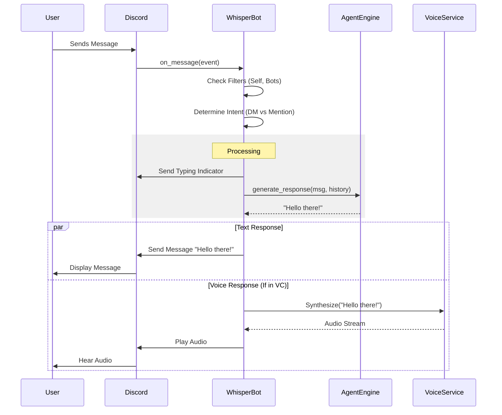

# Discord Integration - The Sensory Interface

**Version**: 2.2  
**Last Updated**: December 1, 2025

---

## Origin

| Field | Value |
|-------|-------|
| **Origin** | Platform integration |
| **Proposed by** | Mark (Discord architecture) |
| **Key insight** | Discord is the gateway through which all external data flows |

---

## Multi-Modal Context: Discord as Input System

Discord is the **input interface** through which characters receive all external data. Every message, reaction, voice channel, and image comes through Discord's events.

| Discord Event | Input Modality |
|---------------|---------------------|
| `on_message` (text) | 💬 Text input |
| `on_message` (with image) | 👁️ Vision input |
| `on_voice_state_update` | 👂 Audio input |
| `on_reaction_add` | ❤️ Emotion input |
| Channel presence | 🌌 Universe (spatial awareness) |
| User activity | 🌌 Universe (social awareness) |

Discord is the gateway through which all external data flows into the system.

For full philosophy: See [`MULTI_MODAL_PERCEPTION.md`](./MULTI_MODAL_PERCEPTION.md)

---

WhisperEngine v2 uses `discord.py` to interface with the Discord API. The bot is designed to be "channel-aware" and supports both text and voice interactions.

## Architectural Theory: Event-Driven & Proactive Agents

### Reactive vs. Proactive
Traditional chatbots are **Reactive**: they only speak when spoken to (Request-Response).
WhisperEngine v2 is **Proactive**: it has its own internal clock and agenda.

*   **Event-Driven**: The system reacts to external events (`on_message`, `on_voice_state_update`).
*   **Agentic Loop**: A background scheduler acts as the character's "Subconscious," checking if it should initiate a conversation based on time of day, past interactions, or "epiphanies" (simulated thoughts).

### Message Lifecycle Diagram

## Core Components

### 1. `WhisperBot` (`src_v2/discord/bot.py`)
The main bot class inheriting from `commands.Bot`.

**Key Responsibilities:**
*   **Event Loop**: Handles `on_ready`, `on_message`.
*   **Status Updates**: Periodically updates the "Playing..." status with stats (friend count, memories).
*   **Message Chunking**: Splits long responses (>2000 chars) into multiple messages.
*   **Proactive Scheduling**: Manages the background scheduler for initiating conversations.

### 2. Message Handling Flow

1.  **Trigger Detection**:
    *   Is it a DM? -> Respond.
    *   Is the bot mentioned? -> Respond.
    *   (Planned) Is the bot "lurking" and finds the topic relevant? -> Respond.

2.  **Processing**:
    *   **Typing Indicator**: `async with message.channel.typing():` is used to show the bot is "thinking".
    *   **Context Gathering**: Fetches recent channel history.
    *   **Engine Call**: Passes the message to `AgentEngine`.

3.  **Response**:
    *   **Text**: Sent back to the channel.
    *   **Voice**: If in a voice channel, the text is also sent to the TTS engine.

### 3. Voice Architecture (`src_v2/discord/voice.py`)

*   **Voice Client**: Manages the connection to a Discord voice channel.
*   **Audio Source**: Uses `FFmpegPCMAudio` to stream generated audio.
*   **TTS Integration**:
    *   Text response -> TTS Service (ElevenLabs/OpenAI) -> MP3 File.
    *   MP3 File -> FFmpeg -> Discord Voice Stream.

### 4. Commands (`src_v2/discord/commands.py`)

Slash commands for managing the bot.

*   `/reset`: Clears the current session context.
*   `/memory query:{text}`: Debug command to search vector memory.
*   `/upload`: Upload a file for the bot to "read" (ingest into knowledge base).
*   `/join`: Join the user's voice channel.
*   `/leave`: Leave the voice channel.

## Proactive Messaging (`src_v2/discord/scheduler.py`)

The bot isn't just reactive. It can initiate conversations based on:
*   **Time**: "Good morning" messages.
*   **Events**: "I just remembered..." (Epiphanies).
*   **Inactivity**: "Hey, haven't heard from you in a while."

**Mechanism**:
*   A background loop checks for scheduled tasks.
*   If a task is due, it triggers the `AgentEngine` to generate an opening message.
*   The message is sent to the user's DM.
