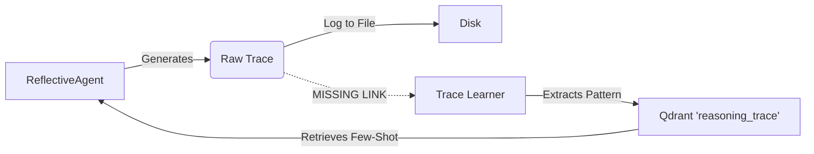

# Trace Learning: Memory of Reasoning (Phase B5)

**Status:** ✅ Complete (December 2025)  
**Priority:** High  
**Dependencies:** Reflective Agent ✅, Qdrant ✅

---

## Origin

| Field | Value |
|-------|-------|
| **Origin** | Architectural evolution of Reflective Agent |
| **Proposed by** | Mark (system design) |
| **Catalyst** | Observation that reasoning traces were being discarded |
| **Key insight** | Successful reasoning patterns should be retrievable for similar problems |

---

## Overview

Trace Learning allows agents to "learn from experience" by storing successful reasoning patterns and retrieving them for similar future problems. This creates a self-improving system where the agent gets smarter and more efficient over time without code changes.

## The "Missing Link" Pipeline

Currently, the Reflective Agent generates traces (logs of thought process + tool usage), but they are only written to disk as JSON logs. We need to close the loop by ingesting these traces into the vector memory.



## Implementation Plan

### 1. Trace Ingestion (AgentEngine)

Modify `AgentEngine.generate_response` to enqueue a background task after a successful reflective response.

```python
# Pseudocode for AgentEngine
async def generate_response(...):
    response, trace = await reflective_agent.run(...)
    
    # If successful and complex enough to matter
    if trace and complexity >= COMPLEX_MID:
        await task_queue.enqueue_trace_learning(
            user_id=user_id,
            character_name=character.name,
            trace=trace,
            user_query=user_message
        )
```

### 2. Trace Learner (InsightWorker)

A new background task that analyzes the raw trace to extract reusable patterns.

```python
# Pseudocode for InsightAgent.learn_from_trace()
async def learn_from_trace(trace, query):
    # 1. Analyze trace with LLM
    analysis = await llm.analyze(trace, query)
    
    # 2. Extract key components
    pattern = analysis.query_pattern      # e.g. "User asks for weather in location"
    approach = analysis.successful_approach # e.g. "Used search tool, then formatted response"
    complexity = analysis.complexity      # e.g. "COMPLEX_LOW"
    
    # 3. Store in Qdrant
    await store_reasoning_trace_tool.run(
        query_pattern=pattern,
        successful_approach=approach,
        tools_used=analysis.tools_used,
        complexity=complexity
    )
```

### 3. Retrieval & Injection (ReflectiveAgent)

Modify `ReflectiveAgent` to retrieve relevant traces before starting its loop.

```python
# Pseudocode for ReflectiveAgent
async def run(user_query, ...):
    # 1. Retrieve similar past traces
    traces = await trace_retriever.get_relevant_traces(user_query)
    
    # 2. Format as few-shot examples
    few_shot_prompt = format_traces(traces)
    
    # 3. Inject into system prompt
    system_prompt += f"\n\nHERE ARE EXAMPLES OF HOW YOU SOLVED SIMILAR PROBLEMS:\n{few_shot_prompt}"
    
    # 4. Run ReAct loop
    ...
```

## Data Model

**Qdrant Collection:** `whisperengine_memory_{bot_name}`  
**Payload Type:** `reasoning_trace`

```json
{
  "content": "[REASONING TRACE] Pattern: Weather request\nApproach: Use search tool...",
  "metadata": {
    "type": "reasoning_trace",
    "query_pattern": "Weather request",
    "tools_used": ["search_tool"],
    "complexity": "COMPLEX_LOW",
    "quality_score": 15.0
  }
}
```

## Success Metrics

- **Efficiency:** Reduction in average steps for recurring complex queries.
- **Success Rate:** Higher success rate for complex queries.
- **Adaptability:** Bot learns new tool usage patterns without code updates.
